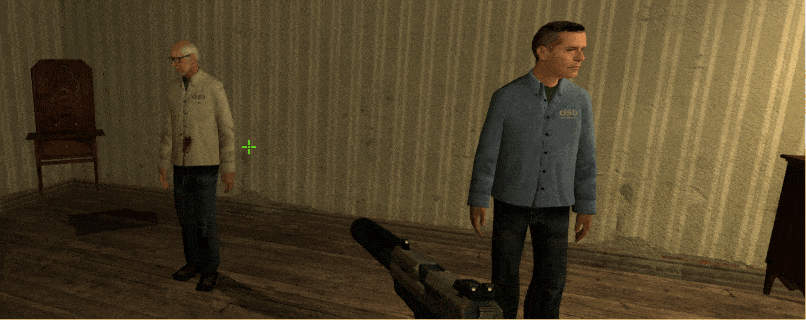

# Description | 內容
Hostages become invulnerable and never die + No collide with players.

> __Note__ <br/>
This plugin is private, Please contact [me](/#私人插件列表-private-plugins-list)<br/>
此為私人插件, 請聯繫[本人](/#私人插件列表-private-plugins-list)

* Apply to | 適用於
	```
	Counter-Strike: Source
	```

* Image | 圖示
	<br/>
    <br/>

* <details><summary>How does it work?</summary>

	* Players won't have hostage penalty. (打到人質也不會被扣錢)
    * Grendates fly through teammates
    * NO physics mayhem/bouncing props BUG
</details>

* Require | 必要安裝
    1. [Physics Mayhem Bug Fix](https://forums.alliedmods.net/showthread.php?t=348804): Fix physics mayhem/bouncing props BUG
        * 解決物體或武器下沉地圖的Bug

* <details><summary>ConVar | 指令</summary>

    * cfg/sourcemod/css_hostage_invulnerable.cfg
        ```php
        // 0=Plugin off, 1=Plugin on.
        css_hostage_invulnerable_enable "1"

        // 0=Hostage becomes invulnerable, players won't have hostage penalty.
        // 1=Hostage becomes invulnerable, but players still have hostage penalty.
        css_hostage_invulnerable_type "0"

        // If 1, Hostage no collide with players
        css_hostage_invulnerable_collide "1"
        ```
</details>

* <details><summary>Changelog | 版本日誌</summary>

    * v1.1 (2025-4-10)
        * Update cvar

    * v1.0 (2023-3-3)
	    * Initial Release
</details>

- - - -
# 中文說明
人質不會受傷死亡+不會與玩家有碰撞 (直接穿透)

* 適用於
	```
	絕對武力：次世代
	```

* 原理
    * 人質不會受傷也不會死亡
    * 即使開槍射到人質也不會扣錢
    * 人質不會與玩家有碰撞 (直接穿透)

* <details><summary>指令中文介紹 (點我展開)</summary>

    * cfg/sourcemod/css_hostage_invulnerable.cfg
        ```php
        // 0=關閉插件, 1=啟動插件
        css_hostage_invulnerable_enable "1"

        // 0=開槍射到人質也不會扣錢
        // 1=開槍射到人質會扣錢
        css_hostage_invulnerable_type "0"

        // 為1時，人質不會與玩家有碰撞 (直接穿透)
        css_hostage_invulnerable_collide "1"
        ```
</details>


