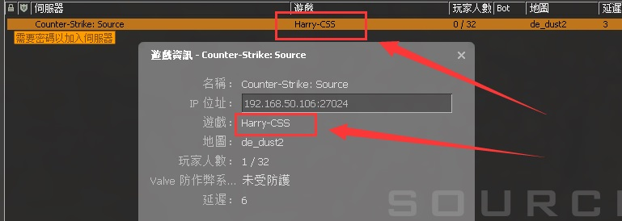

# Description | 內容
Allows changing of displayed game type in server browser

* Apply to | 適用於
	```
	Counter-Strike: Source
	```

* Image | 圖示
    <br/>  

* <details><summary>How does it work?</summary>

    1. Modify file: [configs/css_gametype_description.cfg](configs/css_gametype_description.cfg)
    2. The game description will change on map change or server restart
</details>

* Require | 必要安裝
<br/>None

* <details><summary>Changelog | 版本日誌</summary>

    * v1.0 (2024-4-8)
        * Initial Release
</details>

- - - -
# 中文說明
更改伺服器的遊戲欄資訊

* 改遊戲欄資訊步驟
    1. 請打開文件[configs/css_gametype_description.cfg](configs/css_gametype_description.cfg)並更改 (可以寫中文)
    2. 等待伺服器重啟或換圖