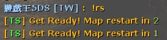

# Description | 內容
Admin say !restartmap to restart current map

> __Note__ <br/>
This plugin is private, Please contact [me](https://github.com/fbef0102/Game-Private_Plugin#私人插件列表-private-plugins-list)<br/>
此為私人插件, 請聯繫[本人](https://github.com/fbef0102/Game-Private_Plugin#私人插件列表-private-plugins-list)

* Video | 影片展示
<br/>None

* Image | 圖示
	* Count down message (倒數計時)
	<br/>

* Require | 必要安裝
	1. [[INC] Multi Colors](https://github.com/fbef0102/L4D1_2-Plugins/releases/tag/Multi-Colors)

* <details><summary>ConVar | 指令</summary>

	* cfg/sourcemod/css_restartmap_command.cfg
		```php
		// 0=Plugin off, 1=Plugin on.
		css_restartmap_command_enable "1"

		// Changes how message displays. (0: Disable, 1:In chat, 2: In Hint Box, 3: In center text)
		css_restartmap_command_announce_type "1"

		// Delay to restart map.
		css_restartmap_command_delay "5"

		// Players with these flags have access to use command to restart map. (Empty = Everyone, -1: Nobody)
		css_restartmap_command_access_flag "z"

		// Count down sound file (relative to to sound/, empty=disable)
		css_restartmap_command_soundfile "buttons/blip1.wav"
		```
</details>

* <details><summary>Command | 命令</summary>

	* **sm_restartmap - changelevels to the current map**
		```php
		sm_restartmap
		sm_rs
		```
</details>

* Apply to | 適用於
	```
	CSS
	```

* <details><summary>Changelog | 版本日誌</summary>

	* v1.0 (2023-3-3)
	    * Initial Release
</details>

- - - -
# 中文說明
管理員輸入!restartmap能重新地圖關卡

* 原理
	* 管理員輸入指令重新當前的關卡
	* 並非重新遊戲開始，也不是重來回合，而是伺服器重新載入當前的地圖

* 用意在哪?
	* 通常地圖發生嚴重bug或者要求伺服器重新執行指令與插件時
	* 給管理員測試用

* <details><summary>指令中文介紹 (點我展開)</summary>

	* cfg/sourcemod/css_restartmap_command.cfg
		```php
		// 0=關閉插件, 1=啟動插件.
		css_restartmap_command_enable "1"

		// 該如何提示重新地圖的倒數計時 (0: 不提示, 1: 聊天框, 2: 黑底白字框, 3: 螢幕正中間)
		css_restartmap_command_announce_type "1"

		// 重新地圖的倒數計時
		css_restartmap_command_delay "5"

		// 擁有這些權限的管理員才能夠輸入!restartmap 重新地圖. (空=任何人都可以輸入, -1=無人有權限輸入)
		css_restartmap_command_access_flag "z"

		// 倒數計時的音效檔案，請填入相對路徑 (路徑相對於 sound 資料夾, 空=關閉音效)
		css_restartmap_command_soundfile "buttons/blip1.wav"
		```
</details>
