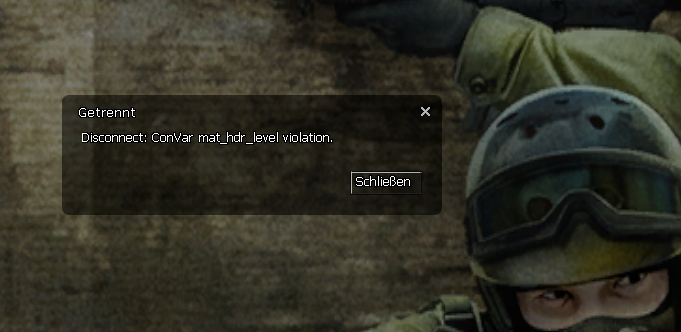

# Description | 內容
Kicks out clients who are potentially attempting to enable mathack

> __Note__ <br/>
This plugin is private, Please contact [me](https://github.com/fbef0102/Game-Private_Plugin#私人插件列表-private-plugins-list)<br/>
此為私人插件, 請聯繫[本人](https://github.com/fbef0102/Game-Private_Plugin#私人插件列表-private-plugins-list)

* Video | 影片展示
<br/>None

* Image | 圖示
	* Kick player using cheat command
        > 踢出試圖使用作弊指令的玩家
        <br/>

* Apply to | 適用於
    ```
    CSS
    ```

* <details><summary>Changelog | 版本日誌</summary>

    * v1.0 (2023-3-3)
	    * Initial Release
</details>

* Require | 必要安裝
<br/>None

* <details><summary>ConVar | 指令</summary>

    * cfg/sourcemod/css_texture_manager_block.cfg
        ```php
        // 1 - kick clients, 0 - only record players in log file(sourcemod/logs/css_mathack_cheaters.txt), other value: ban minutes
        css_texture_manager_block_penalty "1"
        ```
</details>

* <details><summary>Command | 命令</summary>
    
    None
</details>

- - - -
# 中文說明
踢出可能試圖使用作弊指令的客戶

* 原理
    * 幫玩家檢測以下指令，如有發現試圖使用將踢出伺服器
        ```c
        mat_texture_list
        mat_queue_mode
        mat_hdr_level
        r_drawothermodels
        mat_monitorgamma
        ```
    * 如想新增，請洽本人

* 功能
    * 踢出或封鎖玩家
    * 紀錄文件於```sourcempd\logs\css_mathack_cheaters.txt```


