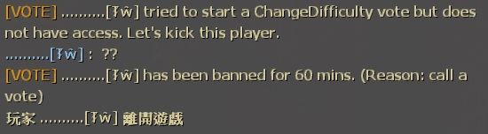

# Description | 內容
Make It So The Person Calling The Vote Gets Kicked!

> __Note__ <br/>
This plugin is private, Please contact [me](/#私人插件列表-private-plugins-list)<br/>
此為私人插件, 請聯繫[本人](/#私人插件列表-private-plugins-list)

* Apply to | 適用於
    ```
    L4D1
    L4D2
    ```

* [Video | 影片展示](https://youtu.be/tc92PDgY5RA)

* Image | 圖示
	<br/>

* <details><summary>How does it work?</summary>

	* If the player A calls vote (ESC->Call vote) -> Prevent the vote and change the vote title "Kick player A" -> kick player A event if vote failed
    * Admin can still call vote
</details>

* Require | 必要安裝
    1. [builtinvotes](https://github.com/fbef0102/builtinvotes/releases)

* <details><summary>ConVar | 指令</summary>

	* cfg/sourcemod/kickthevoter.cfg
        ```php
        // If 1, Spectator can call the vote (0: Disable)
        kick_the_voter_spectator_allow "0"

        // Players with these flags can call a return to lobby vote (Empty = Everyone, -1: Nobody)
        kick_the_voter_lobby_access "z"

        // Players with these flags can call a change difficulty vote (Empty = Everyone, -1: Nobody)
        kick_the_voter_difficulty_access "z"

        // Players with these flags can call a change mission vote (Empty = Everyone, -1: Nobody)
        kick_the_voter_level_access "z"

        // Players with these flags can call a restart level vote (Empty = Everyone, -1: Nobody)
        kick_the_voter_restart_access "z"

        // Players with these flags can call a kick vote (Empty = Everyone, -1: Nobody)
        kick_the_voter_kick_access "z"

        // Players with these flags can call a change all talk vote (Empty = Everyone, -1: Nobody)
        kick_the_voter_changealltalk_access "z"

        // Players must wait (timeout) this many seconds between votes. 0 = no limit
        kick_the_voter_Delay "60"

        // Log voter to data
        kick_the_voter_log "1"

        // If 1, Notify Message about voter.
        kick_the_voter_notify "1"

        // Players with these flags can call switch Survival maps. (Empty = Everyone, -1: Nobody)
        kick_the_voter_surv_map_access "z"

        // Players with these flags can call restart Survival maps. (Empty = Everyone, -1: Nobody)
        kick_the_voter_surv_restart_access "z"

        // Players with these flags can call return to lobby on Survival maps. (Empty = Everyone, -1: Nobody)
        kick_the_voter_surv_lobby_access "z"

        // How to deal with the voter? (-1: kick, 0: Permanent ban, >0: Ban mins)
        kick_the_voter_ban_mins "60"

        // If 1, even if vote result fails, just kick the voter.
        kick_the_voter_all_pass "1"
        ```
</details>

* <details><summary>Related Plugin | 相關插件</summary>

	1. [l4d_vote_block](/L4D_插件/Server_伺服器/l4d_vote_block): Unable to call valve vote depending on gamemode and difficulty.
		* 根據遊戲模式和難度禁止使用Esc->發起投票
</details>

* <details><summary>Changelog | 版本日誌</summary>

	* v1.1
	    * Initial Release
</details>

- - - -
# 中文說明
使用Esc->發起投票的人將會被反踢出去伺服器

* 原理
    * 如果有玩家A發起投票，投票項目無效且會變成"踢出投票者: 玩家A"，即使投票不通過照樣踢出傻B
    * 管理員可以正常發起投票

* 用意在哪?
    * 懲罰玩家惡意發起投票

* <details><summary>指令中文介紹 (點我展開)</summary>

	* cfg/sourcemod/kickthevoter.cfg
        ```php
        // 為1時，旁觀者可以投票 (0=不行)
        kick_the_voter_spectator_allow "0"

        // 擁有這些權限的玩家可以投票"返回大廳" (留白 = 任何人都能, -1: 無人)
        kick_the_voter_lobby_access "z"

        // 擁有這些權限的玩家可以投票"變更難度" (留白 = 任何人都能, -1: 無人)
        kick_the_voter_difficulty_access "z"

        // 擁有這些權限的玩家可以投票"開始新戰役" (留白 = 任何人都能, -1: 無人)
        kick_the_voter_level_access "z"

        // 擁有這些權限的玩家可以投票"重新開始戰役/章節" (留白 = 任何人都能, -1: 無人)
        kick_the_voter_restart_access "z"

        // 擁有這些權限的玩家可以投票"踢掉玩家" (留白 = 任何人都能, -1: 無人)
        kick_the_voter_kick_access "z"

        // 擁有這些權限的玩家可以投票"更變為全體交談" (留白 = 任何人都能, -1: 無人)
        kick_the_voter_changealltalk_access "z"

        // 發起新投票的時間間隔限制. 0 = 無時間限制
        kick_the_voter_Delay "60"

        // 為1時，紀錄投票者到logs文件
        kick_the_voter_log "1"

        // 為1時，顯示訊息誰是投票者
        kick_the_voter_notify "1"

        // 擁有這些權限的玩家可以投票"變更章節" (留白 = 任何人都能, -1: 無人)
        kick_the_voter_surv_map_access "z"

        // 擁有這些權限的玩家可以投票"重新開始回合" (留白 = 任何人都能, -1: 無人)
        kick_the_voter_surv_restart_access "z"

        // 擁有這些權限的玩家可以在生存模式投票"返回大廳" (留白 = 任何人都能, -1: 無人)
        kick_the_voter_surv_lobby_access "z"

        // 如何懲罰發起投票的玩家? (-1: 踢出伺服器, 0: 永久封鎖, >0: 封鎖時間)
        kick_the_voter_ban_mins "60"

        // 為1時，即使投票不通過依然懲罰發起投票的玩家
        kick_the_voter_all_pass "1"
        ```
</details>
