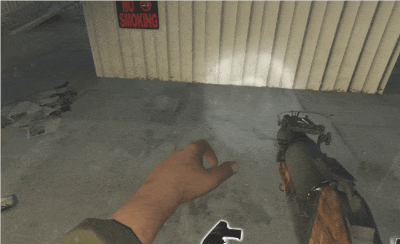

# Description | 內容
Limit the numbers of times weapons/items can be picked up within short time

> __Note__ <br/>
This plugin is private, Please contact [me](https://github.com/fbef0102/Game-Private_Plugin#私人插件列表-private-plugins-list)<br/>
此為私人插件, 請聯繫[本人](https://github.com/fbef0102/Game-Private_Plugin#私人插件列表-private-plugins-list)

* Image | 圖示
	| Before (裝此插件之前)  			| After (裝此插件之後) |
	| -------------|:-----------------:|
	| ||
	| ||

* Apply to | 適用於
	```
	L4D1
	L4D2
	```

* <details><summary>How does it work?</summary>

	* When player picks up weapon or item, add one token. 
	* Once token reach limit, player is unable to pick up any weapons or items
	* Token would be decreased after certain time
</details>

* Require | 必要安裝
	1. [[INC] Multi Colors](https://github.com/fbef0102/L4D1_2-Plugins/releases/tag/Multi-Colors)

* <details><summary>ConVar | 指令</summary>

	* cfg/sourcemod/l4d_anti_juggle_pickup.cfg
		```php
		// 0=Plugin off, 1=Plugin on.
		l4d_anti_juggle_pickup_enable "1"

		// How message displays. (0: Disable, 1:In chat, 2: In Hint Box, 3: In center text)
		l4d_anti_juggle_pickup_announce_type "2"

		// Time interval to decrease a token. (second)
		l4d_anti_juggle_pickup_token_time "5"

		// Max Player Pick-Up weapons/items token limit. (-1 = No Limit)
		l4d_anti_juggle_pickup_max_limit "3"

		// Players with these flags are immune to limit. (Empty=Everyone, -1=Nobody)
		l4d_anti_juggle_pickup_immue_flag "z"

		// (L4D2) Empty string to limit all. Limit these weapon IDs being picked up in this plugin, separate by commas (no spaces). See plugin source code for more details.
		// "weapon_pistol",					    1
		// "weapon_smg",						2
		// "weapon_pumpshotgun",				3
		// "weapon_autoshotgun",				4
		// "weapon_rifle",						5
		// "weapon_hunting_rifle",				6
		// "weapon_smg_silenced",				7
		// "weapon_shotgun_chrome",			    8
		// "weapon_rifle_desert",				9
		// "weapon_sniper_military",			10
		// "weapon_shotgun_spas",				11
		// "weapon_grenade_launcher",			12
		// "weapon_rifle_ak47",				    13
		// "weapon_pistol_magnum",				14
		// "weapon_smg_mp5",					15
		// "weapon_rifle_sg552",				16
		// "weapon_sniper_awp",				    17
		// "weapon_sniper_scout",				18
		// "weapon_rifle_m60",					19
		// "weapon_chainsaw",					20
		// "weapon_melee",						21
		// "weapon_first_aid_kit",				22
		// "weapon_defibrillator",				23
		// "weapon_upgradepack_incendiary",	    24
		// "weapon_upgradepack_explosive",		25
		// "weapon_molotov",					26
		// "weapon_pipe_bomb",					27
		// "weapon_vomitjar",					28
		// "weapon_pain_pills",				    29
		// "weapon_adrenaline",				    30
		// "weapon_gascan",					    31
		// "weapon_propanetank",				32
		// "weapon_oxygentank",				    33
		// "weapon_fireworkcrate",				34
		// "weapon_gnome",						35
		// "weapon_cola_bottles",				36
		l4d_anti_juggle_pickup_weapon "22,23,24,25,26,27,28,29,30"

		// (L4D1) Empty string to limit all. Limit these weapon IDs being picked up in this plugin, separate by commas (no spaces). See plugin source code for more details.
		// "weapon_pistol",					    1
		// "weapon_smg",						2
		// "weapon_pumpshotgun",				3
		// "weapon_autoshotgun",				4
		// "weapon_rifle",						5
		// "weapon_hunting_rifle",			    6
		// "weapon_first_aid_kit",			    7
		// "weapon_molotov",				    8
		// "weapon_pipe_bomb",				    9
		// "weapon_pain_pills",				    10
		// "weapon_gascan",					    11
		// "weapon_propanetank",				12
		// "weapon_oxygentank",				    13
		l4d_anti_juggle_pickup_weapon "7,8,9,10"
		```
</details>

* <details><summary>Translation Support | 支援翻譯</summary>

	```
	English
	繁體中文
	简体中文
	```
</details>

* <details><summary>Changelog | 版本日誌</summary>

	* v1.0 (2024-1-15)
		* Initial Release
</details>

- - - -
# 中文說明
限制玩家頻繁撿取武器或物資，避免搬運或切洗

* 原理
	* 每當玩家撿起武器或物品時，累積一個token
	* 當token達到限制次數時，玩家不能再撿起任何武器或物資
	* 每過一段時間自動移除token，玩家的角色才可以繼續撿

* 用意在哪?
	* 避免頻繁搬運或切武器

* <details><summary>指令中文介紹 (點我展開)</summary>

	* cfg/sourcemod/l4d_anti_juggle_pickup.cfg
		```php
		// 0=關閉插件, 1=啟動插件
		l4d_anti_juggle_pickup_enable "1"

		// 提示該如何顯示. (0: 不提示, 1: 聊天框, 2: 黑底白字框, 3: 螢幕正中間)
		l4d_anti_juggle_pickup_announce_type "2"

		// 每X秒降低一個token
		l4d_anti_juggle_pickup_token_time "5"

		// 每一位玩家短時間內可以撿起武器或物資的次數 (-1 = 無限制)
		l4d_anti_juggle_pickup_max_limit "3"

		// 擁有這些權限的玩家，不受此插件限制 (留白 = 任何人都不受限制, -1: 所有人都被限制)
		l4d_anti_juggle_pickup_immue_flag "z"

		// (L4D2) 空=全武器限制. 填入武器的ID，這些武器被限制, 逗號分隔（不須空格）. 請打開源碼查看武器的ID列表
        // "weapon_pistol",					    1
        // "weapon_smg",						2
        // "weapon_pumpshotgun",				3
        // "weapon_autoshotgun",				4
        // "weapon_rifle",						5
        // "weapon_hunting_rifle",				6
        // "weapon_smg_silenced",				7
        // "weapon_shotgun_chrome",			    8
        // "weapon_rifle_desert",				9
        // "weapon_sniper_military",			10
        // "weapon_shotgun_spas",				11
        // "weapon_grenade_launcher",			12
        // "weapon_rifle_ak47",				    13
        // "weapon_pistol_magnum",				14
        // "weapon_smg_mp5",					15
        // "weapon_rifle_sg552",				16
        // "weapon_sniper_awp",				    17
        // "weapon_sniper_scout",				18
        // "weapon_rifle_m60",					19
        // "weapon_chainsaw",					20
        // "weapon_melee",						21
        // "weapon_first_aid_kit",				22
        // "weapon_defibrillator",				23
        // "weapon_upgradepack_incendiary",	    24
        // "weapon_upgradepack_explosive",		25
        // "weapon_molotov",					26
        // "weapon_pipe_bomb",					27
        // "weapon_vomitjar",					28
        // "weapon_pain_pills",				    29
        // "weapon_adrenaline",				    30
        // "weapon_gascan",					    31
        // "weapon_propanetank",				32
        // "weapon_oxygentank",				    33
        // "weapon_fireworkcrate",				34
        // "weapon_gnome",						35
        // "weapon_cola_bottles",				36
		l4d_anti_juggle_pickup_weapon "22,23,24,25,26,27,28,29,30"

		// (L4D1) 空=全武器限制. 填入武器的ID，這些武器被限制, 逗號分隔（不須空格）. 請打開源碼查看武器的ID列表
        // "weapon_pistol",					    1
        // "weapon_smg",						2
        // "weapon_pumpshotgun",				3
        // "weapon_autoshotgun",				4
        // "weapon_rifle",						5
        // "weapon_hunting_rifle",			    6
        // "weapon_first_aid_kit",			    7
        // "weapon_molotov",				    8
        // "weapon_pipe_bomb",				    9
        // "weapon_pain_pills",				    10
        // "weapon_gascan",					    11
        // "weapon_propanetank",				12
        // "weapon_oxygentank",				    13
		l4d_anti_juggle_pickup_weapon "7,8,9,10"
		```
</details>