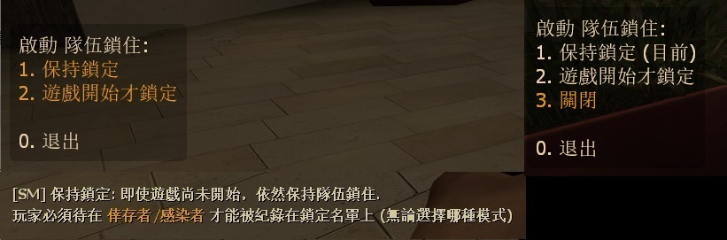

# Description | 內容
Calls a vote to enable / disable locking teams in place once game starts (so no spectators can join in mid-game)

> __Note__ <br/>
This plugin is private, Please contact [me](/#私人插件列表-private-plugins-list)<br/>
此為私人插件, 請聯繫[本人](/#私人插件列表-private-plugins-list)

* Apply to | 適用於
	```
	L4D1
	L4D2
	```

* [Video | 影片展示](https://youtu.be/B1oghdYb_gE)

* <details><summary>Image</summary>

	<br/>
	<br/>
	<br/>
</details>

* <details><summary>How does it work?</summary>

	* Before game starts
		* Every can switch team
	* After game starts, server will "lock the team"
		* Record the infected/survivor players on the whitelisted. Whitelisted still work even if they leave and rejoin the server
		* Only the whitelisted players can switch team and play
		* All other players can not join the team
	* "Game starts" meaning
		* Survivors leave the saferoom
		* Survival starts
		* Scavenge starts
		* Everyone is ready (Support readyup plugin)
	* No other players will be able to join the survivor/infected team until ether:
		* Round end
		* Players vote to disable teamlock
		* Whitelisted players have all left the server
</details>

* Require | 必要安裝
	1. [left4dhooks](https://forums.alliedmods.net/showthread.php?t=321696)
	2. [[INC] Multi Colors](https://github.com/fbef0102/L4D1_2-Plugins/releases/tag/Multi-Colors)
	3. [builtinvotes](https://github.com/fbef0102/Game-Private_Plugin/releases/tag/builtinvotes)
	
* <details><summary>ConVar | 指令</summary>

	* cfg/sourcemod/teamlock_vote.cfg
		```php
		// 0=Plugin off, 1=Plugin on.
		teamlock_vote_enable "1"

		// Delay to start another a teamlock vote after vote ends.
		teamlock_vote_delay "60"

		// Numbers of real survivor and infected player required to start a teamlock vote.
		teamlock_vote_required "2"

		// If 1, players can not start teamlock vote after game starts (survivors leaving saferoom / survival or scavenge begins).
		teamlock_vote_game_block "1"

		// Enable teamlock by default?
		// 0=Disable, 1=Only when round is live
		teamlock_vote_default_value "1"

		// If 1, vote to disable teamlock directly instead of meny when use !teamlock cmd
		teamlock_vote_disable_no_menu "1"
		```
</details>

* <details><summary>Command | 命令</summary>
	
	* **Calls a vote to enable / disable locking teams**
		```php
		sm_teamlock
		```

	* **Check team lock list in console**
		```php
		sm_teamlock_list
		```
</details>

* Translation Support | 支援翻譯
	```
	translations/teamlock_vote.phrases.txt
	```

* <details><summary>Related Plugin | 相關插件</summary>

	1. [readyup](/L4D_插件/Server_伺服器/readyup): Ready Plugin
		* 所有玩家準備才能開始遊戲的插件
</details>

* <details><summary>Changelog | 版本日誌</summary>

	* v1.4 (2024-9-23)
		* Update Translation
		* Add cmd
		* Update cvars

	* v1.3 (2024-9-21)
		* Support Translation
		* Add menu
		* Add continuous lock

	* v1.2 (2023-5-23)
		* Support readyup

	* v1.1 (2023-2-16)
		* Support L4D1

	* v1.0 (2022-11-27)
		* Initial Release
</details>

- - - -
# 中文說明
遊戲開始後旁觀者或路人不能跳隊到倖存者或感染者遊玩

* <details><summary>圖示</summary>

	<br/>
	<br/>
	<br/>
</details>

* 原理
	* 遊戲開始之前
		* 任何人可以自由切換隊伍
	* 當遊戲開始時啟動"隊伍鎖住功能" (teamlock)
		* 紀錄倖存者/感染者的真人玩家在鎖定名單上，即使玩家離開後重進伺服器，鎖定名單依然有效
		* 只有鎖定名單上的玩家可以自由切換隊伍並遊玩
		* 閒置玩家也會被記錄在鎖定名單上
		* 旁觀者其他人(不在鎖定名單上的)不能跳隊下去遊玩
	* 這裡指的"遊戲開始"是
		1. 戰役/對抗/寫實中離開安全室
		2. 生存模式計時開始
		3. 清道夫模式計時開始
		4. 所有人準備之後 (支援準備插件)
	* 以下時間點重置鎖定名單，任何人可以自由切換隊伍
		1. 新的回合開始時
		2. 當伺服器內沒有玩家時
		3. 投票關閉

* 用意在哪
	* 防止傻B路人在遊戲中途跳隊遊玩搗亂

* <details><summary>指令中文介紹 (點我展開)</summary>

	* cfg/sourcemod/teamlock_vote.cfg
		```php
		// 0=關閉插件, 1=啟動插件
		teamlock_vote_enable "1"

		// 60秒後才能再發起 "隊伍鎖住功能" 投票
		teamlock_vote_delay "60"

		// 發起 "隊伍鎖住功能" 投票需要的真人玩家數量，位於特感隊伍與倖存者隊伍
		teamlock_vote_required "2"

		// 為1時，遊戲開始後不能發起 "隊伍鎖住功能" 投票
		// 遊戲開始是指 1. 玩家離開安全室 2. 生存模式計時開始 3. 清道夫模式計時開始 4. 所有人準備之後 (支援準備插件)
		teamlock_vote_game_block "1"

		// 伺服器啟動時，預設的 "隊伍鎖住功能"
		// 0=關閉, 1=遊戲開始才鎖定 (Only when round is live)
		teamlock_vote_default_value "1"

		// 為1時，隊伍鎖住啟動後再次輸入!teamlock會直接發起關閉的投票 不用顯示選單
		teamlock_vote_disable_no_menu "1"
		```
</details>

* <details><summary>命令中文介紹 (點我展開)</summary>
	
	* **發起 "隊伍鎖住功能" 投票**
		```php
		sm_teamlock
		```

	* **控制台查看 "隊伍鎖定名單"**
		```php
		sm_teamlock_list
		```
</details>
