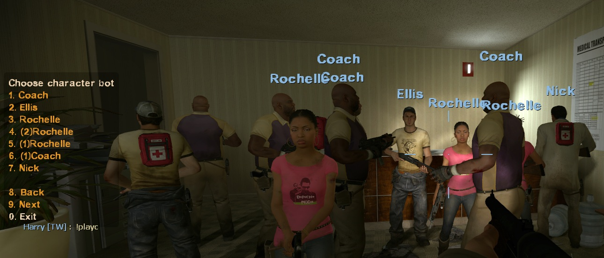
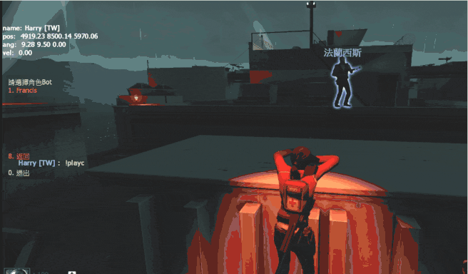
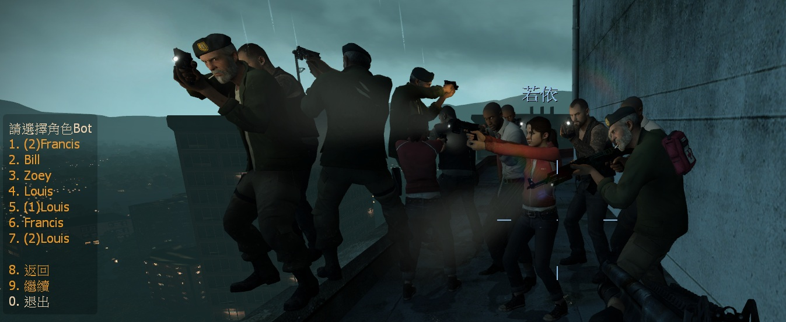

# Description | 內容
Use cmd to play another survivor bot

> __Note__ <br/>
This plugin is private, Please contact [me](/#私人插件列表-private-plugins-list)<br/>
此為私人插件, 請聯繫[本人](/#私人插件列表-private-plugins-list)

* Apply to | 適用於
	```
	L4D1
	L4D2
	```

* [Video | 影片展示](https://youtu.be/C8ceSq1-kns)

* Image | 圖示
	<br/>
	<br/>
	<br/>

* <details><summary>How does it work?</summary>

	* Type ```!playc``` to play another bot character
	* Help bot to pickup items or do somthing
	* Support multi survivor bots
</details>

* Require | 必要安裝
	1. [left4dhooks](https://forums.alliedmods.net/showthread.php?t=321696)

* <details><summary>ConVar | 指令</summary>

	* cfg/sourcemod/l4d_play_character_cmd.cfg
		```php
		// 0=Plugin off, 1=Plugin on.
		l4d_play_character_cmd_enable "1"

		// Players with these flags have access to use command to open character bot menu.  (Empty = Everyone, -1: Nobody)
		l4d_play_character_cmd_access_flag ""

		// If 1, disable cmd after round starts (Survivor left saferoom, Survival/Scavenge begins, round is live...)
		l4d_play_character_cmd_round_disable "0"
		```
</details>

* <details><summary>Command | 命令</summary>

	* **Open Character Bot Menu"**
		```php
		sm_playc
		```
</details>

* Translation Support | 支援翻譯
	```
	translations/l4d_play_character_cmd.phrases.txt
	```

* <details><summary>Changelog | 版本日誌</summary>

	* v1.1 (2025-8-11)
		* Update cvars and cmd
		* Support multi bots

	* v1.0 (2024-7-21)
		* Initial Release
</details>

- - - -
# 中文說明
輸入命令切換到另一個Bot角色遊玩

* 原理
	* 玩家輸入```!playc``` 打開Bot角色菜單，選擇對象後切換到該倖存者角色
	<br/>

* 用意在哪?
	* 幫Bot拿物品或切換自己到喜歡的角色
	* 支援多人Bot

* <details><summary>指令中文介紹 (點我展開)</summary>

	* cfg/sourcemod/l4d_play_character_cmd.cfg
		```php
		// 0=關閉插件, 1=啟動插件
		l4d_play_character_cmd_enable "1"

		// 擁有這些權限的玩家，才可以輸入!playc (留白 = 任何人都能, -1: 無人)
		l4d_play_character_cmd_access_flag ""

		// 為1時，遊戲開始後不能輸入!playc (倖存者離開安全室、生存/清道夫 計時開始, 準備階段開始...)
		l4d_play_character_cmd_round_disable "0"
		```
</details>

* <details><summary>命令中文介紹 (點我展開)</summary>

	* **打開Bot角色菜單**
		```php
		sm_playc
		```
</details>
