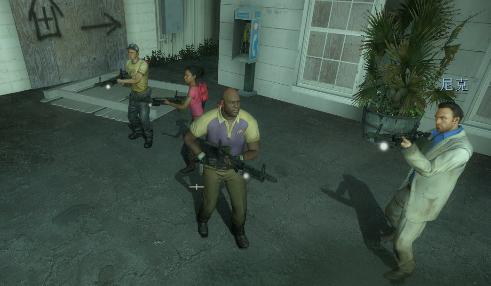

# Description | 內容
Change the favorite weapon of each character bot

> __Note__ <br/>
This plugin is private, Please contact [me](/#私人插件列表-private-plugins-list)<br/>
此為私人插件, 請聯繫[本人](/#私人插件列表-private-plugins-list)

* Apply to | 適用於
	```
	L4D2
	```

* Image | 圖示
	* Ellis stop fking using sinper anymore. (Bot別再撿狙擊槍了)
	<br/>
	* All bots pick up M60 (所有Bot撿起M60)
	<br/>

* <details><summary>How does it work?</summary>

	* Change bot's favorite weapon.
	* For example: Coach's favorite weapon changed to "SCAR Rifle"
		* Coach will pick up SCAR Rifle prior to any other weapons
		* If no SCAR Rifle near around, Coach will pick up any rifle weapons prior to shoutgun and sniper rifle
		* If no any rifles near around, Coach will pick up shoutgun or sniper rifle
		* Priority: SCAR Rifle => Any Rifle => Any T2 weapons => Any T1 weapons
	* If favorite weapon changed to "M60"
		* Priority: M60 => Any Rifle => Any T2 weapons => Any T1 weapons
	* If favorite weapon changed to "Grenade Launcher"
		* Priority: Grenade Launcher => Any T2 weapons => Any T1 weapons
</details>

* <details><summary>FAQ</summary>

	* How to make bots pick up "M60" and "Grenade Launcher"?
		1. Install [Mission and Weapons - Info Editor](https://forums.alliedmods.net/showthread.php?t=310586)
		2. Modify ```data/l4d_info_editor_weapons.cfg```
			```c
			"weapon_rifle_m60"
			{
				"Tier" "2"
			}
			"weapon_grenade_launcher"
			{
				"Tier" "2"
			}
			```
</details>

* Require | 必要安裝
	1. [left4dhooks](https://forums.alliedmods.net/showthread.php?t=321696)

* <details><summary>ConVar | 指令</summary>

	* cfg/sourcemod/l4d_survivor_bot_preferrence.cfg
		```php
		// 0=Plugin off, 1=Plugin on.
		l4d_survivor_bot_preferrence_enable "1"

		// Nick's favorite weapon, 1-Autoshot, 2-SPAS, 3-M16, 4-SCAR, 5-AK47, 6-SG552, 7-Mil Sniper, 8-AWP, 9-Scout, 10=Hunt Rif, 11=M60, 12=Grenade L
		// 0=Game Default
		l4d_survivor_bot_preferrence_nick "1"

		// Ellis's favorite weapon, 1-Autoshot, 2-SPAS, 3-M16, 4-SCAR, 5-AK47, 6-SG552, 7-Mil Sniper, 8-AWP, 9-Scout, 10=Hunt Rif, 11=M60, 12=Grenade L
		// 0=Game Default
		l4d_survivor_bot_preferrence_ellis "2"

		// Rochelle's favorite weapon, 1-Autoshot, 2-SPAS, 3-M16, 4-SCAR, 5-AK47, 6-SG552, 7-Mil Sniper, 8-AWP, 9-Scout, 10=Hunt Rif, 11=M60, 12=Grenade L
		// 0=Game Default
		l4d_survivor_bot_preferrence_rochelle "3"

		// Coach's favorite weapon, 1-Autoshot, 2-SPAS, 3-M16, 4-SCAR, 5-AK47, 6-SG552, 7-Mil Sniper, 8-AWP, 9-Scout, 10=Hunt Rif, 11=M60, 12=Grenade L
		// 0=Game Default
		l4d_survivor_bot_preferrence_coach "4"

		// Bill's favorite weapon, 1-Autoshot, 2-SPAS, 3-M16, 4-SCAR, 5-AK47, 6-SG552, 7-Mil Sniper, 8-AWP, 9-Scout, 10=Hunt Rif, 11=M60, 12=Grenade L
		// 0=Game Default
		l4d_survivor_bot_preferrence_bill "5"

		// Zoey's favorite weapon, 1-Autoshot, 2-SPAS, 3-M16, 4-SCAR, 5-AK47, 6-SG552, 7-Mil Sniper, 8-AWP, 9-Scout, 10=Hunt Rif, 11=M60, 12=Grenade L
		// 0=Game Default
		l4d_survivor_bot_preferrence_zoey "6"

		// Francis's favorite weapon, 1-Autoshot, 2-SPAS, 3-M16, 4-SCAR, 5-AK47, 6-SG552, 7-Mil Sniper, 8-AWP, 9-Scout, 10=Hunt Rif, 11=M60, 12=Grenade L
		// 0=Game Default
		l4d_survivor_bot_preferrence_francis "7"

		// Louis's favorite weapon, 1-Autoshot, 2-SPAS, 3-M16, 4-SCAR, 5-AK47, 6-SG552, 7-Mil Sniper, 8-AWP, 9-Scout, 10=Hunt Rif, 11=M60, 12=Grenade L
		// 0=Game Default
		l4d_survivor_bot_preferrence_louis "10"
		```
</details>

* <details><summary>Changelog | 版本日誌</summary>

	* v1.1 (2024-7-16)
		* Add M60 and Grenade Launcher
		* Update Cvars

	* v1.0 (2023-12-7)
		* Initial Release
		* Credit: [Forgetest](https://github.com/jensewe)
</details>

- - - -
# 中文說明
更改AI Bot的喜愛武器順序，優先拿取合適的武器

* 原理
	* 更改每個AI bot角色的喜愛武器
	* 舉例: Coach的最愛武器更改為 "SCAR三連發步槍"
		* Coach優先拿取SCAR三連發步槍，其他武器忽略
		* 如果周圍沒有SCAR三連發步槍，Coach優先拿取其他的步槍，散彈槍/狙擊槍忽略
		* 如果周圍沒有任何步槍，Coach拿取散彈槍或狙擊槍
		* 優先順序: SCAR三連發步槍 => 步槍 => T2 武器 => T1 武器
	* 如果最愛武器更改為 "M60"
		* 優先順序: M60 => 步槍 => T2 武器 => T1 武器
	* 如果最愛武器更改為 "榴彈發射器"
		* 優先順序: 榴彈發射器 => T2 武器 => T1 武器

* 用意在哪?
	* Bot不會用狙擊槍，別再撿了

* <details><summary>問題區</summary>

	* 如何讓Bots可以撿起 "M60" 與 "榴彈發射器" ?
		1. 安裝 [Mission and Weapons - Info Editor](https://forums.alliedmods.net/showthread.php?t=310586)
		2. 修改文件 ```data/l4d_info_editor_weapons.cfg```
			```c
			"weapon_rifle_m60"
			{
				"Tier" "2"
			}
			"weapon_grenade_launcher"
			{
				"Tier" "2"
			}
			```
</details>

* <details><summary>指令中文介紹 (點我展開)</summary>

	* cfg/sourcemod/l4d_survivor_bot_preferrence.cfg
		```php
		// 0=關閉插件, 1=啟動插件
		l4d_survivor_bot_preferrence_enable "1"

		// Nick 的喜愛武器, 1-自動連發散彈槍, 2-SPAS戰術散彈槍, 3-M16步槍, 4-SCAR步槍, 5-AK47, 6-SG552三連發步槍, 7-軍用狙擊槍, 8-AWP, 9-Scout, 10=獵槍 (狙擊槍), 11=M60, 12=榴彈發射器
		// 0=遊戲預設喜愛武器
		l4d_survivor_bot_preferrence_nick "1"

		// Ellis 的喜愛武器, 1-自動連發散彈槍, 2-SPAS戰術散彈槍, 3-M16步槍, 4-SCAR步槍, 5-AK47, 6-SG552三連發步槍, 7-軍用狙擊槍, 8-AWP, 9-Scout, 10=獵槍 (狙擊槍), 11=M60, 12=榴彈發射器
		// 0=遊戲預設喜愛武器
		l4d_survivor_bot_preferrence_ellis "2"

		// Rochelle 的喜愛武器, 1-自動連發散彈槍, 2-SPAS戰術散彈槍, 3-M16步槍, 4-SCAR步槍, 5-AK47, 6-SG552三連發步槍, 7-軍用狙擊槍, 8-AWP, 9-Scout, 10=獵槍 (狙擊槍), 11=M60, 12=榴彈發射器
		// 0=遊戲預設喜愛武器
		l4d_survivor_bot_preferrence_rochelle "3"

		// Coach 的喜愛武器, 1-自動連發散彈槍, 2-SPAS戰術散彈槍, 3-M16步槍, 4-SCAR步槍, 5-AK47, 6-SG552三連發步槍, 7-軍用狙擊槍, 8-AWP, 9-Scout, 10=獵槍 (狙擊槍), 11=M60, 12=榴彈發射器
		// 0=遊戲預設喜愛武器
		l4d_survivor_bot_preferrence_coach "4"

		// Bill 的喜愛武器, 1-自動連發散彈槍, 2-SPAS戰術散彈槍, 3-M16步槍, 4-SCAR步槍, 5-AK47, 6-SG552三連發步槍, 7-軍用狙擊槍, 8-AWP, 9-Scout, 10=獵槍 (狙擊槍), 11=M60, 12=榴彈發射器
		// 0=遊戲預設喜愛武器
		l4d_survivor_bot_preferrence_bill "5"

		// Zoey 的喜愛武器, 1-自動連發散彈槍, 2-SPAS戰術散彈槍, 3-M16步槍, 4-SCAR步槍, 5-AK47, 6-SG552三連發步槍, 7-軍用狙擊槍, 8-AWP, 9-Scout, 10=獵槍 (狙擊槍), 11=M60, 12=榴彈發射器
		// 0=遊戲預設喜愛武器
		l4d_survivor_bot_preferrence_zoey "6"

		// Francis 的喜愛武器, 1-自動連發散彈槍, 2-SPAS戰術散彈槍, 3-M16步槍, 4-SCAR步槍, 5-AK47, 6-SG552三連發步槍, 7-軍用狙擊槍, 8-AWP, 9-Scout, 10=獵槍 (狙擊槍), 11=M60, 12=榴彈發射器
		// 0=遊戲預設喜愛武器
		l4d_survivor_bot_preferrence_francis "7"

		// Louis 的喜愛武器, 1-自動連發散彈槍, 2-SPAS戰術散彈槍, 3-M16步槍, 4-SCAR步槍, 5-AK47, 6-SG552三連發步槍, 7-軍用狙擊槍, 8-AWP, 9-Scout, 10=獵槍 (狙擊槍), 11=M60, 12=榴彈發射器
		// 0=遊戲預設喜愛武器
		l4d_survivor_bot_preferrence_louis "10"
		```
</details>
