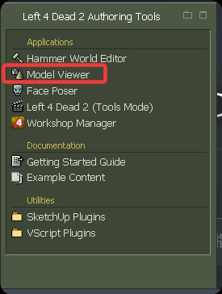
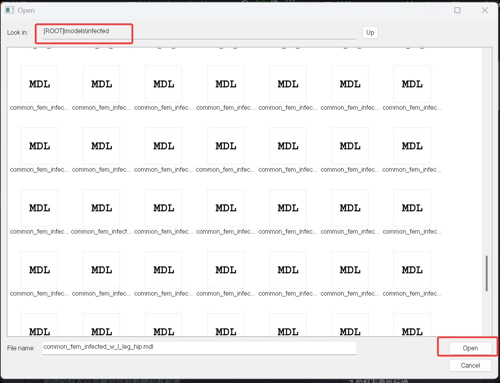
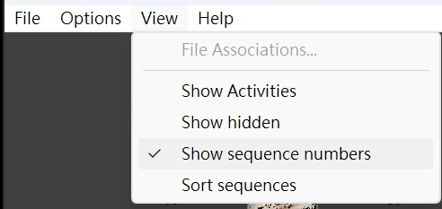
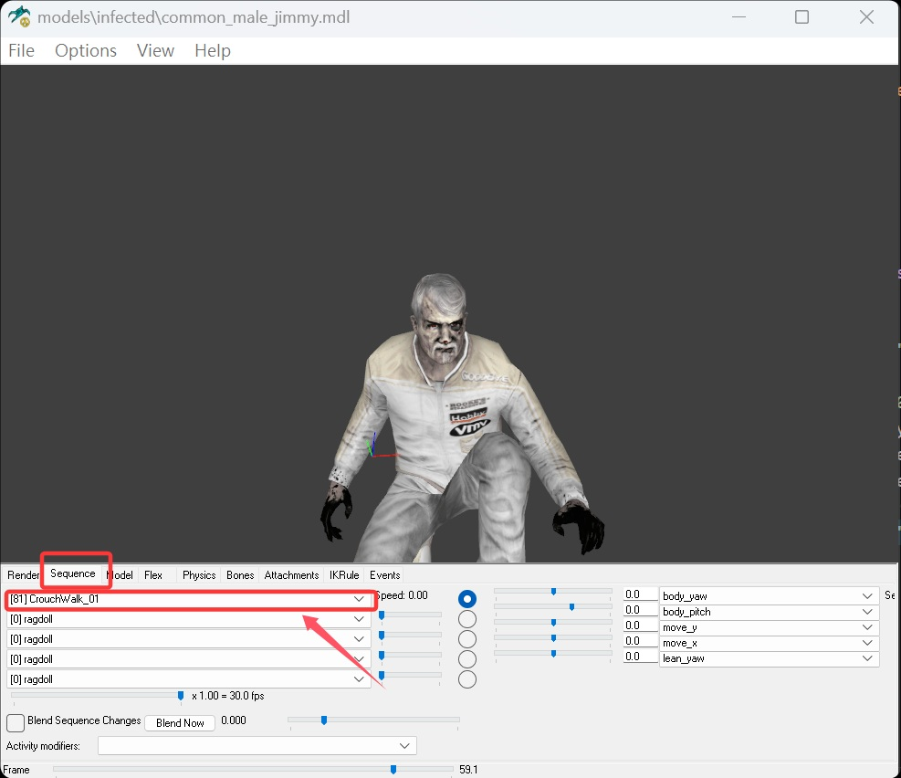

# Description | 內容
Custom common infected spawns with random health, speed, damage, armor and change runing animation.

> __Note__ <br/>
This plugin is private, Please contact [me](/#私人插件列表-private-plugins-list)<br/>
此為私人插件, 請聯繫[本人](/#私人插件列表-private-plugins-list)

* Apply to | 適用於
	```
	L4D2
	```

* [Video | 影片展示](https://youtu.be/S4qcY8V22bA)

* Image | 圖示
	<br/>
	<br/>
	<br/>

* <details><summary>How does it work?</summary>

	* Custom common infected type
		* Random health
		* Random speed, size, 
		* Increase damage to survivors
		* Reduce damge taken from Survivors
		* Change running animation
	* Also affect special uncommon infected
	* Add more common infected type in file: [data/l4d2_common_infected_control.cfg](data/l4d2_common_infected_control.cfg)
		* Manual in this file, click for more details...
</details>

* Require | 必要安裝
<br>None

* <details><summary>Support | 支援插件</summary>

	1. [l4d2_spawn_uncommons](/L4D_插件/Common_Infected_普通感染者/l4d2_spawn_uncommons): Spawn Uncommon Infected on all maps (Support The Last Stand New Model)
		* 所有地圖上可生成特殊一般感染者，有鎮暴警察、CEDA人員、小丑、泥人、工人、吉米賽車手、墮落倖存者
</details>

* <details><summary>ConVar | 指令</summary>

	* cfg/sourcemod/l4d2_common_infected_control.cfg
		```php
		// 0=Plugin off, 1=Plugin on.
		l4d2_common_infected_control_enable "1"
		```
</details>

* <details><summary>How to see all infected model sequence ID?</summary>

	* (L4D2) File: [data/l4d2_common_declare_sequence.cfg](data/l4d2_common_declare_sequence.cfg)
	* (L4D2) File: [data/l4d1_common_declare_sequence.cfg](data/l4d1_common_declare_sequence.cfg)
	* Follow the steps if check custom model
		1. Download "Left 4 Dead 2 Authoring Tools" from steam game library
		2. Launch -> open "Model Viewer"
		<br/>
		3. (Above) File -> Load Model -> load infected model, path: ROOT\models\infected\common_xxxx.mdl
		<br/>
		4. (Above) View -> Check "Show sequence numbers"
		<br/>
		5. (Below) Sequence -> You can see all sequnce ID
		<br/>
</details>

* <details><summary>Changelog | 版本日誌</summary>

	* v1.1h (2026-5-30)
		* Rename plugin
		* Add data to add more infected type
		* Delete cvars
		* Delete model scale size

	* v1.0h (2023-7-3)
		* Remake Code
		* Convert code to latest syntax
		* Changes to fix warnings when compiling on SourceMod 1.11.
		* Add convars to control each type spawn weight.
		* Fix health and speec not working

	* v1.1
	    * [Original Plugin By Mortiegama](https://forums.alliedmods.net/showthread.php?t=239492)
</details>

- - - -
# 中文說明
自定義普通感染者的血量、速度、攻擊傷害、減少受到的傷害，並且改變奔跑的動畫與姿勢

* 原理
	* 每隻普通感染者有機率被改造, 可自定義
		* 隨機血量
		* 隨機速度 
		* 攻擊倖存者的傷害加成
		* 受到倖存者減傷的減傷比
		* 奔跑的動畫姿勢
	* 也會影響特殊一般感染者
	* 自行新增更多感染者類型，詳見文件: [data/l4d2_common_infected_control.cfg](data/l4d2_common_infected_control.cfg)
		* 內有中文說明，可點擊查看

* <details><summary>指令中文介紹(點我展開)</summary>

	* cfg/sourcemod/l4d2_common_infected_control.cfg
		```php
		// 0=啟動插件, 1=關閉插件.
		l4d2_common_infected_control_enable "1"
		```
</details>

* <details><summary>如何查看感染者模型可以用的 sequence 動畫ID?</summary>

	* (二代) 查看文件: [data/l4d2_common_declare_sequence.cfg](data/l4d2_common_declare_sequence.cfg)
	* (一代) 查看文件: [data/l4d1_common_declare_sequence.cfg](data/l4d1_common_declare_sequence.cfg)
	* 想自己查需按照以下步驟
		1. Steam遊戲庫下載 "Left 4 Dead 2 Authoring Tools" 
		2. 啟動 -> 打開 "Model Viewer"
		<br/>
		3. (上方工具列) File -> Load Model -> 隨便選擇一個感染者模型, 路徑是: ROOT\models\infected\common_xxxx.mdl
		<br/>
		4. (上方工具列) View -> 打勾 "Show sequence numbers" 
		<br/>
		5. (下方工具列) Sequence -> 你可以看到所有 sequnce ID
		<br/>
</details>