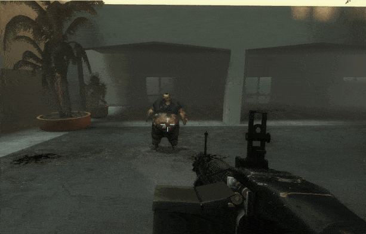
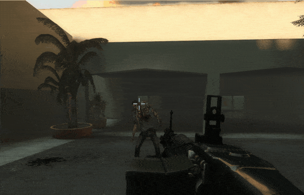

# Description | 內容
Make ragdolls from survivor/common infected/S.I./Witch vanish when they die.

> __Note__ <br/>
This plugin is private, Please contact [me](https://github.com/fbef0102/Game-Private_Plugin#私人插件列表-private-plugins-list)<br/>
此為私人插件, 請聯繫[本人](https://github.com/fbef0102/Game-Private_Plugin#私人插件列表-private-plugins-list)

* Apply to | 適用於
	```
	L4D1 
	L4D2
	```

* [Video | 影片展示](https://youtu.be/QJX4RjQ50Sk)

* <details><summary>Image | 圖示</summary>

	<br/>
	<br/>
	<br/>
	<br/>
	<br/>
</details>

* <details><summary>How does it work?</summary>

	* Ragdolls vanish when they die.
	* Survivors' death model vanish when they die, other players can not use defibrillator ro revive dead player
		* You can disable in cvars
	* Decrease server performance cost for dead bodies
</details>

* Require | 必要安裝
<br/>None

* <details><summary>ConVar | 指令</summary>

	* cfg/sourcemod/l4d_ragdoll_vanish.cfg
		```php
		// 0=Plugin off, 1=Plugin on.
		l4d_ragdoll_vanish_enable "1"

		// If 1, remove survivor death model.
		// (Fade slowly and vanish) Can't use defibrillator ro revive dead player in l4d2
		l4d_ragdoll_vanish_survivor_death_model "0"

		// 1=All ragdolls fade (witch, common, special infected, tank) (Can't adjust by each cvar)
		// 0=All ragdolls instantly vanish (adjust by each cvar)
		l4d_ragdoll_vanish_fade_instead "0"

		// If 1, remove common infected dead body.
		// (Instantly vanish)
		l4d_ragdoll_vanish_common_infected "1"

		// If 1, remove witch dead body.
		// (Instantly vanish)
		l4d_ragdoll_vanish_witch "0"

		// (L4D2) remove Which zombie class dead body, 0=None, 1=Smoker, =Boomer, 4=Hunter, 8=Spitter, 16=Jockey, 32=Charger, 64=Tank. Add numbers together. (127=All)
		// (Instantly vanish)
		l4d_ragdoll_vanish_infected_class "127"

		// (L4D1) clear Which zombie class dead body, 0=None, 1=Smoker, 2=Boomer, 4=Hunter, 8=Tank. Add numbers together. (15=All)
		// (Instantly vanish)
		l4d_ragdoll_vanish_infected_class "15"
		```
</details>

* <details><summary>Changelog | 版本日誌</summary>

	* v1.1h (2025-2-17)
		* Update cvars

	* v1.0h (2024-12-15)
		* Add cvars
		* Add S.I./Tank/Witch/Survivor

	* v1.1
		* [From SirPlease/L4D2-Competitive-Rework](https://github.com/SirPlease/L4D2-Competitive-Rework/blob/master/addons/sourcemod/scripting/l4d_common_ragdolls_be_gone.sp)
</details>

- - - -
# 中文說明
倖存者/普通殭屍/特感/Witch死亡時，屍體立馬消失

* 原理
	* 死亡時，屍體立馬消失
	* 倖存者死亡時，屍體會消失，其他玩家不能用電擊器復活 (可以到指令開關)

* 用意在哪?
	* 減少屍體影響視野
	* 減少屍體影響伺服器卡頓

* <details><summary>指令中文介紹 (點我展開)</summary>

	* cfg/sourcemod/l4d_ragdoll_vanish.cfg
		```php
		// 0=關閉插件, 1=啟動插件
		l4d_ragdoll_vanish_enable "1"

		// 為1時，倖存者死亡時，屍體會消失
		// (緩慢消失) 其他玩家不能用電擊器復活
		l4d_ragdoll_vanish_survivor_death_model "0"

		// 1=所有屍體緩慢消失 (Witch, 普通感染者, 特感, Tank) (不能分別調整指令開關)
		// 0=所有屍體瞬間消失 (可以分別調整指令)
		l4d_ragdoll_vanish_fade_instead "0"

		// 為1時，普通感染者死亡時，屍體會消失
		// (瞬間消失)
		l4d_ragdoll_vanish_common_infected "1"

		// 為1時，Witch死亡時，屍體會消失
		// (瞬間消失)
		l4d_ragdoll_vanish_witch "0"

		// (L4D2) 哪些特感死亡時，屍體會消失, 0=無, 1=Smoker, =Boomer, 4=Hunter, 8=Spitter, 16=Jockey, 32=Charger, 64=Tank. 請將數字相加. (127=全部)
		// (瞬間消失)
		l4d_ragdoll_vanish_infected_class "127"

		// (L4D1) 哪些特感死亡時，屍體會消失, 0=None, 1=Smoker, 2=Boomer, 4=Hunter, 8=Tank. Add numbers together. (15=全部)
		// (瞬間消失)
		l4d_ragdoll_vanish_infected_class "15"
		```
</details>