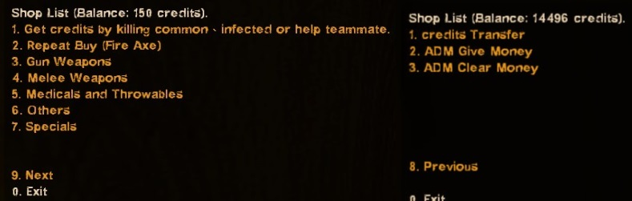
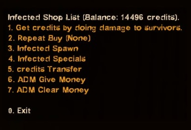
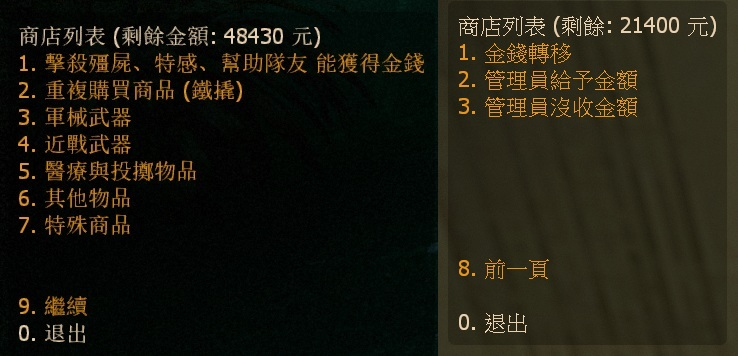
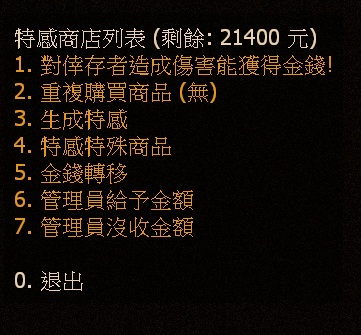
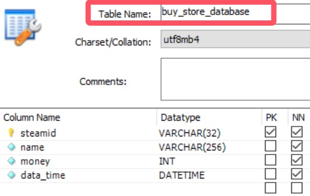

# Description | 內容
L4D2 Human and Zombie Shop by HarryPoter

> __Note__ <br/>
This plugin is private, Please contact [me](/#私人插件列表-private-plugins-list)<br/>
此為私人插件, 請聯繫[本人](/#私人插件列表-private-plugins-list)

* Apply to | 適用於
	```
	L4D2
	```

* [Video | 影片展示](https://youtu.be/LP0ALxlbaZE)

* <details><summary>Image</summary>

	<br/>
	<br/>
	<br/>
	<br/>
	<br/>
	<br/>
</details>

* <details><summary>How does it work?</summary>

	* Type ```!buy``` in chatbox, buy anything you want, have special items
	* (Survivor) Killing zombies and infected to earn credits
	* (Infected) Doing Damage to survivors to earn credits
	* Save player's credits to server. (Support Cookie & Database)
		* Player will can keep credits even if server restart or player disconnect from server
	* To see all items, pleace check: [data/L4D2_Buy_Store.cfg](data/L4D2_Buy_Store.cfg)
		* You can modify item price or disable item
		* Survivor Special items, check ```"survivorSpecial"```
		* Infected Special items, check ```"infectedSpecial"```
</details>

* Require | 必要安裝
	1. [left4dhooks](https://forums.alliedmods.net/showthread.php?t=321696)
	2. [[INC] Multi Colors](https://github.com/fbef0102/L4D1_2-Plugins/releases/tag/Multi-Colors)
	3. [Mission and Weapons - Info Editor](https://forums.alliedmods.net/showthread.php?t=310586): To unlock all melee weapons in all campaigns
		* 解鎖所有官方圖的近戰武器

* <details><summary>ConVar | 指令</summary>

	* cfg/sourcemod/L4D2_Buy_Store.cfg
		```php
		// Numbers of real survivor and infected player require to active this plugin.
		sm_shop_player_require "4"

		// If 1, use CookiesCached to save player money. Otherwise, the money will not be saved if player leaves the server.
		sm_shop_CookiesCached_enable "1"

		// Database to save money to.
		// Empty = don't connect to database
		// (MySQL & SQLite supported)
		sm_shop_database ""

		// Maximum money limit. (Money saved when map change/leaving server)
		sm_shop_max_money_limit "32000"

		// Disable Survivor Shop after survivors have left start safe area over X seconds. (0=Survivor Shop available anytime)
		sm_shop_survivor_disable_time "0"

		// Cold Down Time in seconds a survivor player can not buy again after player buys item. (0=No Cold Down).
		sm_shop_survivor_cooltime_block "5.0"

		// Giving money for killing a boomer  (0=off)
		sm_shop_boomerkilled "10"

		// Giving money for killing a charger  (0=off)
		sm_shop_chargerkilled "30"

		// Giving money for killing a smoker  (0=off)
		sm_shop_smokerkilled "20"

		// Giving money for killing a hunter  (0=off)
		sm_shop_hunterkilled "20"

		// Giving money for killing a jockey  (0=off)
		sm_shop_jockeykilled "25"

		// Giving money for killing a spitter  (0=off)
		sm_shop_spitterkilled "10"

		// Giving money on tank death, money = hurting tank hp ÷ this value (0=off)
		sm_shop_tank_hurt "100"

		// Giving money for killing a witch  (0=off)
		sm_shop_witchkilled "80"

		// Giving money for killing a zombie  (0=off)
		sm_shop_zombiekilled "1"

		// If 1, Giving money for healing people with kit (Money=Amount of health restored)
		sm_shop_heal_teammate "1"

		// Giving money for saving people with defibrillator  (0=off)
		sm_shop_defi_save "200"

		// Giving money for saving incapacitated people. (No Hanging from legde) (0=off)
		sm_shop_help_teammate_save "30"

		// If 1, decrease money if survivor friendly fire each other. (1 hp = 1 credit)
		sm_shop_survivor_TK_enable "1"

		// Giving money to each alive survivor for mission accomplished award (non-final). (0=off)
		sm_shop_stage_complete "400"

		// Giving money to each alive survivor for mission accomplished award (final). (0=off)
		sm_shop_final_mission_complete "3000"

		// Reduce money to each survivor player for mission lost (0=off)
		sm_shop_survivor_mission_lost "300"

		// Changes how 'You got credits by killing infected' Message displays. (0: Disable, 1:In chat, 2: In Hint Box, 3: In center text)
		sm_shop_kill_infected_announce_type "1"

		// "Changes how 'You got credits by helping teammate' Message displays. (0: Disable, 1:In chat, 2: In Hint Box, 3: In center text)
		sm_shop_help_teammate_announce_type "1"

		// If 1, Enable shop for infected.
		sm_shop_infected_enable "1"

		// Infected Shop available after survivors have left start safe area over X seconds. (0=Infected Shop available anytime)
		sm_shop_infected_open_time "10"

		// Cold Down Time in seconds an infected player can not buy again after player buys item. (0=No Cold Down).
		sm_shop_infected_cooltime_block "30.0"

		// Giving money for incapacitating a survivor. (No Hanging from legde) (0=off)
		sm_shop_infected_survivor_incap "30"

		// Giving money for killing a survivor. (0=off)
		sm_shop_infected_survivor_killed "100"

		// Giving money to each infected player for wiping out survivors. (0=off)
		sm_shop_infected_mission_lost "300"

		// Reduce money if tank players lose control and become AI tank. (0=off)
		sm_shop_tank_lost_control "1500"
		```
</details>

* <details><summary>Command | 命令</summary>

	* **Open shop menu**
		```php
		say "b"
		sm_shop
		sm_buy
		sm_b
		sm_money
		sm_purchase
		sm_market
		sm_item
		sm_items
		sm_credit
		sm_credits
		```

	* **Buy item short command list**
		```php
		Weapon
		{
			"!buy pistol" 				-> Pistol
			"!buy pistol_magnum"		-> Magnum
			"!buy pumpshotgun"			-> Pumpshotgun
			"!buy shotgun_chrome"		-> Chrome Shotgun
			"!buy smg"					-> Smg
			"!buy smg_silenced"			-> Silenced Smg
			"!buy smg_mp5"				-> MP5
			"!buy rifle"				-> Rifle
			"!buy rifle_ak47"			-> AK47
			"!buy rifle_desert"			-> Desert Rifle
			"!buy rifle_sg552"			-> SG552
			"!buy shotgun_spas"			-> Spas Shotgun
			"!buy autoshotgun"			-> Autoshotgun
			"!buy hunting_rifle"		-> Hunting Rifle
			"!buy sniper_military"		-> Military Sniper
			"!buy sniper_scout"			-> SCOUT
			"!buy sniper_awp"			-> AWP
			"!buy rifle_m60"			-> M60 Machine Gun
			"!buy grenade_launcher"		-> Grenade Launcher
		}

		Melee
		{
			"!buy chainsaw"				-> Chainsaw
			"!buy baseball_bat"			-> Baseball Bat
			"!buy cricket_bat"			-> Cricket Bat
			"!buy crowbar"				-> Crowbar
			"!buy electric_guitar"		-> Electric Guitar
			"!buy fireaxe"				-> Fire Axe
			"!buy frying_pan"			-> Frying Pan
			"!buy katana"				-> Katana
			"!buy machete"				-> Machete
			"!buy tonfa"				-> Tonfa
			"!buy golfclub"				-> Golf Club
			"!buy knife"				-> Knife
			"!buy pitchfork"			-> Pitchfork
			"!buy shovel"				-> Shovel
		}

		Medic and Throwable
		{
			"!buy health_100"			-> Health+100
			"!buy defibrillator"		-> Defibrillator
			"!buy first_aid_kit"		-> First Aid Kit
			"!buy pain_pills"			-> Pain Pill
			"!buy adrenaline"			-> Adrenaline
			"!buy pipe_bomb"			-> Pipe Bomb
			"!buy molotov"				-> Molotov
			"!buy vomitjar"				-> Vomitjar
		}

		Other
		{
			"!buy ammo"								-> Ammo
			"!buy laser_sight"						-> Laser Sight
			"!buy incendiary_ammo"					-> Incendiary Ammo
			"!buy explosive_ammo"					-> Explosive Ammo
			"!buy weapon_upgradepack_incendiary"	-> Incendiary Pack
			"!buy weapon_upgradepack_explosive"		-> Explosive Pack
			"!buy propanetank"						-> Propane Tank
			"!buy oxygentank"						-> Oxygen Tank
			"!buy fireworkcrate"					-> Firework Crate
			"!buy gascan"							-> Gascan
			"!buy cola_bottles"						-> Cola Bottles
			"!buy gnome"							-> Gnome
		}

		Survivor Special
		{
			"!buy fire"						-> Fire Yourself
			"!buy boom"						-> Drop Pipebomb
			"!buy adrenaline_power"			-> Gain Adrenaline Power
			"!buy revive"					-> Save Yourself
			"!buy fire_infeceted"			-> All Infected Gets On Fire
			"!buy teleport"					-> Teleport to teammate
			"!buy infinite_ammo"			-> Infinite Ammo
			"!buy no_ff"					-> No Friendly Fire
			"!buy dead_eyes"				-> Dead-Eyes
			"!buy kill_commons"				-> Kill Commons
			"!buy Kill_Witches"				-> Kill Witches
			"!buy heal_survivors"			-> Heal Survivors
			"!buy god_mode"					-> God Mode
			"!buy jump_add_1"				-> Jump On Air +1
			"!buy slay_infected"			-> Slay Infected Attacker
			"!buy Respawn"					-> Respawn Alive
			"!buy freeze_infected"			-> Freeze-Infected
		}

		Infected Spawn
		{
			"!buy suicide" 	-> Suicide
			"!buy smoker" 	-> Smoker
			"!buy boomer" 	-> Boomer
			"!buy hunter" 	-> Hunter
			"!buy spitter" 	-> Spitter
			"!buy jockey" 	-> Jockey
			"!buy charger" 	-> Charger
			"!buy tank" 	-> Tank
		}

		Infected Special
		{
			"!buy health" 	-> Restore Health
			"!buy teleport" -> Teleport to survivor
			"!buy immune" 	-> Immune Everything
			"!buy horde" 	-> Zombie Horde
			"!buy witch" 	-> Witch
		}
		```

	* **repeat purchase item you bought last time**
		```php
		sm_repeatbuy
		sm_lastbuy
		```

	* **donate money to another player (Or use "Credits Transfer" in shop menu)**
		```php
		sm_pay <name> <money>
		sm_donate <name> <money>
		```

	* **See all players' or specific player's deposit**
		```php
		sm_inspectbank [name]
		sm_checkbank [name]
		sm_lookbank [name]
		sm_allbank [name]
		```

	* **Adm gives/reduces money (ADMFLAG_ROOT)**
		```php
		sm_givemoney <name> <+-money>
		sm_givecredit <name> <+-money>
		```

	* **Adm removes player's all money (ADMFLAG_ROOT)**
		```php
		sm_clearmoney <name>
		sm_deductmoney <name>
		```
</details>

* <details><summary>Database</summary>

	* Choose one of the following method to save money
		1. CookiesCached: Save player money locally via sourcemod data, set ```sm_shop_CookiesCached_enable "1"``` 
			```php
			//Cookies are saved to sourcemod/data/sqlite/clientprefs-sqlite.sq3
			```

		2. MySQL: Database across server, set ```sm_shop_database "shop"``` and write the following in ```sourcemod/configs/databases.cfg```
			```php
			// There would a data table named "Buy_Store_database" in database
			"shop"
			{
				"driver"			"mysql"
				"host"				"x.x.x.x"
				"database"			"yourdatabase"
				"user"				"youruser"
				"pass"				"yourpass"
				"port"				"yourport"
			}
			```
</details>

* Translation Support | 支援翻譯
	```
	translations/L4D2_Buy_Store.phrases.txt
	```

* <details><summary>Changelog | 版本日誌</summary>

	* v5.7 (2025-7-23)
	* v5.6 (2024-12-12)
	* v5.5 (2024-12-7)
		* Update data
		* Update translation
		* Update cvars
		* Support custom melee from custom map

	* v5.4 (2024-6-19)
		* Fix translation

	* v5.3 (2024-2-16)
		* Reduce money if tank players lose control
		* Update Cvars

	* v5.2 (2023-11-7)
		* Add repeat buy in survivor meanu and infected menu
		* Add data file, more convenient to edit item price

	* v5.1 (2023-4-28)
		* Optimize Code

	* v5.0 (2022-11-15)
		* Add short buy commands, directly buy item.
		* Repeat purchase item you bought last time.
		* Add Survivor/Infected Special items
		* Support Database
		* Points Transfer
</details>

- - - -
# 中文說明
人類與特感的購物商城 (附有特殊商品與資料庫)

* <details><summary>圖示</summary>

	<br/>
	<br/>
	<br/>
	<br/>
	<br/>
	<br/>
</details>

* 原理
	* 輸入```!buy```購買商品，有特殊商品
	* (人類) 殺死特感與小殭屍獲取金額
	* (特感) 對倖存者造成傷害獲取金額
	* 能購轉移金錢給其他玩家
	* 支援Cookie或資料庫儲存
		* 玩家下次進來伺服器依然保留自己的金額
	* 查看所有可買商品，請閱讀文件: [data/L4D2_Buy_Store.cfg](data/L4D2_Buy_Store.cfg)
		* 可自行修改商品的價錢或是關閉商品
		* 人類特殊商品請查看```"survivorSpecial"```
		* 特感特殊商品請查看```"infectedSpecial"```

* <details><summary>指令中文介紹 (點我展開)</summary>

	* cfg/sourcemod/L4D2_Buy_Store.cfg
		```php
		// 倖存者與特感隊伍必須有至少4位以上的真人玩家才會啟動插件
		sm_shop_player_require "4"

		// 為1時，使用 CookiesCached 儲存玩家金錢. 意思是說，下次開服時，玩家依然保留上次遊玩的金額
		sm_shop_CookiesCached_enable "1"

		// 資料庫設定
		// 留白 = 不使用資料庫
		// (支援 MySQL & SQLite)
		sm_shop_database ""

		// 最大能儲存的金額
		sm_shop_max_money_limit "32000"

		// 倖存者離開安全區域超過此秒數後不能再購買商品 (0=人類可以在任意時間點購買)
		sm_shop_survivor_disable_time "0"

		// 倖存者再次購買商品的冷卻時間 (0=無冷卻時間).
		sm_shop_survivor_cooltime_block "5.0"

		// 殺死 Boomer 獲得的金額 (0=關閉這項功能)
		sm_shop_boomerkilled "10"

		// 殺死 Charger 獲得的金額 (0=關閉這項功能)
		sm_shop_chargerkilled "30"

		// 殺死 Smoker 獲得的金額 (0=關閉這項功能)
		sm_shop_smokerkilled "20"

		// 殺死 Hunter 獲得的金額 (0=關閉這項功能)
		sm_shop_hunterkilled "20"

		// 殺死 Jockey 獲得的金額 (0=關閉這項功能)
		sm_shop_jockeykilled "25"

		// 殺死 Spitter 獲得的金額 (0=關閉這項功能)
		sm_shop_spitterkilled "10"

		// Tank死亡後給予有造成傷害的倖存者金錢，金額 = 造成Tank傷害 ÷ 此數值 (0=關閉這項功能)
		sm_shop_tank_hurt "100"

		// 殺死 Witch 獲得的金額 (0=關閉這項功能)
		sm_shop_witchkilled "80"

		// 殺死 普通感染者 獲得的金額 (0=關閉這項功能)
		sm_shop_zombiekilled "1"

		// 為1時，使用治療包療隊友，可以獲得金額 (獲得金額=治療回復的血量)
		sm_shop_heal_teammate "1"

		// 電擊器復活隊友 獲得的金額 (0=關閉這項功能)
		sm_shop_defi_save "200"

		// 拯救倒地的隊友(掛邊不算) 獲得的金額 (0=關閉這項功能)
		sm_shop_help_teammate_save "30"

		// 為1時，友傷會扣除金錢 (每造成1hp友傷扣減1元)
		sm_shop_survivor_TK_enable "1"

		// 過關進入安全室時，活著的倖存者獲得的金額 (非救援關卡). (0=關閉這項功能)
		sm_shop_stage_complete "400"

		// 過關進入救援載具時，活著的倖存者獲得的金額 (救援關卡). (0=關閉這項功能)
		sm_shop_final_mission_complete "3000"

		// 滅團之後倖存者扣除的金額
		sm_shop_survivor_mission_lost "300"

		// "你殺死XXX獲得XX元" 提示該如何顯示. (0: 不提示, 1: 聊天框, 2: 黑底白字框, 3: 螢幕正中間)
		sm_shop_kill_infected_announce_type "1"

		// "你幫助隊友獲得XX元" 提示該如何顯示. (0: 不提示, 1: 聊天框, 2: 黑底白字框, 3: 螢幕正中間)
		sm_shop_help_teammate_announce_type "1"

		// 為1時，特感也能購買商品
		sm_shop_infected_enable "1"

		// 特感玩家必須等人類出門安全區域超過此秒數後才能購買商品 (0=特感可以在任意時間點購買)
		sm_shop_infected_open_time "10"

		// 特感玩家再次購買商品的冷卻時間 (0=無冷卻時間).
		sm_shop_infected_cooltime_block "30.0"

		// 使倖存者倒地的特感玩家(掛邊不算) 獲得的金額 (0=關閉這項功能)
		sm_shop_infected_survivor_incap "30"

		// 殺死倖存者的特感玩家(掛邊不算) 獲得的金額 (0=關閉這項功能)
		sm_shop_infected_survivor_killed "100"

		// 滅團之後特感玩家獲得的金額 (0=關閉這項功能)
		sm_shop_infected_mission_lost "300"

		// Tank玩家失去控制權變成AI tank，將扣除金額. (0=關閉這項功能)
		sm_shop_tank_lost_control "1500"
		```
</details>

* <details><summary>命令中文介紹 (點我展開)</summary>

	* **開啟商城列表**
		```php
		say "b"
		sm_shop
		sm_buy
		sm_b
		sm_money
		sm_purchase
		sm_market
		sm_item
		sm_items
		sm_credit
		sm_credits
		```

	* **直接購買商品短名列表**
		```php
		快速購買武器
		{
			"!buy pistol" 				-> 手槍
			"!buy pistol_magnum"		-> 沙漠之鷹
			"!buy pumpshotgun"			-> 木製霰彈槍
			"!buy shotgun_chrome"		-> 鐵製霰彈槍
			"!buy smg"					-> 機槍
			"!buy smg_silenced"			-> 消音機槍
			"!buy smg_mp5"				-> MP5衝鋒槍
			"!buy rifle"				-> 步槍
			"!buy rifle_ak47"			-> AK47
			"!buy rifle_desert"			-> 三連發步槍
			"!buy rifle_sg552"			-> SG552步槍
			"!buy shotgun_spas"			-> 戰鬥霰彈槍
			"!buy autoshotgun"			-> 連發霰彈槍
			"!buy hunting_rifle"		-> 獵槍
			"!buy sniper_military"		-> 軍用狙擊槍
			"!buy sniper_scout"			-> SCOUT狙擊槍
			"!buy sniper_awp"			-> AWP
			"!buy rifle_m60"			-> 殲滅者 M60
			"!buy grenade_launcher"		-> 榴彈發射器
		}

		快速購買近戰武器
		{
			"!buy chainsaw"				-> 奪魂鋸
			"!buy baseball_bat"			-> 球棒
			"!buy cricket_bat"			-> 板球拍
			"!buy crowbar"				-> 鐵撬
			"!buy electric_guitar"		-> 電吉他
			"!buy fireaxe"				-> 斧頭
			"!buy frying_pan"			-> 平底鍋
			"!buy katana"				-> 武士刀
			"!buy machete"				-> 開山刀
			"!buy tonfa"				-> 警棍
			"!buy golfclub"				-> 高爾夫球棒
			"!buy knife"				-> 小刀
			"!buy pitchfork"			-> 草叉
			"!buy shovel"				-> 鐵鏟
		}

		快速購買醫療與投擲物品
		{
			"!buy health_100"			-> 生命值+100
			"!buy defibrillator"		-> 電擊器
			"!buy first_aid_kit"		-> 治療包
			"!buy pain_pills"			-> 止痛藥丸
			"!buy adrenaline"			-> 腎上腺素
			"!buy pipe_bomb"			-> 土製炸彈
			"!buy molotov"				-> 火瓶
			"!buy vomitjar"				-> 膽汁
		}

		快速購買其他物品
		{
			"!buy ammo"								-> 彈藥補給
			"!buy laser_sight"						-> 雷射裝置
			"!buy incendiary_ammo"					-> 火焰子彈
			"!buy explosive_ammo"					-> 高爆子彈
			"!buy weapon_upgradepack_incendiary"	-> 火焰包
			"!buy weapon_upgradepack_explosive"		-> 高爆彈
			"!buy propanetank"						-> 瓦斯桶
			"!buy oxygentank"						-> 氧氣罐
			"!buy fireworkcrate"					-> 煙火盒
			"!buy gascan"							-> 汽油
			"!buy cola_bottles"						-> 可樂瓶
			"!buy gnome"							-> 精靈小矮人
		}

		快速購買人類特殊物品
		{
			"!buy fire"						-> 振火神通
			"!buy boom"						-> 爆爆王
			"!buy adrenaline_power"			-> 注射興奮劑
			"!buy revive"					-> 拯救自己
			"!buy fire_infeceted"			-> 炎之呼吸
			"!buy teleport"					-> 飛雷神之術
			"!buy infinite_ammo"			-> 無限子彈
			"!buy no_ff"					-> 不會造成與受到友傷
			"!buy dead_eyes"				-> 心靈透視
			"!buy kill_commons"				-> 殺死所有普通殭屍
			"!buy kill_witches"				-> 殺死所有Witch
			"!buy heal_survivors"			-> Heal Survivors
			"!buy heal_survivors"			-> 團隊治癒+100
			"!buy jump_add_1"				-> 超級瑪利歐, 空中跳躍+1
			"!buy slay_infected"			-> 處死攻擊你的特感
			"!buy respawn"					-> 魔法卡: 死者甦醒
			"!buy freeze_Infected"			-> 冰凍世界
		}

		快速購買特感種類
		{
			"!buy suicide" 	-> 自殺
			"!buy smoker" 	-> Smoker
			"!buy boomer" 	-> Boomer
			"!buy hunter" 	-> Hunter
			"!buy spitter" 	-> Spitter
			"!buy jockey" 	-> Jockey
			"!buy charger" 	-> Charger
			"!buy tank" 	-> Tank
		}

		快速購買特感特殊物品
		{
			"!buy health" 	-> 恢復一定血量
			"!buy teleport" -> 異時空傳送門 (Tank不能購買)
			"!buy immune" 	-> God 上帝模式
			"!buy horde" 	-> 屍潮降臨
			"!buy witch" 	-> 召喚Witch
		}
		```

	* **重複購買上次的商品**
		```php
		sm_repeatbuy
		sm_lastbuy
		```

	* **捐贈金額給其他人 (或在商城列表使用"金錢轉移")**
		```php
		sm_pay <玩家名稱> <金錢>
		sm_donate <玩家名稱> <金錢>
		```

	* **查看所有玩家的銀行儲值**
		```php
		sm_inspectbank [name]
		sm_checkbank [name]
		sm_lookbank [name]
		sm_allbank [name]
		```

	* **管理員打錢 (權限：ADMFLAG_ROOT)**
		```php
		sm_givemoney <玩家名稱> <+-金錢>
		sm_givecredit <玩家名稱> <+-金錢>
		```

	* **管理員沒收玩家的金錢 (權限：ADMFLAG_ROOT)**
		```php
		sm_clearmoney <玩家名稱>
		sm_deductmoney <玩家名稱>
		```
</details>

* <details><summary>資料庫設定</summary>

	* 以下方法二選一
		1. CookiesCached: 能幫玩家儲值金額到本地sourcemod庫上，開啟指令 ```sm_shop_CookiesCached_enable "1"```
			```php
			// 數據儲存於sourcemod/data/sqlite/clientprefs-sqlite.sq3
			```

		2. MySQL: 跨伺服器儲值金額，設定指令 ```sm_shop_database "shop"```，然後設定文件 ```sourcemod/configs/databases.cfg```
			```php
			// 資料庫中自動創建表格，名稱是 "Buy_Store_database"
			"shop"
			{
				"driver"			"mysql"
				"host"				"x.x.x.x"
				"database"			"yourdatabase"
				"user"				"youruser"
				"pass"				"yourpass"
				"port"				"yourport"
			}
			```
</details>


