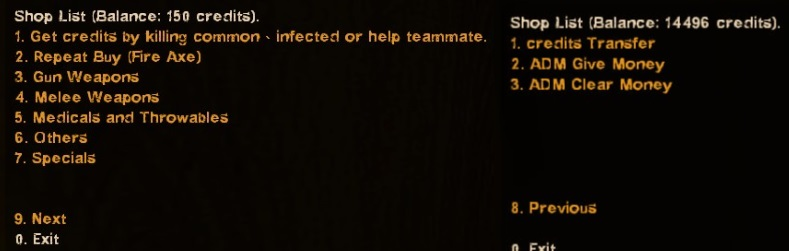
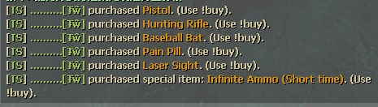
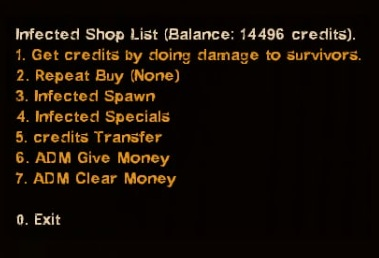
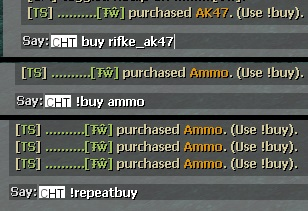
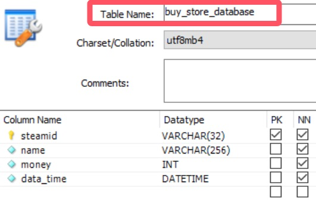
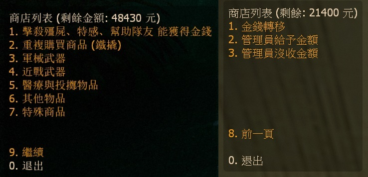
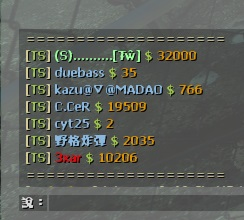
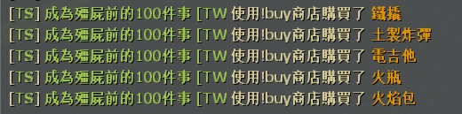
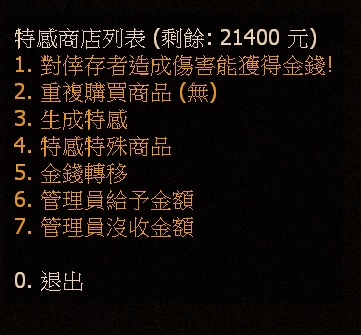
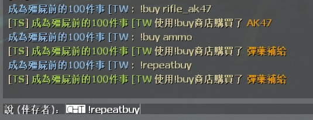

# Description | 內容
L4D2 Human and Zombie Shop by HarryPoter

> __Note__ <br/>
This plugin is private, Please contact [me](/#私人插件列表-private-plugins-list)<br/>
此為私人插件, 請聯繫[本人](/#私人插件列表-private-plugins-list)

* Apply to | 適用於
	```
	L4D2
	```

* [Video | 影片展示](https://youtu.be/LP0ALxlbaZE)

* <details><summary>Image</summary>

	<br/>
	<br/>
	<br/>
	<br/>
	<br/>
	<br/>
</details>

* <details><summary>How does it work?</summary>

	* Type ```!buy``` in chatbox, buy anything you want, have special items
	* (Survivor) Killing zombies and infected to earn credits
	* (Infected) Doing Damage to survivors to earn credits
	* Save player's credits to server. (Support Cookie & Database)
		* Player will can keep credits even if server restart or player disconnect from server
	* To see all items, pleace check: [data/L4D2_Buy_Store.cfg](data/L4D2_Buy_Store.cfg)
		* You can modify item price or disable item
		* Survivor Special items, check ```"survivorSpecial"```
		* Infected Special items, check ```"infectedSpecial"```
</details>

* Require | 必要安裝
	1. [left4dhooks](https://forums.alliedmods.net/showthread.php?t=321696)
	2. [[INC] Multi Colors](https://github.com/fbef0102/L4D1_2-Plugins/releases/tag/Multi-Colors)
	3. [Mission and Weapons - Info Editor](https://forums.alliedmods.net/showthread.php?t=310586): To unlock all melee weapons in all campaigns
		* 解鎖所有官方圖的近戰武器

* <details><summary>ConVar | 指令</summary>

	* cfg/sourcemod/L4D2_Buy_Store.cfg
		* Settings
			```php
			// Numbers of real survivor and infected player require to active this plugin.
			sm_shop_player_require "4"

			// How server saves money 
			// (0=Off, 1=Use cookie to save, 2=Use MySQL & SQLite to save)
			sm_shop_db_type "1"

			// Database to save money to.
			// Empty = don't connect to database
			// (only works with _db_type=2, MySQL & SQLite supported)
			sm_shop_database ""

			// Maximum money limit. (Money saved when map change/leaving server)
			sm_shop_max_money_limit "32000"

			// If new player join the sever, give credit (0=off)
			sm_shop_new_player_credit "100"

			// How many credits players will have after resetting point every new round? (only works with _db_type=0)
			sm_shop_reset_credit "150"

			// Changes how 'You got credits by killing infected' Message displays. (0: Disable, 1:In chat, 2: In Hint Box, 3: In center text)
			sm_shop_kill_infected_announce_type "1"

			// Changes how 'You got credits by helping teammate' Message displays. (0: Disable, 1:In chat, 2: In Hint Box, 3: In center text)
			sm_shop_help_teammate_announce_type "1"

			// Changes how 'You got credits by hurting survivor' Message displays. (0: Disable, 1:In chat, 2: In Hint Box, 3: In center text)
			sm_shop_infected_hurt_survivor_announce_type "1"
			```

		* Survivor
			```php
			// Disable Survivor Shop after survivors have left start safe area over X seconds. (0=Survivor Shop available anytime)
			sm_shop_survivor_disable_time "0"

			// Cold Down Time in seconds a survivor player can not buy again after player buys item. (0=No Cold Down).
			sm_shop_survivor_cooltime_block "5.0"

			// Giving money for killing a boomer  (0=off)
			sm_shop_boomerkilled "10"

			// Giving money for killing a charger  (0=off)
			sm_shop_chargerkilled "30"

			// Giving money for killing a smoker  (0=off)
			sm_shop_smokerkilled "20"

			// Giving money for killing a hunter  (0=off)
			sm_shop_hunterkilled "20"

			// Giving money for killing a jockey  (0=off)
			sm_shop_jockeykilled "25"

			// Giving money for killing a spitter  (0=off)
			sm_shop_spitterkilled "10"

			// Giving money for killing a tank (0=off)
			sm_shop_tankkilled "200"

			// Who will get the money when killing a tank? (0=All Survivors, 1=Attacker Only)
			sm_shop_tankkill_type "0"

			// Giving extra money if player does some damges to tank after tank dead, money = hurting tank hp ÷ this value (0=off)
			sm_shop_tank_hurt "100"

			// Giving money for killing a witch  (0=off)
			sm_shop_witchkilled "80"

			// How many killed infected does it take to earn money (0=off)
			sm_shop_zombiekilled_x "10"

		    // Giving money for killing a certain number of common infected (0=off)
			sm_shop_zombiekilled_y "1"

			// Giving money for healing people with kit (0=off, -1=Money is the amount of health restored)
			sm_shop_heal_teammate "1"

			// Giving money for saving people with defibrillator  (0=off)
			sm_shop_defi_save "200"

			// Giving money for saving incapacitated people. (No Hanging from legde) (0=off)
			sm_shop_help_teammate_save "30"

			// If 1, decrease money if survivor friendly fire each other. (1 hp = 1 credit)
			sm_shop_survivor_TK_enable "1"

			// Giving money to each alive survivor for mission accomplished award (non-final). (0=off)
			sm_shop_stage_complete "400"

			// Giving money to each alive survivor for mission accomplished award (final). (0=off)
			sm_shop_final_mission_complete "3000"

			// Reduce money to each survivor player for mission lost (0=off)
			sm_shop_survivor_mission_lost "300"

			// Giving money to player who protects teammates (0=off)
			sm_shop_survivor_protect_teammate "1"

			// Giving money to player who rescued the dead survivor (0=off)
			sm_shop_survivor_rescued "2"
			```

		* Infected
			```php
			// If 1, Enable shop for infected.
			sm_shop_infected_enable "1"

			// Infected Shop available after survivors have left start safe area over X seconds. (0=Infected Shop available anytime)
			sm_shop_infected_open_time "10"

			// Cold Down Time in seconds an infected player can not buy again after player buys item. (0=No Cold Down).
			sm_shop_infected_cooltime_block "30.0"

			// Giving money for incapacitating a survivor. (No Hanging from legde) (0=off)
			sm_shop_infected_survivor_incap "30"

			// Giving money for killing a survivor. (0=off)
			sm_shop_infected_survivor_killed "100"

			// Giving money to each infected player for wiping out survivors. (0=off)
			sm_shop_infected_mission_lost "300"

			// Reduce money if tank players lose control and become AI tank. (0=off)
			sm_shop_tank_lost_control "1500"

			// Giving money [as a charger] when a survivor is slammed into a wall/floor by a Charger. 0=Disabled
			sm_shop_infected_charger_slamme "1"

			// Giving money [as a charger] when a survivor is flung by a charger impact. 0=Disabled
			sm_shop_infected_charger_impact "1"

			// Giving money [as a boomer] when you vomit/explode on a survivor. (0=off)
			sm_shop_infected_boomer_vomit "1"

			// Giving money [as a smoker] when you grab a survivor. (0=off)
			sm_shop_infected_smoker_grab "1"

			// Giving money [as a hunter] when you pounce a survivor. (0=off)
			sm_shop_infected_hunter_pounce "1"

			// Giving money [as a jockey] when you ride on a survivor. (0=off)
			sm_shop_infected_jockey_ride "1"

			// How many damage done to survivors to earn money (0=off)
			sm_shop_infected_hurt_x "10"

			// Giving money for doing a certain number of damage to survivors (0=off)
			sm_shop_infected_hurt_y "2"
			```
</details>

* <details><summary>Command | 命令</summary>

	* **Open shop menu**
		```php
		say "b"
		sm_shop
		sm_buy
		sm_b
		sm_money
		sm_purchase
		sm_market
		sm_item
		sm_items
		sm_credit
		sm_credits
		```

	* **Buy item short command list**
		```php
		see data/L4D2_Buy_Store.cfg
		```

	* **repeat purchase item you bought last time**
		```php
		sm_repeatbuy
		sm_lastbuy
		```
</details>

* <details><summary>Database</summary>

	* Choose one of the following method to save money
		1. Cookies: Save player money locally via sourcemod data, 
			* Set plugin cvar
				```
				sm_shop_db_type "1"
				```
			* Data location
				```php
				// All data saved in sourcemod/data/sqlite/clientprefs-sqlite.sq3, please do not modify
				```

		2. MySQL: Database across server
			* Set plugin cvar
				```
				sm_shop_db_type "2"
				sm_shop_database "shop"
				```
			* Write the following in ```sourcemod/configs/databases.cfg```
				```php
				// There would a data table named "Buy_Store_database" in database
				"shop"
				{
					"driver"			"mysql"
					"host"				"x.x.x.x"
					"database"			"yourdatabase"
					"user"				"youruser"
					"pass"				"yourpass"
					"port"				"yourport"
				}
				```
</details>

* Translation Support | 支援翻譯
	```
	translations/L4D2_Buy_Store.phrases.txt
	```

* <details><summary>Changelog | 版本日誌</summary>

	* v6.1 (2026-4-19)
		* Support custom melee weapons from custom map

	* v6.0 (2026-4-4)
		* Add "ADM Give Money", "ADM Clear Money" in main menu (Root Admin only)
		* Update translation, data, cvars
		* Add more points if special infected attacks survivor
		* Control weapon max ammo limit when buy "Ammo"
		* Add more speical items in infected team

	* v5.9 (2026-1-11)
		* Update data, translation
		* Add survivor specail item "Respawn All": Respawn All Dead Survivors

	* v5.8 (2025-10-12)
		* Update data, translation, cvars

	* v5.7 (2025-7-23)
	* v5.6 (2024-12-12)
	* v5.5 (2024-12-7)
		* Update data
		* Update translation
		* Update cvars

	* v5.4 (2024-6-19)
		* Fix translation

	* v5.3 (2024-2-16)
		* Reduce money if tank players lose control
		* Update Cvars

	* v5.2 (2023-11-7)
		* Add repeat buy in survivor meanu and infected menu
		* Add data file, more convenient to edit item price

	* v5.1 (2023-4-28)
		* Optimize Code

	* v5.0 (2022-11-15)
		* Add short buy commands, directly buy item.
		* Repeat purchase item you bought last time.
		* Add Survivor/Infected Special items
		* Support Database
		* Points Transfer
</details>

- - - -
# 中文說明
人類與特感的購物商城 (附有特殊商品與資料庫)

* <details><summary>圖示</summary>

	<br/>
	<br/>
	<br/>
	<br/>
	<br/>
	<br/>
</details>

* 原理
	* 輸入```!buy```購買商品，有特殊商品
	* (人類) 擊殺特感與普通殭屍獲取金額
	* (特感) 對倖存者造成傷害獲取金額
	* 能購轉移金錢給其他玩家
	* 支援Cookie或資料庫儲存
		* 玩家下次進來伺服器依然保留自己的金額
	* 查看所有可買商品，請閱讀文件: [data/L4D2_Buy_Store.cfg](data/L4D2_Buy_Store.cfg)
		* 可自行修改商品的價錢或是關閉商品
		* 人類特殊商品請查看```"survivorSpecial"```
		* 特感特殊商品請查看```"infectedSpecial"```

* <details><summary>指令中文介紹 (點我展開)</summary>

	* cfg/sourcemod/L4D2_Buy_Store.cfg
		* 基本設置
			```php
			// 倖存者與特感隊伍必須有至少4位以上的真人玩家才會啟動插件
			sm_shop_player_require "4"

			// 如何儲存玩家金錢. 意思是說，下次開服時，玩家依然保留上次遊玩的金額 
			// (0=不儲存, 1=使用cookie本地儲存, 2=使用MySQL & SQLite跨服儲存)
			sm_shop_db_type "1"

			// 資料庫設定
			// 留白 = 不使用資料庫
			// (需要先設置指令 _db_type=2, 支援 MySQL & SQLite)
			sm_shop_database ""

			// 最大能儲存的金額
			sm_shop_max_money_limit "32000"

			// 新玩家的初始金額 (0=不給)
			sm_shop_new_player_credit "100"

			// 每回合開始時，所有玩家的初始金額 (需要先設置指令 _db_type=1,)
			sm_shop_reset_credit "150"

			// "你擊殺XXX獲得XX元" 提示該如何顯示. (0: 不提示, 1: 聊天框, 2: 黑底白字框, 3: 螢幕正中間)
			sm_shop_kill_infected_announce_type "1"

			// "你幫助隊友獲得XX元" 提示該如何顯示. (0: 不提示, 1: 聊天框, 2: 黑底白字框, 3: 螢幕正中間)
			sm_shop_help_teammate_announce_type "1"

			// "特感傷害倖存者獲得XX元" 提示該如何顯示. (0: 不提示, 1: 聊天框, 2: 黑底白字框, 3: 螢幕正中間)
			sm_shop_infected_hurt_survivor_announce_type "1"
			```

		* 倖存者設置
			```php
			// 倖存者離開安全區域超過此秒數後不能再購買商品 (0=人類可以在任意時間點購買)
			sm_shop_survivor_disable_time "0"

			// 倖存者再次購買商品的冷卻時間 (0=無冷卻時間).
			sm_shop_survivor_cooltime_block "5.0"

			// 擊殺 Boomer 獲得的金額 (0=關閉這項功能)
			sm_shop_boomerkilled "10"

			// 擊殺 Charger 獲得的金額 (0=關閉這項功能)
			sm_shop_chargerkilled "30"

			// 擊殺 Smoker 獲得的金額 (0=關閉這項功能)
			sm_shop_smokerkilled "20"

			// 擊殺 Hunter 獲得的金額 (0=關閉這項功能)
			sm_shop_hunterkilled "20"

			// 擊殺 Jockey 獲得的金額 (0=關閉這項功能)
			sm_shop_jockeykilled "25"

			// 擊殺 Spitter 獲得的金額 (0=關閉這項功能)
			sm_shop_spitterkilled "10"

			// 擊殺 Tank 獲得的金額 (0=關閉這項功能)
			sm_shop_tankkilled "200"

			// Tank死亡後誰能獲得 "_tankkilled" 的金額 (0=所有倖存者, 1=擊殺者)
			sm_shop_tankkill_type "0"

			// Tank死亡後給予有造成Tank傷害的倖存者金錢，金額 = 造成Tank傷害 ÷ 此數值 (0=關閉這項功能)
			sm_shop_tank_hurt "100"

			// 擊殺 Witch 獲得的金額 (0=關閉這項功能)
			sm_shop_witchkilled "80"

			// 擊殺 "_zombiekilled_x" 隻普通感染者才能獲得 "zombiekilled_y" 金額 (0=關閉這項功能)
			sm_shop_zombiekilled_x "10"

		    // 擊殺 "_zombiekilled_x" 隻普通感染者才能獲得 "zombiekilled_y" 金額 (0=關閉這項功能)
			sm_shop_zombiekilled_y "1"

			// 使用治療包療隊友，可以獲得的金額 (0=關閉這項功能, -1=獲得的金額等於治療回復的血量)
			sm_shop_heal_teammate "1"

			// 電擊器復活隊友 獲得的金額 (0=關閉這項功能)
			sm_shop_defi_save "200"

			// 拯救倒地的隊友(掛邊不算) 獲得的金額 (0=關閉這項功能)
			sm_shop_help_teammate_save "30"

			// 為1時，友傷會扣除金錢 (每造成1hp友傷扣減1元)
			sm_shop_survivor_TK_enable "1"

			// 過關進入安全室時，活著的倖存者獲得的金額 (非救援關卡) (0=關閉這項功能)
			sm_shop_stage_complete "400"

			// 過關進入救援載具時，活著的倖存者獲得的金額 (救援關卡) (0=關閉這項功能)
			sm_shop_final_mission_complete "3000"

			// 滅團之後倖存者扣除的金額
			sm_shop_survivor_mission_lost "300"

			// 保護隊友獲得的金額 (0=關閉這項功能)
			sm_shop_survivor_protect_teammate "1"

			// 拯救出救援房間內的隊友獲得的金額 (0=關閉這項功能)
			sm_shop_survivor_rescued "2"
			```

		* 感染者設置
			```php
			// 為1時，特感也能購買商品
			sm_shop_infected_enable "1"

			// 特感玩家必須等人類出門安全區域超過此秒數後才能購買商品 (0=特感可以在任意時間點購買)
			sm_shop_infected_open_time "10"

			// 特感玩家再次購買商品的冷卻時間 (0=無冷卻時間)
			sm_shop_infected_cooltime_block "30.0"

			// 使倖存者倒地的特感玩家(掛邊不算) 獲得的金額 (0=關閉這項功能)
			sm_shop_infected_survivor_incap "30"

			// 擊殺倖存者的特感玩家(掛邊不算) 獲得的金額 (0=關閉這項功能)
			sm_shop_infected_survivor_killed "100"

			// 滅團之後特感玩家獲得的金額 (0=關閉這項功能)
			sm_shop_infected_mission_lost "300"

			// Tank玩家失去控制權變成AI tank，將扣除的金額 (0=關閉這項功能)
			sm_shop_tank_lost_control "1500"

			// [Charger] 抓著倖存者撞牆或地板之後獲得的金額 (0=關閉這項功能)
			sm_shop_infected_charger_slamme "1"

			// [Charger] 撞飛倖存者獲得的金額 (0=關閉這項功能)
			sm_shop_infected_charger_impact "1"

			// [Boomer] 噴到或是炸到倖存者獲得的金額 (0=關閉這項功能)
			sm_shop_infected_charger_impact "1"

			// [Smoker] 拉到倖存者獲得的金額 (0=關閉這項功能)
			sm_shop_infected_smoker_grab "1"

			// [Hunter] 撲到倖存者獲得的金額 (0=關閉這項功能)
			sm_shop_infected_hunter_pounce "1"

			// [Jockey] 騎到倖存者獲得的金額 (0=關閉這項功能)
			sm_shop_infected_jockey_ride "1"

			// 對倖存者造成 "_infected_hurt_x" 傷害後才能獲得 "_infected_hurt_y" 金額 (0=關閉這項功能)
			sm_shop_infected_hurt_x "10"

			// 對倖存者造成 "_infected_hurt_x" 傷害後才能獲得 "_infected_hurt_y" 金額 (0=關閉這項功能)
			sm_shop_infected_hurt_y "2"
			```
</details>

* <details><summary>命令中文介紹 (點我展開)</summary>

	* **開啟商城列表**
		```php
		say "b"
		sm_shop
		sm_buy
		sm_b
		sm_money
		sm_purchase
		sm_market
		sm_item
		sm_items
		sm_credit
		sm_credits
		```

	* **直接購買商品短名列表**
		```php
		查看文件 data/L4D2_Buy_Store.cfg
		```

	* **重複購買上次的商品**
		```php
		sm_repeatbuy
		sm_lastbuy
		```
</details>

* <details><summary>資料庫設定</summary>

	* 以下方法二選一
		1. Cookies: 能幫玩家儲值金額到本地sourcemod資料庫上
			* 設置插件指令
				```
				sm_shop_db_type "1"
				```
			* 資料位置
				```php
				// 數據儲存於sourcemod/data/sqlite/clientprefs-sqlite.sq3，請不要修改此文件
				```

		2. MySQL: 跨伺服器儲值金額
			* 設置插件指令
				```
				sm_shop_db_type "2"
				sm_shop_database "shop"
				```
			* 設定文件 ```sourcemod/configs/databases.cfg```
				```php
				// 資料庫中自動創建表格，名稱是 "Buy_Store_database"
				"shop"
				{
					"driver"			"mysql"
					"host"				"x.x.x.x"
					"database"			"yourdatabase"
					"user"				"youruser"
					"pass"				"yourpass"
					"port"				"yourport"
				}
				```
</details>


