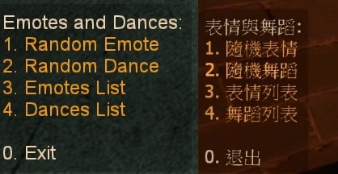
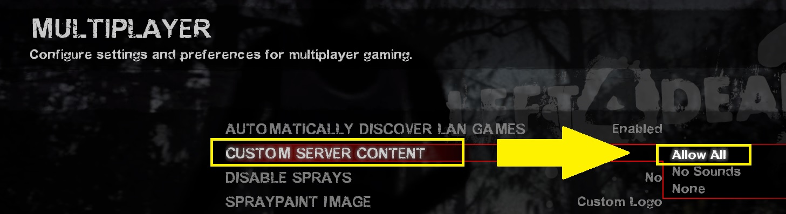
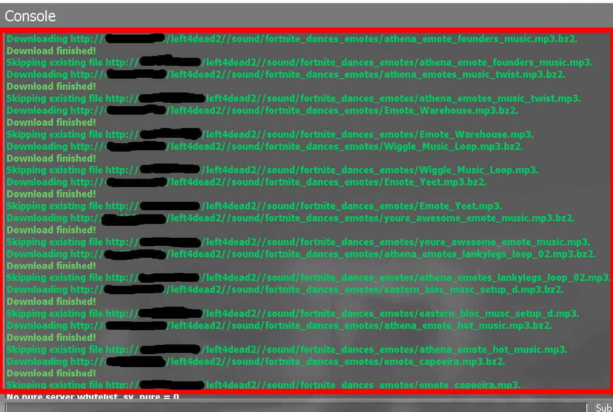
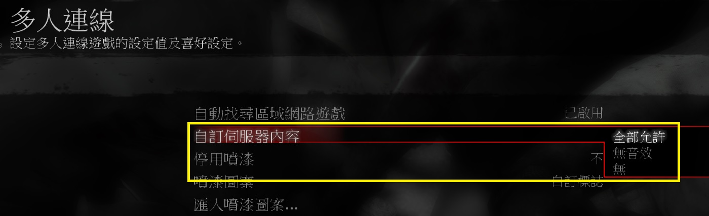

# Description | 內容
Emotes and Dance in L4D1/2

> __Note__ <br/>
This plugin is private, Please contact [me](/#私人插件列表-private-plugins-list)<br/>
此為私人插件, 請聯繫[本人](/#私人插件列表-private-plugins-list)

* Apply to | 適用於
	```
	L4D1
	L4D2
	```

* [Video | 影片展示](https://youtu.be/iIDv53oFaJE)

* Image | 圖示
	<br/>
	* Special Infected can dance (特感也可以跳舞)
	<br/>
	* Support Lux's Model Changer (支援模組改變)
	<br/>
	* You can move while dancing (可以一邊移動一邊跳舞)
	<br/>
	<br/>

* <details><summary>How does it work?</summary>

	* Everyone types ```!dance``` -> Enjoy, everyone can see you dance
	* Admin types ```!admin``` -> Player commands -> "Emote player" -> make player dance
	* You can import custom dance model, animation sequnce adn music in [addons/sourcemod/data/fortnite_dances_emotes_l4d.cfg](addons/sourcemod/data/fortnite_dances_emotes_l4d.cfg)
	* Use FastDL if you need players to download custom dance models and music files while joining server
</details>

* Require | 必要安裝
	1. [left4dhooks](https://forums.alliedmods.net/showthread.php?t=321696)
	2. [[INC] Multi Colors](https://github.com/fbef0102/L4D1_2-Plugins/releases/tag/Multi-Colors)
	3. 🟥 Prepare [your content-server for FastDL](https://developer.valvesoftware.com/wiki/FastDL): Players download dance model and sould files while joining server
		* 🟥 需[自備網空且支援FastDL](https://developer.valvesoftware.com/wiki/Zh/FastDL): 玩家進入伺服器時下載跳舞模型與音樂檔案 (不知道什麼是FastDL請自行Google)

* <details><summary>Support | 支援插件</summary>

	1. [l4d_force_client_custom_download](/L4D_插件/Player_玩家/l4d_force_client_custom_download): Force player to download your server's custom content
		* 強制玩家打開設置下載伺服器自製的檔案
	2. [Lux's Model Changer](https://github.com/fbef0102/L4D1_2-Plugins/tree/master/Luxs-Model-Changer): Change model and dance
		* 可以自由變成其他角色或NPC的模組然後跳舞
</details>

* <details><summary>ConVar | 指令</summary>

	* cfg/sourcemod/fortnite_dances_emotes_l4d.cfg
		```php
		// Enable/Disable sounds for emotes/dances. (Needs to restart map)
		fortnite_dances_emotes_l4d_sounds "0"

		// Cooldown for emotes/dances in seconds. -1 or 0 = no cooldown.
		fortnite_dances_emotes_l4d_cooldown "2.0"

		// Sound volume for the emotes/dances. [0.0-1.0]
		fortnite_dances_emotes_l4d_sound_volume "1.0"

		// Players with these flags have access to use sm_dance [ID] cmd to dance. (Empty = Everyone, -1: Nobody)
		fortnite_dances_emotes_l4d_flag_dance_cmd ""

		// Players with these flags have access to use emotes menu. (Empty = Everyone, -1: Nobody)
		fortnite_dances_emotes_l4d_flag_emote_menu ""

		// Players with these flags have access to use dances menu. (Empty = Everyone, -1: Nobody)
		fortnite_dances_emotes_l4d_flag_dance_menu ""

		// If 1, Hide weapons when dancing
		fortnite_dances_emotes_l4d_hide_weapons "1"

		// If 1, Hide enemy players when dancing
		fortnite_dances_emotes_l4d_hide_enemies "0"

		// 0=Player can move freely while dancing (The attached models such as hats won't follow the dance movement)
		// 1=Player can't move while dancing. (The attached models such as hats will follow the dance movement)
		fortnite_dances_emotes_l4d_teleportonend "0"

		// Sets the playback speed of the animation. [0.0-1.0]
		fortnite_dances_emotes_l4d_speed "0.80"

		// Player [1=Dance, 2=Emotes, 3=Random] when someone uses kit to heal him. (0=off)
		fortnite_dances_emotes_l4d_heal_dance "3"
		```
</details>

* <details><summary>Command | 命令</summary>
	
	* **Open Dance&Emote Menu**
		```php
		sm_dances
		sm_dance
		```

	* **Dance for specific Emote ID, check data file to see Emote ID**
		```php
		sm_dances [Emote ID]
		sm_dances [Emote ID]
		```

	* **Adm forces someone to dance, check data file to see Emote ID (Adm required: ADMFLAG_ROOT)**
		```php
		sm_setdances <#userid|name> [Emote ID]
		sm_setdance <#userid|name> [Emote ID]
		```
</details>

* <details><summary>How to make player download custom models and sounds</summary>

	1. Preparation
		* Download all files(addons, models, and sound).
		* Prepare [your content-server for FastDL](https://developer.valvesoftware.com/wiki/FastDL), if you don't know what "FastDL" is, please google it
		* Allow HTTP (Port 80 needed to be open), not HTTPS

	2. Setup server to work with downloadable content
		* Write down in your ```cfg/server.cfg```:
			* If you are L4D1
			```php
			sm_cvar sv_allowdownload "1"
			sm_cvar sv_downloadurl "http://your-content-server.com/left4dead/"
			```
			* If you are L4D2
			```php
			sm_cvar sv_allowdownload "1"
			sm_cvar sv_downloadurl "http://your-content-server.com/left4dead2/"	
			```

	3. Uploading files to server.
		* Upload "models" and "sound" folder to content-server
			* If you are L4D1, ```your-content-server.com/left4dead/models/``` and ```your-content-server.com/left4dead/sound/```
			* If you are L4D2, ```your-content-server.com/left4dead2/models/``` and ```your-content-server.com/left4dead2/sound/```
		* Upload "models" and "sound" folder to game server.
			* If you are L4D1, ```Left 4 Dead Dedicated Server/left4dead```
			* If you are L4D2, ```Left 4 Dead 2 Dedicated Server/left4dead2```
		* Upload "models" and "sound" folder to your client's game folder (for test).
			* If you are L4D1, ```left 4 dead/left4dead/models/``` and ```left 4 dead/left4dead/sound/```
			* If you are L4D2, ```Left 4 Dead 2/left4dead2/models/``` and ```Left 4 Dead 2/left4dead2/sound/```

	4. Start the server and test
		* Launch your game, Options-> Multiplayer -> CUSTOM SERVER CONTENT -> Allow All
		<br/>
		* Connect to server. 
		* Join survivor and type ```!dance```.

	5. Players download custom mp3 files when connecting to your server
		* 🟥 They need to set "Options-> Multiplayer -> CUSTOM SERVER CONTENT -> Allow All"
		<br/>
</details>

* Translation Support | 支援翻譯
	```
	translations/fortnite_dances_emotes_l4d.phrases.txt
	```

* <details><summary>Related Plugin | 相關插件</summary>

	1. [l4d_MusicMapStart](https://github.com/fbef0102/L4D1_2-Plugins/tree/master/l4d_MusicMapStart): Download and play custom music in game
		* 回合開始播放音樂，使用!music點歌系統，可播放自製的音樂
	2. [map-decals](https://github.com/fbef0102/L4D1_2-Plugins/tree/master/map-decals): Allows admins to place any decals into the map that are defined in the the config and save them permanently for each map
		* 允許管理員將任何塗鴉放置在配置中定義的地圖中，並為每個地圖永久保存它們
</details>

* <details><summary>Changelog | 版本日誌</summary>

	* v2.0h (2025-12-5)
		* Update cvars, cmds, data, translation
		* Player can now use cmd to dance for specific Emote ID

	* v1.9h (2025-10-16)
		* You can add more custom dance model in data file
		* Change dance model, author: nearlycivilized

	* v1.8h (2025-6-16)
		* Fixed cvar not working
		* add more native and api

	* v1.7h (2025-1-31)
		* You can move and jump while dancing
		* Fixed stuck or falling if dance on the evelator or any other moving vehicle
	
	* v1.5h (2024-9-23)
		* Compatible with with "Lux's Model Changer"

	* v1.4h (2024-5-8)
		* Update Translation
		* Update cvars
		* Add api
		* Change plugin name

	* v1.3h (2024-4-1)
		* Update Translation
		* Update cmds
		* Add "Emote player" in admin menu under 'Player commands' category

	* v1.2h (2024-3-25)
		* Fixed camera stuck when player dies

	* v1.1h (2024-3-13)
		* Fixed infected flashight off after dance end
		* Add Gamedata
		* Support readyup

	* v1.0h (2024-3-1)
		* Require left4dhooks
		* Survivor can't dance if is incap, hanging from ledge or get pinned by infected
		* Infected can't dance if is dead, or pinning survivor
		* Update translation

	* v1.5.3 (2023-12-24)
		* Fixed crash in some custom maps

	* v1.5.2 (2023-11-10)
		* Fixed crash when other plugins trying to call "CreateFakeClient"

	* v1.5.1 (2023-10-20)
		* Ghost infected can not dance

	* v1.5.0 (2022-11-14)
		* Player dances when someone uses kit to heal him
		* fix translation error
		* fix file error
		* Compatibility support for SourceMod 1.11. Fixed various warnings.
		* Combine L4D1 and L4D2 required files
		* Add convar to disable dance dounce and stop downloading sound files

	* Original & Credit
		* [Original plugin by Kodua, Franc1sco franug, TheBO$$, Foxhound](https://forums.alliedmods.net/showpost.php?p=2712458&postcount=163)
		* [Dance model by nearlycivilized](https://forums.alliedmods.net/showpost.php?p=2823676&postcount=261)
</details>

- - - -
# 中文說明
搞笑動作模組: 表情與舞蹈

* 原理
	* 任何人輸入```!dance```可以跳舞，所有玩家都會看到你在跳舞
	* 管理員輸入` ```!admin``` -> "玩家指令" -> "設置玩家表情/跳舞" -> 指定玩家跳舞
	* 玩家的模組做特殊的動作，即使是訂閱工作仿的角色皮膚模組，依然能做表情與舞蹈
	* 可自定義與載入自己的跳舞模型與音樂資源，詳情看文件: [addons/sourcemod/data/fortnite_dances_emotes_l4d.cfg](addons/sourcemod/data/fortnite_dances_emotes_l4d.cfg)
	* 如果要玩家自動下載跳舞模型與音樂，請自行準備fastdl

* <details><summary>指令中文介紹 (點我展開)</summary>

	* cfg/sourcemod/fortnite_dances_emotes_l4d.cfg
		```php
		// 0=關閉跳舞音樂, 1=啟動跳舞音樂 (需要重啟地圖才會生效)
		fortnite_dances_emotes_l4d_sounds "1"

		// 再次跳舞的CD時間, -1或0 = 無CD.
		fortnite_dances_emotes_l4d_cooldown "3.0"

		// 跳舞音樂的音量 [數值介於 0.0~1.0] (1.0是最大了)
		fortnite_dances_emotes_l4d_sound_volume "1.0"

		// 擁有這些權限的玩家，可以使用命令: sm_dance [ID] (留白 = 任何人都能, -1: 無人)
		fortnite_dances_emotes_l4d_flag_dance_cmd ""

		// 擁有這些權限的玩家，可以使用表情 (留白 = 任何人都能, -1: 無人)
		fortnite_dances_emotes_l4d_flag_emote_menu ""

		// 擁有這些權限的玩家，可以使用跳舞 (留白 = 任何人都能, -1: 無人)
		fortnite_dances_emotes_l4d_flag_dance_menu ""

		// 為1時，跳舞時隱藏武器
		fortnite_dances_emotes_l4d_hide_weapons "1"

		//為1時，跳舞時隱藏敵人
		fortnite_dances_emotes_l4d_hide_enemies "0"

		// 0=跳舞時可以移動 (玩家的裝飾譬如帽子插件不會跟隨跳舞而有變化)
		// 1=跳舞時不可移動，跳舞完畢後回到原始的位置 (玩家的裝飾譬如帽子插件會跟隨跳舞而有位置變化)
		fortnite_dances_emotes_l4d_teleportonend "0"

		// 跳舞速度 [數值介於 0.0~1.0]
		fortnite_dances_emotes_l4d_speed "0.80"

		// 玩家被治療時，開始跳舞 [1=跳舞, 2=做表情, 3=隨機] (0=關閉這項功能)
		fortnite_dances_emotes_l4d_heal_dance "3"
		```
</details>

* <details><summary>命令中文介紹 (點我展開)</summary>
	
	* **打開跳舞選單**
		```php
		sm_dances
		sm_dance
		```

	* **指定舞蹈ID直接跳舞, 跳舞ID請查看data文件**
		```php
		sm_dances [Emote ID]
		sm_dances [Emote ID]
		```

	* **管理員指定舞蹈ID並強制玩家跳舞, 跳舞ID請查看data文件 (權限: ADMFLAG_ROOT)**
		```php
		sm_setdances <#userid|name> [Emote ID]
		sm_setdance <#userid|name> [Emote ID]
		```
</details>

* <details><summary>如何使玩家自動下載跳舞檔案</summary>

	1. 準備清單
		* 下載所有文件（跳舞模組與音樂檔案）。
		* 準備[你的網空並可以支援FastDL](https://developer.valvesoftware.com/wiki/Zh/FastDL), 不知道什麼是FastDL請自行Google
		* 網空的網站允許HTTP協定 (Port 80 必須打開)，注意不是 HTTPS

	2. 設置伺服器以處理可下載的內容
		* 寫入以下內容到```cfg/server.cfg```
			* 如果你是 L4D1
			```php
			sm_cvar sv_allowdownload "1"
			sm_cvar sv_downloadurl "http://your-content-server.com/left4dead/"
			```
			* 如果你是 L4D2
			```php
			sm_cvar sv_allowdownload "1"
			sm_cvar sv_downloadurl "http://your-content-server.com/left4dead2/"	
			```
		
	3. 上傳文件到伺服器。
		* 將"models" 和 "sound"資料夾上傳到網空伺服器
			* 如果你是 L4D1，```your-content-server.com/left4dead/models/``` 和 ```your-content-server.com/left4dead/sound/```
			* 如果你是 L4D2，```your-content-server.com/left4dead2/models/``` 和 ```your-content-server.com/left4dead2/sound/```
		* 將"models" 和 "sound"資料夾複製到您的伺服器資料夾上。
			* 如果你是 L4D1，```Left 4 Dead Dedicated Server/left4dead/models/``` 和 ```Left 4 Dead Dedicated Server/left4dead/sound/```
			* 如果你是 L4D2，```Left 4 Dead 2 Dedicated Server/left4dead2/models/``` 和 ```Left 4 Dead 2 Dedicated Server/left4dead/sound/```
		* 將"models" 和 "sound"資料夾上傳到您的遊戲本地資料夾（用於測試）。
			* 如果你是 L4D1，```left 4 dead/left4dead/models/``` 和 ```left 4 dead/left4dead/sound/```
			* 如果你是 L4D2，```Left 4 Dead 2/left4dead2/models/``` 和 ```Left 4 Dead 2/left4dead2/sound/```
		
	4. 啟動伺服器並測試
		* 打開你的遊戲，選項->多人連線->自訂伺服器內容->全部允許
		<br/>
		* 連線到伺服器
		* 加入倖存者並輸入```!dance```，測試跳舞是否有動作

	5. 玩家加入伺服器時，會自動下載自製的音樂檔案 
		* 🟥 玩家必須自己打開"選項->多人連線->自訂伺服器內容->全部允許"
		<br/>
</details>
