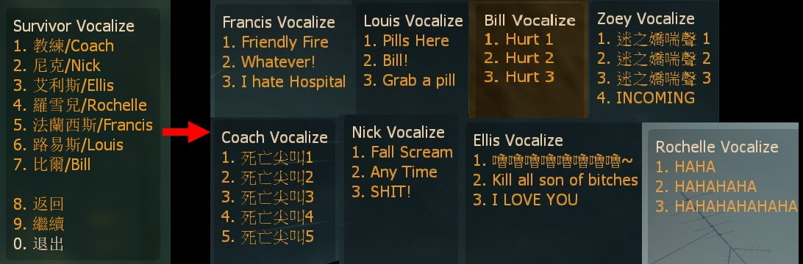

# Description | 內容
Player can select other character's voice and vocalize

> __Note__ <br/>
This plugin is private, Please contact [me](/#私人插件列表-private-plugins-list)<br/>
此為私人插件, 請聯繫[本人](/#私人插件列表-private-plugins-list)

* Apply to | 適用於
	```
	L4D1
	L4D2
	```

* [Video | 影片展示](https://youtu.be/EVW_neSFDLg)

* <details><summary>Image | 圖示</summary>

	<br/>
	* All characters' vocalize menu (Custom) - 所有角色的語音 (可自定義)
	<br/>
	<br/>
	<br/>
</details>

* <details><summary>How does it work?</summary>

	* Type ```!vocal``` -> choose any sound to vocalize -> Have Fun!
</details>

* Require | 必要安裝
<br/>None

* <details><summary>ConVar | 指令</summary>

	* cfg/sourcemod/l4d_character_vocalize_select.cfg
		```php
		// 0=Plugin off, 1=Plugin on.
		l4d_character_vocalize_select_enable "1"

		// How message displays when playe selects vocalize. (0: Disable, 1:In chat, 2: In Hint Box, 3: In center text)
		l4d_character_vocalize_select_announce_type "1"

		// Cold Down Time in seconds a player can use menu again. (0=No Cold Down)
		l4d_character_vocalize_select_cooldown_time "0.5"

		// Press which button to trigger full auto mode, 131072=Shift, 4=Ctrl, 32=Use, 8192=Reload, 524288=Middle Mouse
		// You can add numbers together, ex: 655360=Shift + Middle Mouse
		l4d_character_vocalize_select_buttons_key "8192"

		// Hold button key for at least X seconds to open menu. (-1=Disable button)
		l4d_character_vocalize_select_button_press "2.0"

		// If 1, player can only select his own character
		l4d_character_vocalize_select_model_only "0"
		```
</details>

* <details><summary>Command | 命令</summary>

	* **Open vocalize menu**
		```php
		sm_vocal
		```
</details>

* <details><summary>Data Config</summary>

	* [data/l4d_character_vocalize_select.cfg](data/l4d_character_vocalize_select.cfg)
		> Manual in this file, click for more details...
</details>

* <details><summary>Changelog | 版本日誌</summary>

	* v1.2 (2025-9-16)
		* Update cvars

	* v1.1 (2024-8-19)
		* Add Infeced/NPC/Custom
		* Update menu
		* Update data
		* Update cvars

	* v1.0 (2023-4-6)
	    * Initial Release
</details>

- - - -
# 中文說明
可以使用所有角色語音並發出對話，能自定義語音列表

* 原理
	* 輸入```!vocal```或者長按```R鍵```兩秒鐘，會出現語音選單列表
	* 可以選擇其他角色並發出專屬於其他角色的語音
	* 語音列表可以自定義，見下方“Data設定範例”

* 用意在哪?
	* 娛樂，開黑好玩用
	* 瘋狂死亡尖叫
	* 假裝自己是特感或NPC

* <details><summary>指令中文介紹 (點我展開)</summary>

	* cfg/sourcemod/l4d_character_vocalize_select.cfg
		```php
		// 0=關閉插件, 1=啟動插件
		l4d_character_vocalize_select_enable "1"

		// 玩家選擇語音的提示該如何顯示. (0: 不提示, 1: 聊天框, 2: 黑底白字框, 3: 螢幕正中間)
		l4d_character_vocalize_select_announce_type "1"

		// 語音冷卻時間 (0=無冷卻)
		l4d_character_vocalize_select_cooldown_time "0.5"

		// 使用哪個按鍵出現語音選單? 131072=Shift鍵, 4=Ctrl鍵, 32=E鍵, 8192=R鍵, 524288=滾輪鍵
		// 可以數字相加, 譬如: 655360=必須同時按 "Shift鍵+滾輪鍵"
		l4d_character_vocalize_select_buttons_key "8192"

		// 長按鍵位出現語音選單列表的時間. (-1=關閉這項功能)
		l4d_character_vocalize_select_button_press "2.0"

		// 為1時, 玩家只能選擇自己的角色語音
		l4d_character_vocalize_select_model_only "0"
		```
</details>

* <details><summary>命令中文介紹 (點我展開)</summary>

	* **打開語音選單列表**
		```php
		sm_vocal
		```
</details>

* <details><summary>文件設定範例</summary>

	* [data/l4d_character_vocalize_select.cfg](data/l4d_character_vocalize_select.cfg)
		> 內有中文說明，可點擊查看
</details>
