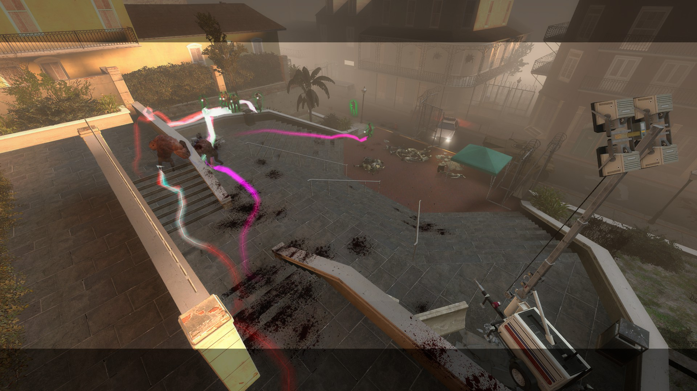
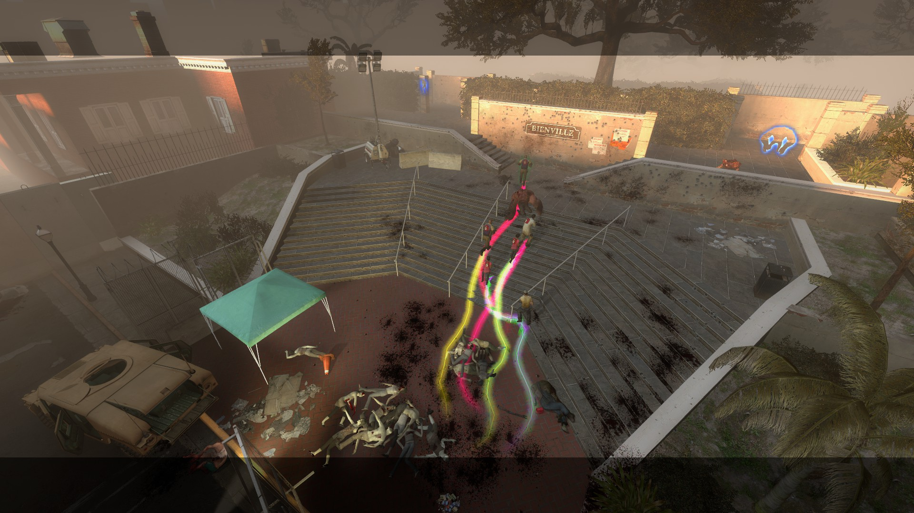
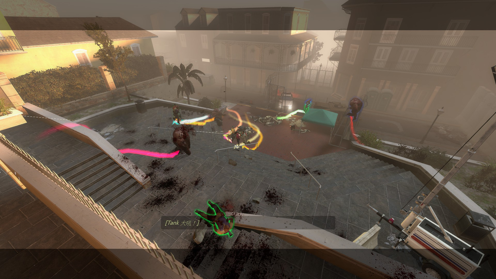
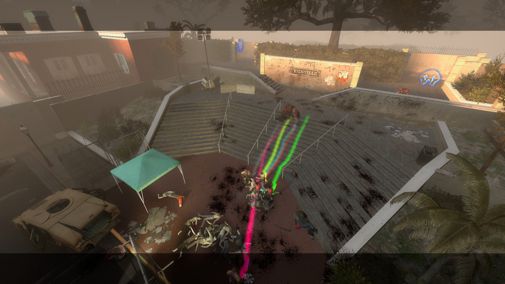
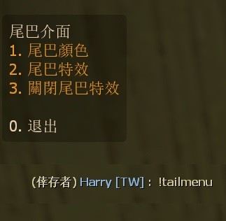

# Description | 內容
l4d player tail effect (prop_dynamic_override)

> __Note__ <br/>
This plugin is private, Please contact [me](/#私人插件列表-private-plugins-list)<br/>
此為私人插件, 請聯繫[本人](/#私人插件列表-private-plugins-list)

* Apply to | 適用於
	```
	L4D1
	L4D2
	```

* [Video | 影片展示](https://youtu.be/VC7-96qwwuo)

* <details><summary>Image | 圖示</summary>

	<br/>
	<br/>
	<br/>
	<br/>
</details>

* <details><summary>How does it work?</summary>

	* Type ```!tailmenu``` -> choose colors and sprite -> have fun
	* You can add Custom Colors or tail sprite in [configs/l4d_player_tail.cfg](addons/sourcemod/configs/l4d_player_tail.cfg)
	* 🟥 Tail could temporarily disappear if player stop moving
</details>


* Require | 必要安裝
	1. [left4dhooks](https://forums.alliedmods.net/showthread.php?t=321696)
	2. [[INC] Multi Colors](https://github.com/fbef0102/L4D1_2-Plugins/releases/tag/Multi-Colors)

* <details><summary>ConVar | 指令</summary>

	* cfg/sourcemod/l4d_player_tail.cfg
		```php
		// 1=Enable Tail effect for everyone default? [1-Enable/0-Disable]
		l4d_player_tail_default_value "1"

		// Enable Tail effect for Survivor, 1=Bot, 2=Real player, 3=Both
		l4d_player_tail_survivor_enable "3"

		// Enable Tail effect for Infected, 1=Bot, 2=Real player, 3=Both
		l4d_player_tail_infected_enable "3"

		// Players with these flags have access to have tail effect and use tail command. (Empty = Everyone, -1: Nobody)
		l4d_player_tail_command_access_flag ""

		// Transparency of the tail (10-255).
		l4d_player_tail_color_alpha "100"

		// The default tail color for survivor. 
		// Three values between 0-255 separated by spaces. RGB Color255 - Red Green Blue. [-1 -1 -1: Random]
		l4d_player_tail_color_sur "-1 -1 -1"

		// The default tail color for infected.
		// Three values between 0-255 separated by spaces. RGB Color255 - Red Green Blue. [-1 -1 -1: Random]
		l4d_player_tail_color_inf "-1 -1 -1"

		// How long the beam is shown. (Tail could temporarily disappear if player stop moving)
		// This value must greater than or equal to _changecolor_interval
		l4d_player_tail_lifetime "5.0"

		// The width of the beam to the beginning.
		l4d_player_tail_startwidth "10.0"

		// The width of the beam when it has full expanded.
		l4d_player_tail_endwidth "1.0"

		// The default attached tail height
		l4d_player_tail_height "5.0"

		// Time interval to change tail color to random (0=Don't change color)
		l4d_player_tail_changecolor_interval "0"

		// If 1, setup small beam sprite in middle of tail
		l4d_player_tail_middle_beam "1"

		// Players with these flags have access to open tail menu. (Empty = Everyone, -1: Nobody)
		l4d_player_tail_menu_access_flag ""

		// Database to save personal tail settings. (MySQL & SQLite supported, Empty = Off)
		l4d_player_tail_database ""
		```
</details>

* <details><summary>Command | 命令</summary>

	* **Toggle the attached tailed. Usage: sm_tail [R G B|off|random|red|green|blue|purple|cyan|orange|white|pink|lime|maroon|teal|yellow|grey]**
		```php
		sm_tail
		sm_tails
		```

	* **Open tail menu**
		```php
		sm_tailmenu
		```
</details>

* <details><summary>Database</summary>

	* Choose one of the following method
		1. MySQL: Database across server, you must build your own extra database system
			* Set ConVar ```l4d_player_tail_database "tail"``` and write the following in ```sourcemod/configs/databases.cfg```
				```php
				// There would a data table named "L4D_Player_Tail" in database
				"tail"
				{
					"driver"			"mysql"
					"host"				"x.x.x.x"
					"database"			"yourdatabase"
					"user"				"youruser"
					"pass"				"yourpass"
					"port"				"yourport"
				}
				```

		2. SQLite: SourceMod built-in Local Database, you don't have to install an additional database
			* Set ConVar ```l4d_player_tail_database "tail"``` and write the following in ```sourcemod/configs/databases.cfg```
				```php
				// There would be a file created: sourcemod/data/sqlite/tail.sq3
				"tail"
				{
					"driver"			"sqlite"
					"database"			"tail"
				}
				```
</details>

* Translation Support | 支援翻譯
	```
	translations/l4d_player_tail.phrases.txt
	```

* <details><summary>Similar Plugin | 相似插件</summary>

	1. [l4d_player_spritetrail](/L4D_插件/Fun_娛樂/l4d_player_spritetrail)
		> 一樣是尾巴特效，看自己喜歡用哪一種
</details>

* <details><summary>Changelog | 版本日誌</summary>

	* v2.1 (2025-2-17)
		* Update menu

	* v2.0 (2024-12-14)
		* Update cvars

	* v1.9 (2024-7-9)
		* Fix not working in l4d1

	* v1.8 (2023-10-28)
		* Fix memory leak

	* v1.7 (2023-8-15)
		* Translation Support

	* v1.6 (2023-1-23)
		* Support database to save personal tail settings. (MySQL & SQLite supported)
		* Add a convar ```l4d_player_tail_database```

	* v1.5 (2023-1-22)
		* Fixed client crash: received failure code 6.
		* Fixed missing model.
		* Delete a convar ```l4d_player_tail_sprite_model```

	* v1.4 (2023-1-13)
		* Add a convar, access flags to open tail menu

	* v1.3
		* Add menu to choose color and sprite model
		* Support custom sprite model

	* v1.2
	    * Initial Release
</details>

- - - -
# 中文說明
玩家走路，會有尾巴特效 (使用物件: prop_dynamic_override)

* 圖示
<br/>

* 原理
	* 線條色塊，逐漸變色
	* 輸入```!tail```開關尾巴特效或者```!tailmenu```打開介面選擇顏色與貼圖
	* 會自動儲存於資料庫，下次玩家進來伺服器，顏色與貼圖保持不變
	* 尾巴過一段時間會隨機變色
	* 可以設定文件[configs/l4d_player_tail.cfg](addons/sourcemod/configs/l4d_player_tail.cfg)，自定義尾巴的顏色與圖案
	* 🟥 如果倖存者不動，尾巴特效會短暫消失

* <details><summary>指令中文介紹 (點我展開)</summary>

	* cfg/sourcemod/l4d_player_tail.cfg
		```php
		// 為1時，幫所有玩家預設打開特效尾巴
		l4d_player_tail_default_value "1"

		// 倖存者打開特效尾巴, 1=Bot, 2=真人玩家, 3=兩者都打開
		l4d_player_tail_survivor_enable "3"

		// 特感打開特效尾巴, 1=Bot, 2=真人玩家, 3=兩者都打開
		l4d_player_tail_infected_enable "3"

		// 擁有這些權限的玩家，才可以使用尾巴特效 (留白 = 任何人都能, -1: 無人)
		l4d_player_tail_command_access_flag ""

		// 尾巴顏色透明度 (10-255).
		l4d_player_tail_color_alpha "100"

		// 設置倖存者尾巴顏色
		// 填入RGB三色 (三個數值介於0~255，需要空格) [-1 -1 -1: 隨機顏色]
		l4d_player_tail_color_sur "-1 -1 -1"

		// 設置特感尾巴顏色
		// 填入RGB三色 (三個數值介於0~255，需要空格) [-1 -1 -1: 隨機顏色]
		l4d_player_tail_color_inf "-1 -1 -1"

		// 尾巴特效的時間 (如果玩家不動，尾巴特效可能會暫時消失)
		// 指令數值必須大於或等於 ```l4d_player_tail_changecolor_interval``` 指令數值
		l4d_player_tail_lifetime "5.0"

		// 尾巴特效的起點寬度
		l4d_player_tail_startwidth "10.0"

		// 尾巴特效的終點寬度
		l4d_player_tail_endwidth "1.0"

		// 尾巴特效的高度
		l4d_player_tail_height "5.0"

		// 每X秒變更尾巴特效的顏色 (0=顏色不變化)
		l4d_player_tail_changecolor_interval "0"

		// 為1時，尾巴特效中間再增加一條線
		l4d_player_tail_middle_beam "1"

		// 擁有這些權限的玩家，才可以打開尾巴特效介面選擇顏色與貼圖 (留白 = 任何人都能, -1: 無人)
		l4d_player_tail_menu_access_flag ""

		// 資料庫的名稱. (MySQL & SQLite supported, 留白=不使用資料庫)
		l4d_player_tail_database ""
		```
</details>

* <details><summary>命令中文介紹 (點我展開)</summary>

	* **!tail <顏色名稱或R G B>. 顏色: red, green, blue, purple, orange, yellow, white. 或是 3 個 0-255 RGB之值. 譬如: !tail red 或是 !tail 255 0 0**
		```php
		sm_tail
		sm_tails
		```
		
	* **打開尾巴選單介面**
		```php
		sm_tailmenu
		```
</details>

* <details><summary>資料庫設定</summary>

	* 以下方法二選一
		1. MySQL: 支援跨伺服器，您需要另外安裝並使用自己的資料庫，儲值玩家的數據
			* 如果不會安裝就選擇第二種方法
			* 設定指令 ```l4d_player_tail_database "tail"```，然後設定文件 ```sourcemod/configs/databases.cfg```
				```php
				// 資料庫中自動創建表格，名稱是 "L4D_Player_Tail"
				"tail"
				{
					"driver"			"mysql"
					"host"				"x.x.x.x"
					"database"			"yourdatabase"
					"user"				"youruser"
					"pass"				"yourpass"
					"port"				"yourport"
				}
				```

		2. SQLite: Sourcemod自帶的本地資料庫，您無須另外安裝
			* 設定指令 ```l4d_player_tail_database "tail"```，然後設定文件 ```sourcemod/configs/databases.cfg```
				```php
				// 自動創建檔案: sourcemod/data/sqlite/tail.sq3
				"tail"
				{
					"driver"			"sqlite"
					"database"			"tail"
				}
				```
</details>
