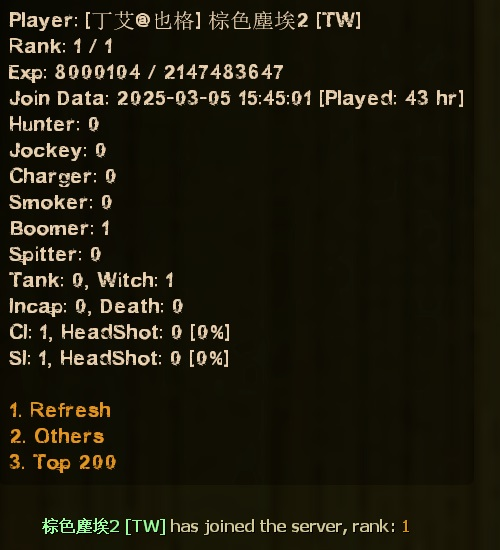
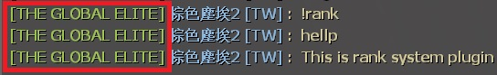
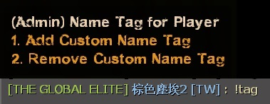
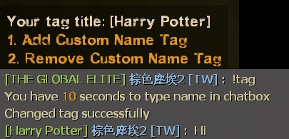
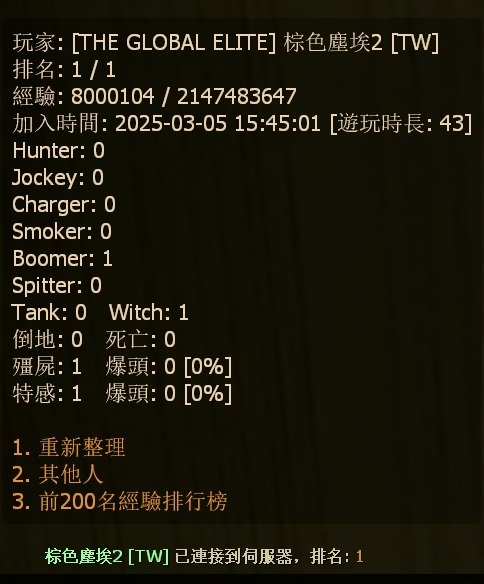
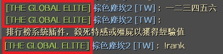
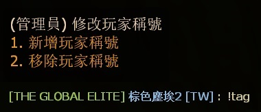
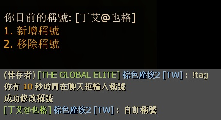
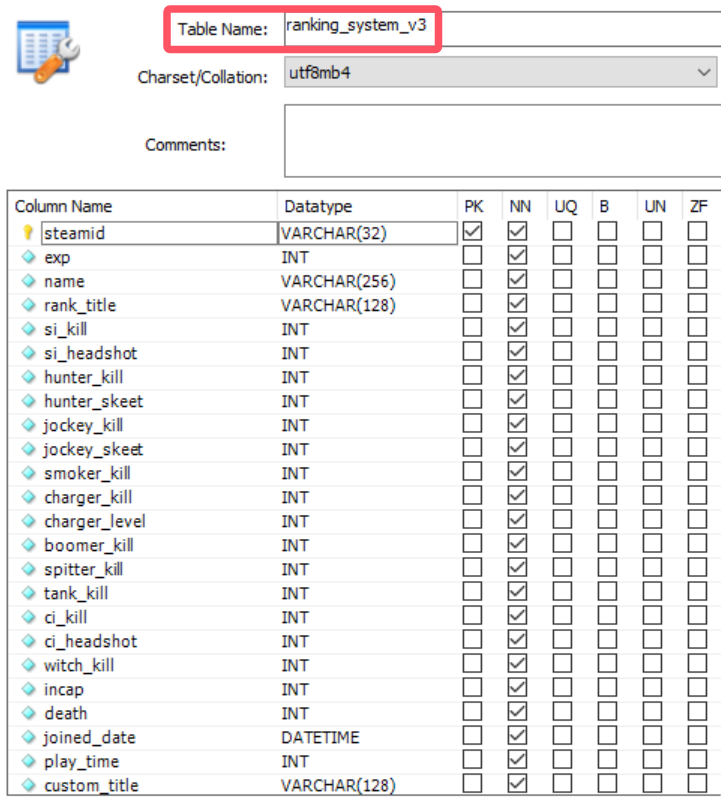

# Description | 內容
Kill infected to get Exp and rank, type !rank to show rank menu, save database

> __Note__ <br/>
This plugin is private, Please contact [me](/#私人插件列表-private-plugins-list)<br/>
此為私人插件, 請聯繫[本人](/#私人插件列表-private-plugins-list)

* Apply to | 適用於
	```
	L4D1
	L4D2
	```

* Image | 圖示
	<br/>
	<br/>

* <details><summary>How does it work?</summary>

	* Kill common infected, tank, witch, and special infected to get exp, and save exp in database
	* Lose exp if incap, die, or friendy fire...
	* Type ```!rank``` to see your statistics
	* Give different rank tag based on exp
	* Add rank tag to player name in chatbox
	* Admin can type ```!tag``` to change other player's tag name
	<br/>
	* Non-Admin players can type ```!tag``` to change tag name (if enough exp)
	<br/>
	* You can modify rank title and color in [configs/l4d_ranking_system.cfg](configs/l4d_ranking_system.cfg)
	* Save Database (MySQL & SQLite supported)
	<br/>
</details>

* Require | 必要安裝
	1. [left4dhooks](https://forums.alliedmods.net/showthread.php?t=321696)
	2. [[INC] Multi Colors](https://github.com/fbef0102/L4D1_2-Plugins/releases/tag/Multi-Colors)
	3. [simple_chatprocessor](https://github.com/fbef0102/Sourcemod-Plugins/tree/main/simple_chatprocessor)
	4. [smlib](https://github.com/fbef0102/L4D1_2-Plugins/releases/tag/smlib-Colors)

* <details><summary>Support | 支援插件</summary>

	1. [readyup](/L4D_插件/Server_伺服器/readyup): Display rank hud while hide readyup hud
		* readyup顯示期間不會被rank面板擋住
	2. [l4d2_skill_detect](https://github.com/fbef0102/L4D1_2-Plugins/tree/master/l4d2_skill_detect): Skeet hunter, jockey or level charger to get more exp
		* 人類透過花式技巧殺死特感可以獲得更多經驗值
	3. [simple-chatcolors](/Source_插件/Fun_娛樂/simple-chatcolors): Support chat color
		* 修改聊天窗口的對話顏色，可以與Rank稱號一起顯示
</details>

* <details><summary>ConVar | 指令</summary>

	* cfg/sourcemod/l4d_ranking_system.cfg
		```php
		// 0=Plugin off, 1=Plugin on.
		l4d_ranking_system_allow "1"

		// Numbers of real survivor + infected player require to active this plugin.
		l4d_ranking_system_player_require "2"

		// Database to save ranking system. (MySQL & SQLite supported)
		l4d_ranking_system_database "rank"

		// Giving exp for killing a smoker (0=off)
		l4d_ranking_system_smoker_killed "5"

		// Giving exp for killing a boomer (0=off)
		l4d_ranking_system_boomer_killed "3"

		// Giving exp for killing a hunter (0=off)
		l4d_ranking_system_hunter_killed "4"
		
		// Giving exp if skeet a hunter (0=off)
		// need to install l4d2_skill_detect by Harry
		l4d_ranking_system_hunter_skeeted "8"

		// Giving exp for killing a jockey (0=off)
		l4d_ranking_system_jockey_killed "6"

		// Giving exp if skeet a jockey (0=off)
		// need to install l4d2_skill_detect by Harry
		l4d_ranking_system_jockey_skeeted "12"

		// Giving exp for killing a charger (0=off)
		l4d_ranking_system_charger_killed "7"

		// Giving exp if level a charger (0=off)
		// need to install l4d2_skill_detect by Harry
		l4d_ranking_system_charger_leveled "14"

		// Giving exp for killing a spitter (0=off)
		l4d_ranking_system_spitter_killed "3"

		// Giving exp for killing a witch (0=off)
		l4d_ranking_system_witch_killed "100"

		// Giving exp for killing a tank (0=off)
		l4d_ranking_system_tank_killed "30"
		
		// Giving exp for killing a zombie (0=off)
		l4d_ranking_system_zombie_killed "1"

		// Notify message when kill 1=Smoker, 2=Boomer, 4=Hunter, 8=Spitter, 16=Jockey, 32=Charger, 64=Tank, 128=Witch, 256=CI. Add numbers together (0=Off, 511=All)
		l4d_ranking_system_zombie_notify_flag "1"

		// Notify message whe 1=Join server, 2=left server, 4=join survivor team. Add numbers together (0=Off, 7=All)
		l4d_ranking_system_join_leave_notify_flag "1"

		// If 1, add rank title to player name in chatbox (0=off)
		l4d_ranking_system_rank_display "1"

		// How many top rank players to display in 'Top Players' menu
		l4d_ranking_system_top_rank_numbers "10"

		// If 1, Display your rank panel when join server
		l4d_ranking_system_join_server_display "1"

		// Lose exp when survivors wipe out (mission lost). (0=off)
		l4d_ranking_system_survivor_mission_lost "50"

		// Lose exp when incap. (0=off)
		l4d_ranking_system_survivor_incap "50"

		// Lose exp when die. (0=off)
		l4d_ranking_system_survivor_death "50"

		// Lose exp if friendly fire-kill teammate. (0=off)
		l4d_ranking_system_survivor_ff_kill "200"

		// Lose exp multiplier if firendly fire damage. (0=off)
		l4d_ranking_system_survivor_ff_multi "2.0"

		// Players with these flags have access to use command to change other player's rank title. type !tag to open menu (Empty = Everyone, -1: Nobody)
		l4d_ranking_system_custom_tag_access_flag "z"

		// No access players can use command to change his own rank title if exp over this value. type !tag to change (0=off)
		l4d_ranking_system_custom_tag_exp_threshold "800000"
		```
</details>

* <details><summary>Command | 命令</summary>

	* **Open Rank System Menu**
		```php
		sm_rank
		sm_rankmenu
		```

	* **(Admin) Open menu to change other player's rank title manually**
	* **(No-Admin) Set or Remove custom rank title**
		```php
		sm_tag
		```

	* **(Server) Set player's rank title manually**
		```php
		sm_tag <player name> <tag>
		```

	* **(Server) Remove player's custom rank title**
		```php
		sm_tag <player name>
		```
</details>

* <details><summary>API | 串接</summary>

	* [l4d_ranking_system.inc](scripting/include/l4d_ranking_system.inc)
		```php
		library name: l4d_ranking_system
		```
</details>

* <details><summary>How to Set Database</summary>

	* Choose one of the following method
		1. MySQL: Database across server, set ConVar ```l4d_ranking_system_database "rank"``` and write the following in ```sourcemod/configs/databases.cfg```
			```php
			// There would a data table named "Ranking_System_V3" in database
			"rank"
			{
				"driver"			"mysql"
				"host"				"x.x.x.x"
				"database"			"yourdatabase"
				"user"				"youruser"
				"pass"				"yourpass"
				"port"				"yourport"
			}
			```

		2. SQLite: Local Database, set ConVar ```l4d_ranking_system_database "rank"``` and write the following in ```sourcemod/configs/databases.cfg```
			```php
			// There would be a file created: sourcemod/data/sqlite/rank_system.sq3
			"rank"
			{
				"driver"			"sqlite"
				"database"			"rank_system"
			}
			```
</details>

* Translation Support | 支援翻譯
	```
	translations/l4d_ranking_system.phrases.txt
	```

* <details><summary>Changelog | 版本日誌</summary>

	* v1.9h (2025-6-21)
		* Add cmd
		* Update translation

	* v1.8h (2025-3-5)
		* Require simple_chatprocessor
		* Add translation support
		* Add more exp
		* Custom rank title
		* Add colors for rank title
		* Update cvars, config
		* Update database

	* v1.8 (2024-2-28)
		* Replace OnClientPutInServer with OnClientPostAdminCheck to fix client can't load data from database

	* v1.7 (2024-1-20)
		* Compatible with simple-chatcolors by harry
		* Add API

	* v1.6 (2023-11-5)
		* Require simple_chatprocessor & smlib

	* v1.5 (2023-5-9)
		* Add rank title to player name

	* v1.4 (2023-4-28)
		* Optimize Code

	* v1.3 (2023-1-16)
		* Add 
			1. number of SI kills
			2. number of Witch kills
			3. number of CI Kills
			4. number of Tank Kills
			5. number of SI headshots
			6. number of CI headshots
			7. and how long player playing on this server start from joined date


	* v1.2 (2022-12-23)
		* Show rank hud when new player joins and new round starts

	* v1.1
		* Supporty MySQL and Local-SQLite

	* v1.0
		* Initial Release
</details>

- - - -
# 中文說明
殺死殭屍與特感獲得經驗值與頭銜名稱，輸入!rank顯示排行榜選單

* 圖示
	<br/>
	<br/>

* 原理
	* 殺死殭屍與特感獲得經驗值，根據玩家的經驗值獲得對應的Rank頭銜名稱
	* 友傷黑槍隊友、滅團、倒地、死亡...，扣除經驗值
	* 在聊天框的玩家名子前顯示Rank頭銜名稱
	* 輸入```!rank```隨時查看自己或他人資料
	* 可自訂Rank名稱與顏色，位於[configs/l4d_ranking_system_V3.cfg](configs/l4d_ranking_system_V3.cfg)
		* 內有中文說明，可點擊查看
	* 管理員可以輸入 ```!tag``` 修改其他玩家的Rank名稱
	<br/>
	* 非管理員的玩家可以輸入 ```!tag``` 修改自己的稱號 (必須達到一定的經驗值)
	<br/>
	* 使用資料庫保存玩家的經驗值 (支援 MySQL & SQLite)
	<br/>

* <details><summary>指令中文介紹 (點我展開)</summary>

	* cfg/sourcemod/l4d_ranking_system.cfg
		```php
		// 0=插件關閉, 1=插件開啟.
		l4d_ranking_system_allow "1"

		// 至少需要X位真人玩家在倖存者與特感隊伍才能獲得經驗值.
		l4d_ranking_system_player_require "2"

		// 儲存經驗值、稱號、排行系統的資料庫設定. (支援 MySQL & SQLite)
		l4d_ranking_system_database "rank"

		// 殺死Smoker所獲得的經驗值 (0=關閉)
		l4d_ranking_system_smoker_killed "5"

		// 殺死Boomer所獲得的經驗值 (0=關閉)
		l4d_ranking_system_boomer_illed "3"

		// 殺死Hunter所獲得的經驗值 (0=關閉)
		l4d_ranking_system_hunter_killed "4"

		// 空爆Hunter所獲得的戰力值 (0=關閉)
		// 需安裝插件l4d2_skill_detect by Harry
		l4d_ranking_system_hunter_skeeted "8"

		// 殺死Jockey所獲得的經驗值 (0=關閉)
		l4d_ranking_system_jockey_killed "6"

		// 空爆Jockey所獲得的戰力值 (0=關閉)
		// 需安裝插件l4d2_skill_detect by Harry
		l4d_ranking_system_jockey_skeeted "12"

		// 殺死Charger所獲得的經驗值 (0=關閉)
		l4d_ranking_system_charger_killed "7"

		// 秒殺衝鋒的Charger所獲得的戰力值 (0=關閉)
		// 需安裝插件l4d2_skill_detect by Harry
		l4d_ranking_system_charger_leveled "14"

		// 殺死Spitter所獲得的經驗值 (0=關閉)
		l4d_ranking_system_spitter_killed "3"

		// 殺死Witch所獲得的經驗值 (0=關閉)
		l4d_ranking_system_witch_killed "100"

		// 殺死Tank所獲得的經驗值 (0=關閉)
		l4d_ranking_system_tank_killed "30"

		// 殺死普通感染者所獲得的經驗值 (0=關閉)
		l4d_ranking_system_zombie_killed "1"

		// 當殺死 1=Smoker, 2=Boomer, 4=Hunter, 8=Spitter, 16=Jockey, 32=Charger, 64=Tank, 128=Witch, 256=普通感染者時 提示獲得經驗值. 數字相加起來 (0=關閉提示, 511=全部)
		l4d_ranking_system_zombie_notify_flag "511"

		// 當玩家 1=連線進服後, 2=離開伺服器時, 4=加入倖存者時 提示所有人該玩家的排名. 數字相加起來 (0=關閉提示, 7=全部)
		l4d_ranking_system_join_leave_notify_flag "7"

		// 玩家在聊天室框聊天時，1=玩家名稱會加上稱號，0=玩家名稱不加稱號
		l4d_ranking_system_rank_display_name "1"

		// '經驗排行榜' 顯示多少個排名玩家?
		l4d_ranking_system_top_rank_numbers "200"

		// 為1時，玩家進來後自動顯示Rank面板
		l4d_ranking_system_join_display_hud "1"

		// 團滅損失XX經驗值. (0=關閉)
		l4d_ranking_system_survivor_mission_lost "50"

		// 倖存者倒地損失XX經驗值. (0=關閉)
		l4d_ranking_system_survivor_incap "50"

		// 倖存者死亡損失XX經驗值. (0=關閉)
		l4d_ranking_system_survivor_death "50"

		// 友傷黑死隊友損失XX經驗值. (0=關閉)
		l4d_ranking_system_survivor_ff_kill "200"

		// 倖存者攻擊隊友損失友傷乘上X倍的經驗值. (0=關閉)
		l4d_ranking_system_survivor_ff_multi "2"

		// 擁有這權限的管理員可以自訂稱號或幫別人取稱號，使用!tag打開菜單 (留空 = Everyone, -1: Nobody)
		l4d_ranking_system_custom_tag_access_flag "z"

		// 沒有權限的玩家，如果經驗值達到此數值可以自訂稱號，使用!tag (0=沒有權限的玩家永遠不能改稱號)
		l4d_ranking_system_custom_tag_exp_threshold "800000"
		```
</details>

* <details><summary>命令中文介紹 (點我展開)</summary>

	* **打開 Rank System 選單**
		```php
		sm_rank
		sm_rankmenu
		sm_rk
		```

	* **(管理員) 修改其他人的Rank稱號**
	* **(非管理員的玩家) 修改自己的Rank稱號**
		```php
		sm_tag
		```

	* **(伺服器後台) 設置玩家的Rank稱號**
		```php
		sm_tag <player name> <tag>
		```

	* **(伺服器後台) 移除玩家的Rank稱號**
		```php
		sm_tag <player name>
		```
</details>

* <details><summary>如何設定資料庫</summary>

	* 以下方法二選一
		1. MySQL: 支援跨伺服器儲值，設定指令 ```l4d_ranking_system_database "rank"```，然後設定文件 ```sourcemod/configs/databases.cfg```
			```php
			// 資料庫中自動創建表格，名稱是 "Ranking_System_V3"
			"rank"
			{
				"driver"			"mysql"
				"host"				"x.x.x.x"
				"database"			"yourdatabase"
				"user"				"youruser"
				"pass"				"yourpass"
				"port"				"yourport"
			}
			```
			
		2. SQLite: 本地資料庫儲值，設定指令 ```l4d_ranking_system_database "rank"```，然後設定文件 ```sourcemod/configs/databases.cfg```
			```php
			// 自動創建檔案: sourcemod/data/sqlite/rank_system.sq3
			"rank"
			{
				"driver"			"sqlite"
				"database"			"rank_system"
			}
			```
</details>