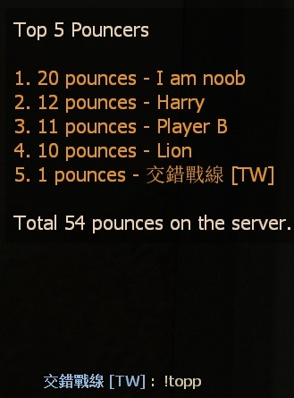
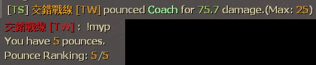
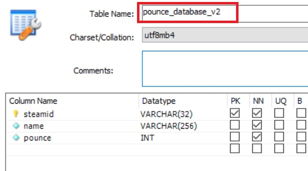

# Description | 內容
Adding a statistic of hunter 25 damage pounces, and save to database

> __Note__ <br/>
This plugin is private, Please contact [me](https://github.com/fbef0102/Game-Private_Plugin#私人插件列表-private-plugins-list)<br/>
此為私人插件, 請聯繫[本人](https://github.com/fbef0102/Game-Private_Plugin#私人插件列表-private-plugins-list)

* Apply to | 適用於
	```
	L4D1
	L4D2
	```

* <details><summary>Image | 圖示</summary>

	* Record Top 5
	<br/>
	<br/>
	* Support MySql & Sqlite (支援資料庫，跨伺服器儲存)
	<br/>
</details>

* <details><summary>How does it work?</summary>

	* Add statistic when a player-controlled hunter makes 25 damage pounce on survivor
	* Save to database, do not modify [data/l4d_pounce_database_remake.txt](data/l4d_pounce_database_remake.txt)
	* Type ```!topp``` to see top 5 player
	* Type ```!myp``` to see your pounces and rank
</details>

* Require | 必要安裝
	1. [[INC] Multi Colors](https://github.com/fbef0102/L4D1_2-Plugins/releases/tag/Multi-Colors)

* <details><summary>ConVar | 指令</summary>

	* cfg/sourcemod/l4d_pounce_database_remake.cfg
		```php
		// 0=Plugin off, 1=Plugin on.
		l4d_pounce_database_remake_enable "1"

		// If 1,Announces the pounce in chatbox.
		l4d_pounce_database_remake_announce "0"

		// Turn on the plugin in these game modes. 0=All, 1=Coop, 2=Survival, 4=Versus, 8=Scavenge. Add numbers together.
		l4d_pounce_database_remake_modes_tog "4"

		// Numbers of real survivor players required at least to enable this plugin
		l4d_pounce_database_remake_survivors_required "4"

		// Count if pounce ai survivor? [1: Yes, 0: No]
		l4d_pounce_database_remake_ai_survivor "0"

		// The minimum amount of high pounce damage required to record the pounce
		l4d_pounce_database_remake_minimum "25"

		// Database to save pounce to.
		// Empty = Don't connect to database, use data/l4d_pounce_database_remake.txt only
		// (MySQL & SQLite supported)
		l4d_pounce_database_remake_sql "pounce"
		```
</details>

* <details><summary>Command | 命令</summary>

	* **Show your current pounce count and rank.**
		```php
		sm_myp
		```

	* **Show TOP 5 pounce players**
		```php
		sm_topp
		```
</details>

* <details><summary>How to Set Database</summary>

	* Choose one of the following method
		1. MySQL: Database across server, set ConVar ```l4d_pounce_database_remake_sql "pounce"``` and write the following in ```sourcemod/configs/databases.cfg```
			```php
			// There would a data table named "pounce_database_V2" in database
			"pounce"
			{
				"driver"			"mysql"
				"host"				"x.x.x.x"
				"database"			"yourdatabase"
				"user"				"youruser"
				"pass"				"yourpass"
				"port"				"yourport"
			}
			```

		2. Data: Local Database, set ConVar ```l4d_pounce_database_remake_sql ""```
			```php
			// All datas saved to ```sourcemod/data/l4d_pounce_database_remake.txt```
			```
</details>

* <details><summary>Changelog | 版本日誌</summary>

	* v1.0h (2025-1-10)
		* Remake code
		* Add mysql & sqilite database support
	
	* Original
		* [pounce_database](https://github.com/fbef0102/L4D1_2-Plugins/tree/master/pounce_database)
</details>

- - - -
# 中文說明
統計Hunter高撲玩家25傷害的次數，並儲存於數據庫當中

* 原理
	* 當玩家高撲倖存者25傷害時，統計+1
	* 儲存到數據庫當中，請不要修改文件: [data/l4d_pounce_database_remake.txt](data/l4d_pounce_database_remake.txt)
	* 輸入 ```!topp``` 查看前五名高撲倖存者25傷害次數的玩家
	* 輸入 ```!myp``` 查看高撲倖存者25傷害的次數與排行榜

* <details><summary>指令中文介紹 (點我展開)</summary>

	* cfg/sourcemod/l4d_pounce_database_remake.cfg
		```php
		// 0=關閉插件, 1=啟動插件
		l4d_pounce_database_remake_enable "1"

		// 為1時，當有玩家高撲時，顯示於聊天框
		l4d_pounce_database_remake_announce "0"

		// 什麼模式下啟動此插件. 0=所有模式, 1=戰役, 2=生存, 4=對抗, 8=清道夫. 請將數字相加起來
		l4d_pounce_database_remake_modes_tog "4"

		// 倖存者隊伍至少需要的真人玩家，才會啟動此插件
		l4d_pounce_database_remake_survivors_required "4"

		// 為1時，玩家高撲AI倖存者也有統計
		l4d_pounce_database_remake_ai_survivor "0"

		// 高撲傷害至少達到此數值以上才會列入統計
		l4d_pounce_database_remake_minimum "25"

		// 儲存統計的資料庫
		// 空 = 不使用資料庫, 只使用data/l4d_pounce_database_remake.txt
		// (支援 MySQL & SQLite)
		l4d_pounce_database_remake_sql "pounce"
		```
</details>

* <details><summary>命令中文介紹 (點我展開)</summary>

	* **查看高撲倖存者25傷害的次數與排行榜**
		```php
		sm_myp
		```

	* **查看前五名高撲倖存者25傷害次數的玩家**
		```php
		sm_topp
		```
</details>

* <details><summary>如何設定資料庫</summary>

	* 以下方法二選一
		1. MySQL: 支援跨伺服器，儲值經驗值，設定指令 ```l4d_pounce_database_remake_sql "pounce"```，然後設定文件 ```sourcemod/configs/databases.cfg```
			```php
			// 資料庫中自動創建表格，名稱是 "pounce_database_V2"
			"pounce"
			{
				"driver"			"mysql"
				"host"				"x.x.x.x"
				"database"			"yourdatabase"
				"user"				"youruser"
				"pass"				"yourpass"
				"port"				"yourport"
			}
			```
			
		2. Data: 本地資料庫，設定指令 ```l4d_pounce_database_remake_sql ""```
			```php
			// 自動創建檔案: sourcemod/data/l4d_pounce_database_remake.txt
			```
</details>
