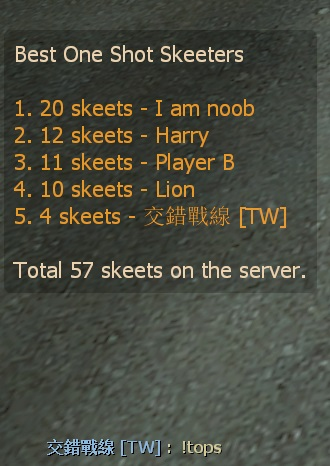
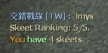
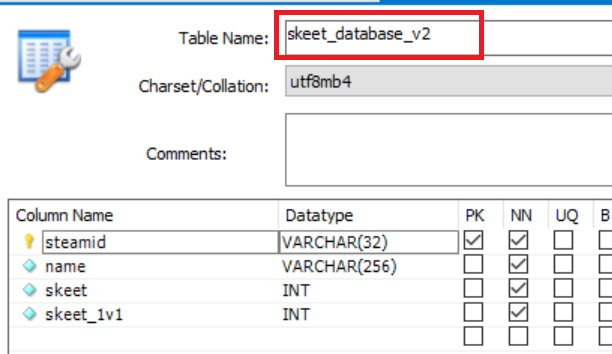

# Description | 內容
Adding a statistic of hunter skeets and save to database

> __Note__ <br/>
This plugin is private, Please contact [me](/#私人插件列表-private-plugins-list)<br/>
此為私人插件, 請聯繫[本人](/#私人插件列表-private-plugins-list)

* Apply to | 適用於
	```
	L4D1
	L4D2
	```

* <details><summary>Image | 圖示</summary>

	* Record skeets
	<br/>
	<br/>
	* Support MySql & Sqlite (支援資料庫，跨伺服器儲存)
	<br/>
</details>

* <details><summary>How does it work?</summary>

	* Add statistic when a player skeeted the hunter in one shot while hunter is pouncing
	* Support Database (MySQL & SQLite), data saved even if player disconnected from server or server restart
	* Type ```!tops``` to see top 5 player
	* Type ```!mys``` to see your skeets and rank
</details>

* Require | 必要安裝
	1. [[INC] Multi Colors](https://github.com/fbef0102/L4D1_2-Plugins/releases/tag/Multi-Colors)

* <details><summary>ConVar | 指令</summary>

	* cfg/sourcemod/l4d_skeet_database_remake.cfg
		```php
		// Enable this plugin?
		l4d_skeet_database_remake_enable "1"

		// If 1, Announce skeet/shots in chatbox when someone skeets.
		l4d_skeet_database_remake_announce "0"

		// Turn on the plugin in these game modes. 0=All, 1=Coop, 2=Survival, 4=Versus, 8=Scavenge. Add numbers together.
		l4d_skeet_database_remake_modes_tog "4"

		// Numbers of real survivor players required at least to enable this plugin
		l4d_skeet_database_remake_survivors_required "4"

		// Count AI Hunter also ?[1: Yes, 0: No]
		l4d_skeet_database_remake_ai_hunter "0"

		// If 1, Record 1v1 skeet database in 1v1 mode.
		l4d_skeet_database_remake_1v1_seprate "1"

		// Database to save skeet to.
		//  (MySQL & SQLite supported)
		l4d_skeet_database_remake_sql "skeet"
		```
</details>

* <details><summary>Command | 命令</summary>

	* **Show your current skeet count and rank.**
		```php
		sm_mys
		```

	* **Show TOP 5 skeet players**
		```php
		sm_tops
		```
</details>

* <details><summary>How to Set Database</summary>

	* Choose one of the following method
		1. MySQL: Database across server, you must build your own extra database system
			* Set ConVar ```l4d_skeet_database_remake_sql "skeet"``` and write the following in ```sourcemod/configs/databases.cfg```
				```php
				// There would a data table named "skeet_database_v2" in database
				"skeet"
				{
					"driver"			"mysql"
					"host"				"x.x.x.x"
					"database"			"yourdatabase"
					"user"				"youruser"
					"pass"				"yourpass"
					"port"				"yourport"
				}
				```

		2. SQLite: SourceMod built-in Local Database
			* Set ConVar ```l4d_skeet_database_remake_sql "skeet"``` and write the following in ```sourcemod/configs/databases.cfg```
				```php
				// There would be a file created: sourcemod/data/sqlite/skeet.sq3
				"skeet"
				{
					"driver"			"sqlite"
					"database"			"skeet"
				}
				```
</details>

* <details><summary>Changelog | 版本日誌</summary>

	* v1.1h (2025-11-24)
		* Remove data file
		* Optimize code

	* v1.0h (2025-1-10)
		* Remake code
		* Add mysql & sqilite database support
	
	* Original
		* [skeet_database](https://github.com/fbef0102/L4D1_2-Plugins/tree/master/skeet_database)
</details>

- - - -
# 中文說明
統計一槍擊殺Hunter的數量，並儲存於數據庫當中

* 原理
	* 當玩家一槍擊殺Hunter時 (Hunter必須是正在飛撲當中)，統計+1
	* 使用資料庫保存玩家的統計數據 (支援 MySQL & SQLite)，即使離開伺服器或伺服器重啟，玩家數據依然保存
	* 輸入 ```!tops``` 查看前五名一槍擊殺Hunter數量的玩家
	* 輸入 ```!mys``` 查看自己一槍擊殺Hunter的數量與排行榜

* <details><summary>指令中文介紹 (點我展開)</summary>

	* cfg/sourcemod/l4d_skeet_database_remake.cfg
		```php
		// 0=關閉插件, 1=啟動插件
		l4d_skeet_database_remake_enable "1"

		// 為1時，當有玩家秒殺Hunter時，顯示於聊天框
		l4d_skeet_database_remake_announce "0"

		// 什麼模式下啟動此插件. 0=所有模式, 1=戰役, 2=生存, 4=對抗, 8=清道夫. 請將數字相加起來
		l4d_skeet_database_remake_modes_tog "4"

		// 倖存者隊伍至少需要的真人玩家，才會啟動此插件
		l4d_skeet_database_remake_survivors_required "4"

		// 為1時，秒殺AI Hunter也會列入統計
		l4d_skeet_database_remake_ai_hunter "0"

		// 在1對1模式時 (一位倖存者VS一位特感)，秒殺Hunter也會列入統計
		l4d_skeet_database_remake_1v1_seprate "1"

		// 儲存統計的資料庫
		// (支援 MySQL & SQLite)
		l4d_skeet_database_remake_sql "skeet"
		```
</details>

* <details><summary>命令中文介紹 (點我展開)</summary>

	* **查看自己一槍擊殺Hunter的數量與排行榜**
		```php
		sm_mys
		sm_skeets
		```

	* **查看前五名一槍擊殺Hunter數量的玩家**
		```php
		sm_tops
		```
</details>

* <details><summary>如何設定資料庫</summary>

	* 以下方法二選一
		1. MySQL: 支援跨伺服器，您需要另外安裝並使用自己的資料庫，儲值玩家的數據
			* 如果不會安裝就選擇第二種方法
			* 設定指令 ```l4d_skeet_database_remake_sql "skeet"```，然後設定文件 ```sourcemod/configs/databases.cfg```
				```php
				// 資料庫中自動創建表格，名稱是 "skeet_database_v2"
				"skeet"
				{
					"driver"			"mysql"
					"host"				"x.x.x.x"
					"database"			"yourdatabase"
					"user"				"youruser"
					"pass"				"yourpass"
					"port"				"yourport"
				}
				```
			
		2. SQLite: Sourcemod自帶的本地資料庫，您無須另外安裝
			* 設定指令 ```l4d_skeet_database_remake_sql "skeet"```，然後設定文件 ```sourcemod/configs/databases.cfg```
				```php
				// 自動創建檔案: sourcemod/data/sqlite/skeet.sq3
				"skeet"
				{
					"driver"			"sqlite"
					"database"			"skeet"
				}
				```
</details>
