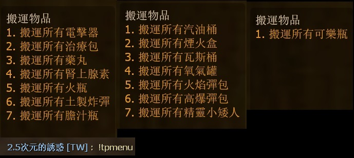

# Description | 內容
Open Menu to teleport items on the map.

> __Note__ <br/>
This plugin is private, Please contact [me](https://github.com/fbef0102/Game-Private_Plugin#私人插件列表-private-plugins-list)<br/>
此為私人插件, 請聯繫[本人](https://github.com/fbef0102/Game-Private_Plugin#私人插件列表-private-plugins-list)

* [Video | 影片展示](https://youtu.be/hlEiyPxE_Eo)

* Image
	<br/>
	<br/>
	<br/>
	<br/>
	<br/>

* <details><summary>How does it work?</summary>

	* Type ```!tpmenu``` -> Select item -> Teleport all items into your position
		* Defibrillators
		* Medical Kits
		* Pills
		* Adrenaline shots
		* Molotovs
		* Pipe Bombs
		* Bile Jars
		* Gas Cans
		* Fireworks
		* Propane Tanks
		* Oxygen Tanks
		* Incendiary Upgrade Packs
		* Explosive Upgrade Packs
		* Gnomes
		* Cola Bottles
	* Can use in any game mode
	* Save your time to move gas cans in survival mode
</details>

* Require | 必要安裝
	1. [[INC] Multi Colors](https://github.com/fbef0102/L4D1_2-Plugins/releases/tag/Multi-Colors)

* <details><summary>ConVar | 指令</summary>

	* cfg/sourcemod/l4d_Teleport_Item.cfg
		```php
		// 0=Plugin off, 1=Plugin on.
		l4d_Teleport_Item_allow "1"

		// Turn on the plugin in these game modes, separate by commas (no spaces). (Empty = all).
		l4d_Teleport_Item_modes ""

		// Turn off the plugin in these maps, separate by commas (no spaces). (0=All maps, Empty = none).
		l4d_Teleport_Item_map_off ""

		// Turn on the plugin in these game modes. 0=All, 1=Coop, 2=Survival, 4=Versus, 8=Scavenge. Add numbers together.
		l4d_Teleport_Item_modes_tog "0"

		// Turn off the plugin in these game modes, separate by commas (no spaces). (Empty = none).
		l4d_Teleport_Item_modes_off ""

		// Players with these flags have access to use command to open menu. (Empty = Everyone, -1: Nobody)
		l4d_Teleport_Item_access_flag ""
		```
</details>

* <details><summary>Command | 命令</summary>
	
	* **Display Item menu**
		```php
		sm_tpmenu
		```
</details>

* Apply to | 適用於
	```
	L4D1
	L4D2
	```

* <details><summary>Translation Support | 支援翻譯</summary>

	```
	English
	繁體中文
	简体中文
	```
</details>

* <details><summary>Changelog | 版本日誌</summary>

	* v1.2 (2024-8-27)
		* Update Translation
		* Update Menu

	* v1.1 (2024-8-26)
		* Translation Support

	* v1.0
		* Initial Release
</details>

- - - -
# 中文說明
打開選單傳送地圖上所有物品到身邊

* 圖示
	<br/>
	<br/>

* 原理
	* 輸入```!tpmenu```，可以將地圖上所有的汽油桶或物資搬運到你所在的位置上
	* 可適用於任何模式

* 用意在哪?
	* 在生存模式之下耗費時間搬運汽油桶與物資，安裝這插件能節省你大量的時間

* <details><summary>指令中文介紹 (點我展開)</summary>

	* cfg/sourcemod/l4d_Teleport_Item.cfg
		```php
		// 0=關閉插件, 1=啟動插件
		l4d_Teleport_Item_allow "1"

		// 什麼模式下啟動此插件, 逗號區隔 (無空白). (留白 = 所有模式)
		l4d_Teleport_Item_modes ""

		// 什麼模式下關閉此插件, 逗號區隔 (無空白). (留白 = 無)
		l4d_Teleport_Item_map_off ""

		// 什麼模式下啟動此插件. 0=所有模式, 1=戰役, 2=生存, 4=對抗, 8=清道夫. 請將數字相加起來
		l4d_Teleport_Item_modes_tog "0"

		// 什麼模式下關閉此插件, 逗號區隔 (無空白). (留白 = 無)
		l4d_Teleport_Item_modes_off ""

		// 擁有這些權限的玩家，才可以輸入!tpmenu (留白 = 任何人都能, -1: 無人)
		l4d_Teleport_Item_access_flag ""
		```
</details>

* <details><summary>命令中文介紹 (點我展開)</summary>
	
	* **打開搬運物資的選單**
		```php
		sm_tpmenu
		```
</details>
