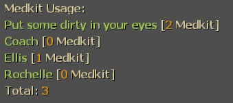

# Description | 內容
Report Personal Medkit Status when player used Medkits

> __Note__ <br/>
This plugin is private, Please contact [me](https://github.com/fbef0102/Game-Private_Plugin#私人插件列表-private-plugins-list)<br/>
此為私人插件, 請聯繫[本人](https://github.com/fbef0102/Game-Private_Plugin#私人插件列表-private-plugins-list)

* Video | 影片展示
<br/>None

* Image | 圖示
	* Display message (顯示訊息)
	<br/>

	* All Player Medkit Status (所有玩家的治療包使用量)
	<br/>

* Require | 必要安裝
	1. [left4dhooks](https://forums.alliedmods.net/showthread.php?t=321696)
	2. [[INC] Multi Colors](https://github.com/fbef0102/L4D1_2-Plugins/releases/tag/Multi-Colors)

* <details><summary>ConVar | 指令</summary>

	* cfg/sourcemod/l4d_saferoom_prevent_kit.cfg
		```php
		// 0=Plugin off, 1=Plugin on.
		l4d_medkit_status_enable "1"

		// Changes how message displays. (0: Disable, 1:In chat, 2: In Hint Box, 3: In center text)
		l4d_medkit_status_announce_type "1"

		// Count medkit to which player. (1=Person doing the healing, 2=Person being healed)
		l4d_medkit_status_count_player "1"

		// If 1, start to count medkit used after game starts (survivors leaving saferoom / survival or scavenge begins) (0=Always count)
		l4d_medkit_status_game_start_enable "1"

		// Reset all players data when 0=Map Change, 1=Next New Round, 2=Next Game starts (survivors leaving saferoom / survival or scavenge begins)
		l4d_medkit_status_reset_when "2"
		```
</details>

* <details><summary>Command | 命令</summary>
	
	* **Display All Medkits Stats.**
		```php
		sm_med
		```
</details>

* Apply to | 適用於
	```
	L4D1 
	L4D2
	```
	
* <details><summary>Translation Support | 支援翻譯</summary>

	```
	English
	繁體中文
	简体中文
	```
</details>

* <details><summary>Changelog | 版本日誌</summary>

	* v1.1 (2024-9-3)
		* Add translation file

	* v1.0 (2022-12-23)
		* Initial Release
</details>

- - - -
# 中文說明
使用治療包時提示個人的治療包使用數量與狀態

* 原理
	* 顯示目前為止使用的治療包數量以及距離上一次使用治療包的時間
	* 倖存者Bot也有
	* 即使玩家離線仍然保留數據
	* 輸入```!med```顯示所有人的治療包使用數量

* <details><summary>ConVar | 指令</summary>

	* cfg/sourcemod/l4d_saferoom_prevent_kit.cfg
		```php
		// 0=關閉插件, 1=啟動插件
		l4d_medkit_status_enable "1"

		// 提示該如何顯示. (0: 不提示, 1: 聊天框, 2: 黑底白字框, 3: 螢幕正中間)
		l4d_medkit_status_announce_type "1"

		// 計算誰使用的治療包. (1=治療的人, 2=被治療的人)
		l4d_medkit_status_count_player "1"

		// 為1時，遊戲開始之後才會計算治療包使用數量 (倖存者離開安全室 或 生存/清道夫 計時開始)
		// 0 = 一直都計算
		l4d_medkit_status_game_start_enable "1"

		// 何時重置治療包數據? 0=換圖時, 1=新的回合開始時, 2=下次遊戲開始之時 (離開安全室 / 生存或清道夫模式計時開始).
		l4d_medkit_status_reset_when "2"
		```
</details>

* <details><summary>Command | 命令</summary>
	
	* **查看所有人的治療包數據.**
		```php
		sm_med
		```
</details>