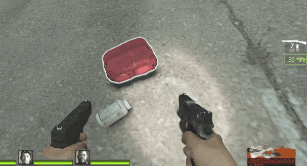
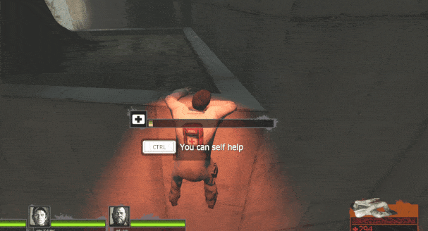
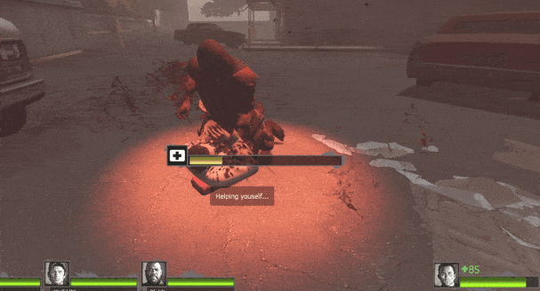
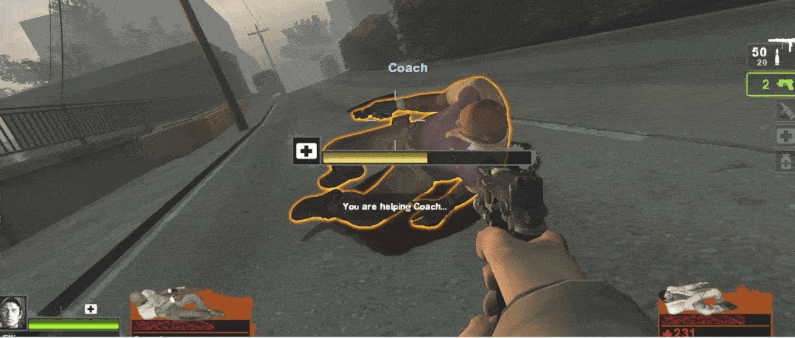

# Description | 內容
Self revive with medkid, defibrillator, pain pills and adrenaline shot whie incapped, hanging from ledge, pinned by special infected.

> __Note__ <br/>
This plugin is private, Please contact [me](/#私人插件列表-private-plugins-list)<br/>
此為私人插件, 請聯繫[本人](/#私人插件列表-private-plugins-list)

* Apply to | 適用於
	```
	L4D1
	L4D2
	```

* Image | 圖示
	<br/>
	<br/>
	<br/>
	<br/>
	<br/>

* <details><summary>How does it work?</summary>

	* If you have medical items while you are incapped, hanging from ledge, pinned by special infected, press Duck key to self help
		* Gain more temp health from incap
		* Kill special infected attacker
	* You can pick up medical items within the range around you while incap, Aim items and Press E
	* While incap, you can Help other players who are incap or hanging from ledge within the range around you
	* Control each medical items in data file: [data/l4d_selfhelp_remake.cfg](data/l4d_selfhelp_remake.cfg)
</details>

* Require | 必要安裝
	1. [left4dhooks](https://forums.alliedmods.net/showthread.php?t=321696)
	2. [[INC] Multi Colors](https://github.com/fbef0102/L4D1_2-Plugins/releases/tag/Multi-Colors)
	3. [[INC] l4d2_weapons](/L4D_插件/Require_檔案/scripting/include/l4d2_weapons.inc)

* <details><summary>ConVar | 指令</summary>

	* cfg/sourcemod/l4d_selfhelp_remake.cfg
		```php
		// 0=Plugin off, 1=Plugin on.
		l4d_selfhelp_remake_enable "1"
		```
</details>

* Translation Support | 支援翻譯
	```
	translations/l4d_selfhelp_remake.phrases.txt
	```

* <details><summary>Changelog | 版本日誌</summary>

	* v1.2h (2025-9-17)
		* Update data
		* Set temp health or permant health
		* Kill attacker and set health

	* v1.1h (2025-3-6)
		* Update data
		
	* v1.0h (2025-2-27)
		* Add temp health after self help from incap
		* Use Data file to control each medical items
		* Fixed player never get black and white
		* Fixed error that sometimes player can't self help or items removed even though player is not incap
		* Add director hint
		* Support L4D1 progress bar
		* Remake code, convert code to latest syntax
		* Fix warnings when compiling
		* Optimize code to prevent lagging
		* Translation Support 

	* Original & Credit
		* [panxiaohai](https://forums.alliedmods.net/showthread.php?t=129444)
</details>

- - - -
# 中文說明
倒地、掛邊、被控時，可以消耗身上的醫療物品自救

* 原理
	* 倒地、掛邊、被控時，按下ctrl鍵可以消耗身上的醫療物品自救
		* 倒地自救後獲得更多的血量
		* 處死控制你的特感
	* 倒地期間可以撿起周圍的醫療物品，準心指向物品後按E鍵
	* 倒地期間, 你可以救起來範圍內倒地或掛邊的玩家
	* 控制每個醫療物品: [data/l4d_selfhelp_remake.cfg](data/l4d_selfhelp_remake.cfg)

* <details><summary>指令中文介紹 (點我展開)</summary>

	* cfg/sourcemod/l4d_selfhelp_remake.cfg
		```php
		// 0=關閉插件, 1=啟動插件
		l4d_selfhelp_remake_enable "1"
		```
</details>
