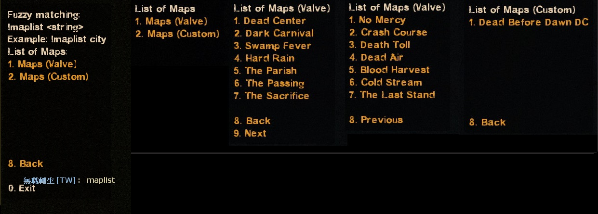
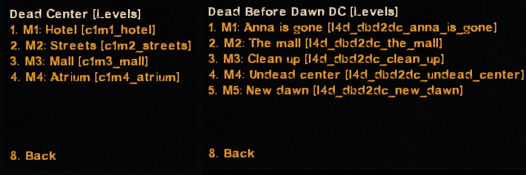
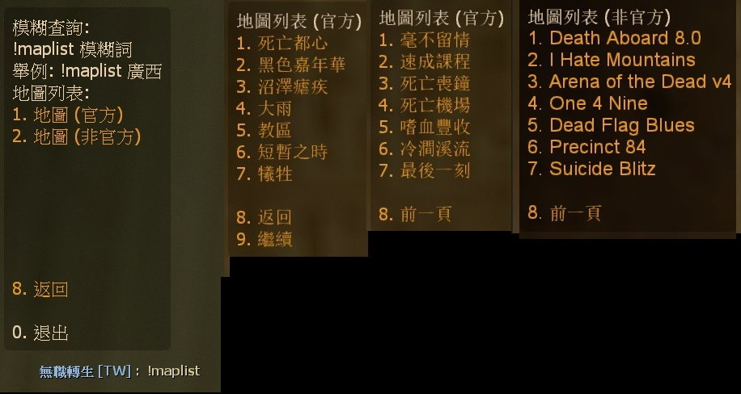

# Description | 內容
Reads all available custom campaigns and display all available missions in menu, provide for admin to change map directly or for player to call vote to change map

> __Note__ <br/>
This plugin is private, Please contact [me](/#私人插件列表-private-plugins-list)<br/>
此為私人插件, 請聯繫[本人](/#私人插件列表-private-plugins-list)
<br/>🟥Dedicated Server Only
<br/>🟥只能安裝在Dedicated Server

* Apply to | 適用於
	```
	L4D1 Dedicated Server
	L4D2 Dedicated Server
	```

* <details><summary>Image</summary>

	* (Admin) !admin -> Server Commands -> "List of Maps"
	<br/>
	<br/>
	* (Player) !maplist -> call a vote to change map.
	<br/>
</details>

* <details><summary>How does it work?</summary>

	* Admin types ```!admin``` -> Server Commands -> "List of Maps" -> choose map -> server change map immediately
	* Player types ```!maplist``` -> call a vote to change map.
	* Automatically add all official maps and custom maps to menu list, no need to add map manually.
	* You can add translation for custom maps
</details>

* <details><summary>Notice</summary>

  * It require some time to initialize map list at first time server launch. (20 - 60 sec, and < 2 sec. next times)
  * Plugin auto-generates the following files, please **DO NOT modify**
      * data/l4d_all_missions_list_coop.txt
      * data/l4d_all_missions_list_scavenge.txt
      * data/l4d_all_missions_list_survival.txt
      * data/l4d_all_missions_list_versus.txt
</details>

* Require | 必要安裝
	1. [left4dhooks](https://forums.alliedmods.net/showthread.php?t=321696)
	2. [[INC] Multi Colors](https://github.com/fbef0102/L4D1_2-Plugins/releases/tag/Multi-Colors)
	3. [builtinvotes](https://github.com/fbef0102/Game-Private_Plugin/releases/tag/builtinvotes)
	4. [[INC] localizer](https://github.com/dragokas/SM-Localizer/blob/master/localizer.inc)
	5. [l4d2_fix_changelevel](https://github.com/Target5150/MoYu_Server_Stupid_Plugins/tree/master/The%20Last%20Stand/l4d2_fix_changelevel): Fix issues due to forced changelevel.
		* 修復手動更換地圖會遇到的問題
	6. [l4d2_transition_info_fix](https://github.com/fbef0102/L4D1_2-Plugins/tree/master/l4d2_transition_info_fix): Fix issues after map transitioned, transition info is still retaining when changed new map by other ways.
		* 修復中途換地圖的時候(譬如使用Changelevel指令)，會遺留上次的過關保存設定，導致滅團後倖存者被傳送到安全室之外或死亡

* <details><summary>ConVar | 指令</summary>

	* cfg/sourcemod/l4d_all_missions_list.cfg
		```php
        // If 1, player can use comamnd !maplist and call a vote to change map.
        l4d_all_missions_list_vote_enable "1"

        // Delay to start another a vote after vote ends.
        l4d_all_missions_list_vote_delay "60"

        // Numbers of real survivor and infected player required to start a vote to change map.
        l4d_all_missions_list_vote_required "2"
		```
</details>

* <details><summary>Command | 命令</summary>
    
	* **Display mission list and vote to change map**
		```php
		sm_maplist
		```

	* **Update mission list manually (Adm required: ADMFLAG_ROOT)**
		```php
		sm_mission_list_update
		```
</details>

* Translation Support | 支援翻譯
	```
	translations/l4d_all_missions_list.phrases.txt
	```

* <details><summary>Changelog | 版本日誌</summary>

    * v1.4h (2025-3-10)
        * Fixed some maps not reading if mission file size too large

    * v1.3h (2024-12-8)
        * You can add translation for custom maps
        * Update translation

    * v1.2h (2024-10-11)
        * Fixed map menu mess up or wrong order or missing if there are multi missions or multi gamemodes in vpk file

    * v1.1h (2023-7-8)
        * Add vote system, non-admin players can use command to view mission list and call a vote to change map.

    * v1.0h (2023-7-5)
        * Support L4D1
        * Add left4dhooks
        * Remove changelevel inc

    * Original
        * [By dr_lex](https://forums.alliedmods.net/showthread.php?t=336378)
</details>

- - - -
# 中文說明
自動讀取官方地圖與所有三方地圖，並將關卡顯示在列表上，供管理員換圖用或者普通玩家投票換圖

* <details><summary>圖示</summary>

	<br/>
	<br/>
    <br/>
</details>

* 原理
    * 管理員輸入```!admin``` -> 伺服器指令 -> "地圖列表"，即可出現所有地圖與關卡列表
      * 管理員選擇關卡之後，立刻換圖 (無須投票)
    * 玩家輸入```!maplist``` -> 即可出現所有地圖與關卡表
      * 選擇關卡之後，發起投票換圖
	* 自動新增三方圖的地圖與關卡，無須手動新增
    * 三方圖關卡名稱可自己翻譯

* <details><summary>指令中文介紹 (點我展開)</summary>

	* cfg/sourcemod/l4d_all_missions_list.cfg
		```php
        // 為1時，玩家可輸入!maplist
        l4d_all_missions_list_vote_enable "1"

        // 投票間隔冷卻時間
        l4d_all_missions_list_vote_delay "60"

        // 至少需要的真人倖存者+真人特感數量在場，才可以發起投票
        l4d_all_missions_list_vote_required "2"
		```
</details>

* <details><summary>命令中文介紹 (點我展開)</summary>
    
	* **所有地圖與關卡選單**
		```php
		sm_maplist
		```

	* **手動更新地圖與關卡列表 (權限: ADMFLAG_ROOT)**
		```php
		sm_mission_list_update
		```
</details>

* 注意事項
    1. <details><summary>安裝此插件之後</summary>

        * 第一次啟動伺服器時，插件需要花30~60秒讀取分析地圖，因此伺服器卡住是正常的現象，請等待插件跑完
        * 安裝上這個插件並啟動伺服器之後，伺服器會自動產生以下檔案
            * data/l4d_all_missions_list_coop.txt
            * data/l4d_all_missions_list_scavenge.txt
            * data/l4d_all_missions_list_survival.txt
            * data/l4d_all_missions_list_versus.txt
    </details>

    2. <details><summary>安裝新的三方圖</summary>

        * 每當安裝三方圖時，left4dead2/addons/sourcemod/data/內的文件內容會有變化，自動新增三方圖的地圖與關卡
        * 反之，每當移除三方圖時，自動移除三方圖的地圖與關卡
            * data/l4d_all_missions_list_coop.txt
            * data/l4d_all_missions_list_scavenge.txt
            * data/l4d_all_missions_list_survival.txt
            * data/l4d_all_missions_list_versus.txt
    </details>