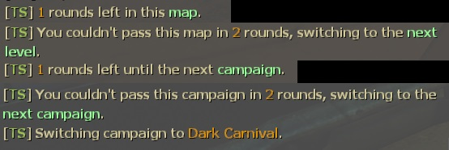
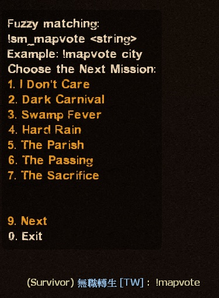
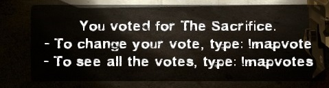
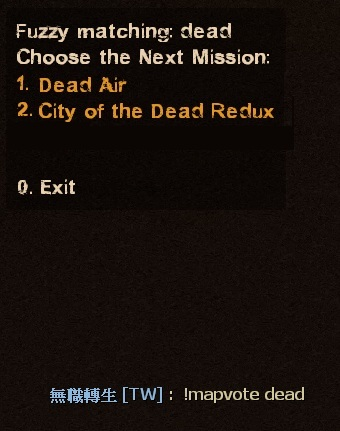
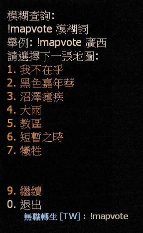
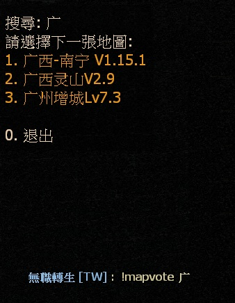

# Description | 內容
Force change to next mission when current mission(final stage) end + Force change to next level when survivors wipe out + Vote to next map (Apply to Versus/Survival/Scavenge).

> __Note__ <br/>
This plugin is private, Please contact [me](/#私人插件列表-private-plugins-list)<br/>
此為私人插件, 請聯繫[本人](/#私人插件列表-private-plugins-list)
<br/>🟥Dedicated Server Only
<br/>🟥只能安裝在Dedicated Server

* Apply to | 適用於
	```
	L4D2 Dedicated Server
	```

* <details><summary>Image</summary>

	* Automatically change next level when survivors wipe out in coop/realism
	<br/>
	* Players can vote next map
	<br/>
	<br/>
</details>

* <details><summary>How does it work?</summary>

	* Automatically change next level when survivors wipe out in coop/realism
	* Automatically change next map when survivors wipe out in survival
	* Automatically change next map when match end in scavenge
	* Automatically change next map when final ends in versus/cooo/realism
	* Automatic parsing of custom maps vpk files - no need to add map names manually
	* Next map vote starts when 
		* Leaving the saferoom
		* Survival/Scavenge round starts 
	* Auto change map to official map if no one in server when playing custom maps
	* Support fuzzy matching. Example: ```!mapvote dead```, filter maps whose names contain "dead".
	<br/>
</details>

* Require | 必要安裝
	1. [left4dhooks](https://forums.alliedmods.net/showthread.php?t=321696)
	2. [[INC] Multi Colors](https://github.com/fbef0102/L4D1_2-Plugins/releases/tag/Multi-Colors)
	3. [l4d2_mission_manager](https://github.com/fbef0102/L4D1_2-Plugins/tree/master/l4d2_mission_manager)
	4. [l4d2_fix_changelevel](https://github.com/Target5150/MoYu_Server_Stupid_Plugins/tree/master/The%20Last%20Stand/l4d2_fix_changelevel): Fix issues due to forced changelevel.
		* 修復手動更換地圖會遇到的問題
	5. [l4d2_transition_info_fix](https://github.com/fbef0102/L4D1_2-Plugins/tree/master/l4d2_transition_info_fix): Fix issues after map transitioned, transition info is still retaining when changed new map by other ways.
		* 修復中途換地圖的時候(譬如使用Changelevel指令)，會遺留上次的過關保存設定，導致滅團後倖存者被傳送到安全室之外或死亡

* <details><summary>ConVar | 指令</summary>

	* cfg/sourcemod/sm_l4d_mapchanger.cfg
		```php
		// Mission for change by default on final map in coop/realism.
		// Empty=Use configs/missioncycle.coop.txt map order
		sm_l4d_fmc_def_coop ""

		// Map for change by default in survival.
		// Empty=Use configs/missioncycle.survival.txt map order
		sm_l4d_fmc_def_survival "c5m5_bridge"

		// Mission for change by default on final map in versus.
		// Empty=Use configs/missioncycle.versus.txt map order
		sm_l4d_fmc_def_versus ""

		// Map for change by default in scavenge.
		// Empty=Use configs/missioncycle.scavenge.txt map order
		sm_l4d_fmc_def_scavenge "c14m1_junkyard"

		// Quantity of rounds (tries) events survivors wipe out before force of changelevel on non-final maps in coop/realism (0=Off)
		sm_l4d_fmc_crec_coop_map "3"

		// Quantity of rounds (tries) events survivors wipe out before force of changelevel on final maps in coop/realism (0=Off)
		sm_l4d_fmc_crec_coop_final "3"

		// Quantity of rounds (tries) events survivors wipe out before force of changelevel in survival. (0=Off)
		sm_l4d_fmc_crec_survival_map "5"

		// After final map finishes, delay before force of changelevel in versus. (0=Don't force to change map)
		sm_l4d_fmc_delay_vs "13.0"

		// After quantity of survival rounds (tries), delay before force of changelevel in survival. (0=Don't force to change map)
		sm_l4d_fmc_delay_survival "15.0"

		// After scavenge match ends, delay before force of changelevel in scavenge. (0=Don't force to change map)
		sm_l4d_fmc_delay_scavenge "15.0"

		// In coop/realism final map, when to change next map? 
		// -1=Wait until campaign credit end or players press space to skip credit.
		// 0=Don't force to change map
		// >0: After final rescue vehicle leaving, delay before force of changelevel
		sm_l4d_fmc_delay_coop_final "15.0"

		// Enables next mission and how many chances left to advertise to players.
		sm_l4d_fmc_announce "1"

		// If 1, Enables players to vote for the next map or campaign.
		sm_l4d_fmc_voting_system_enabled "1"

		// When to display vote menu to player in coop/versus/realim? 0=When survivors leave the saferoom, 1=When final rescue starts
		sm_l4d_fmc_voting_system_when "1"

		// How the next campaign/map is advertised during a finale and scavenge/survival map [0 = DISABLED, 1 = HINT TEXT, 2 = CHAT TEXT]
		sm_l4d_fmc_next_map_ad_mode "2"

		// Time in seconds between advertisements for the next campaign/map on finales and scavenge/survival maps. (0=Off)
		sm_l4d_fmc_next_map_ad_interval "120.0"

		// Time in seconds to wait after survivors leave the start area to advertise voting system. (0=Off)
		sm_l4d_fmc_voting_ad_delay_time "10.0"

		// If 1, Excludes current map(s) from the map voting menu
		sm_l4d_fmc_next_map_menu_excludes "1"

		// Controls the maps shown in the next map voting menu [0 = Official and addon maps, 1 = Official maps only, 2 = Addon maps only]
		sm_l4d_fmc_next_map_menu_options "0"

		// Controls the order of maps shown in the next map voting menu [0 = Official then addon maps, 1 = Random]
		sm_l4d_fmc_next_map_menu_order "0"

		// If 1, The server automatically switch to the first available official map when no one is playing a 3-rd map
		sm_l4d_fmc_prevent_empty_server "1"
		```
</details>

* <details><summary>Command | 命令</summary>
	
	* **Display Next Map**
		```php
		sm_fmc_nextmap
		sm_fmc
		```

	* **Vote the next map**
		```php
		sm_mapvote
		```

	* **Filter map name list (fuzzy matching)**
		```php
		sm_mapvote <string>
		```

	* **See all the votes**
		```php
		sm_mapvotes
		```
</details>

* <details><summary>API | 串接</summary>

	* [sm_l4d_mapchanger.inc](scripting/include/sm_l4d_mapchanger.inc)
		```php
		library name: sm_l4d_mapchanger
		```
</details>

* <details><summary>Example Config</summary>

	* [data/sm_l4d_mapchanger.txt](data/sm_l4d_mapchanger.txt)
		```php
		"ForceMissionChangerSettings"
		{
			"c1m2_streets"
			{
				"chapter_nextmap" "c5m3_cemetery" // <-- next chapter in coop/versus/realism
				"chapter_nextname" "c5m3_cemetery" // <-- Translation phrase in maps.phrases.txt or missions.phrases.txt
			}

			"c8m5_rooftop" // current map
			{
				"next mission map" "c9m2_lots"   // <-- next campaign in coop/versus/realism
				"next mission name" "L4D2C9"  	// <-- Translation phrase in maps.phrases.txt or missions.phrases.txt
				
				"survival_nextmap" "c1m2_streets"	// <-- next map in survival mode
				"survival_nextname" "c1m2_streets" 	// <-- Translation phrase in maps.phrases.txt or missions.phrases.txt

				"scavenge_nextmap" "c2m1_highway" // <-- next map in scavenge mode
				"scavenge_nextname" "c2m1_highway" // <-- Translation phrase in maps.phrases.txt or missions.phrases.txt
			}

			// If map name not in this file
			// In Coop/Realism, Next map would be: sm_l4d_fmc_def_coop "xxxxx"，if convar value empty, then map order in configs/missioncycle.coop.txt
			// In Versus, Next map would be: sm_l4d_fmc_def_versus "xxxxx"，if convar value empty, then map order in configs/missioncycle.versus.txt
			// In Survival, Next map would be: sm_l4d_fmc_def_survival "xxxxx"，if convar value empty, then map order in configs/missioncycle.survival.txt
			// In Scavenge, Next map would be: sm_l4d_fmc_def_scavenge "xxxxx"，if convar value empty, then map order in configs/missioncycle.scavenge.txt
		} 
		```

	* [configs/finale.coop.txt](configs/finale.coop.txt)
		```php
		// The following maps will be treated as finale maps in Coop/Versus/Realism mode mode. Example: c1m1_hotel. Do not delete this line!
		l4d2_deathcraft_05_lighthouse
		l4d2_minecraft_evolution
		```
</details>

* Translation Support | 支援翻譯
	```
	translations/sm_l4d_mapchanger.phrases.txt
	```

* <details><summary>Related Plugin | 相關插件</summary>

	1. [l4d_restartmap_command](/L4D_插件/Map_%E9%97%9C%E5%8D%A1/l4d_restartmap_command): Admin say !restartmap to restart current map + Force of restartmap after Quantity of rounds (tries) events survivors wipe out
		> 管理員輸入!restartmap能重新地圖關卡 + 滅團N次後重新地圖

	2. [l4d_random_map_vote](/L4D_插件/Map_%E9%97%9C%E5%8D%A1/l4d_random_map_vote):Vote to change map, the map is chosen randomly from data
		> 投票更換地圖，但是地圖是隨機挑選的
</details>

* <details><summary>Changelog | 版本日誌</summary>

	* v1.9h (2026-1-20)
		* Support fuzzy matching, use ```!mapvote <string>```
		* Update translation

	* v1.8h (2025-2-27)
	* v1.7h (2024-11-12)
		* Update cvars
		* Fixed "return to lobby" vote

	* v1.6h (2024-9-29)
		* In coop/realism mode, force of changelevel in coop/realism after campaign credit end or players press space to skip credit
		* Update cvars

	* v1.5h (2024-9-12)
		* Fixed mapvote menu error after server startup
		* Update Data

	* v1.4h (2024-4-16)
		* Change next chapter in coop/realism/versus
		* Update Data

	* v1.3h (2024-2-7)
		* Fixed vote menu wrong map order

	* v1.2h (2024-1-7)
		* Fixed cvar is not working

	* v1.1h (2023-4-18)
		* Optimize code
		* Fixed next map not working in custom final maps

	* v1.0h (2023-4-17)
		* Support Scavenge Mode. After scavenge match ends, force to change next map
		* Player can vote the next map in survival/scavenge or next campaign in coop/versus
		* Require l4d2_mission_manager
		* Code Credit: [Automatic Campaign Switcher (ACS) from Chris7c0](https://github.com/Chris7c0/ACS)

	* v1.4.0
		* [Original Plugin by Dionys](https://forums.alliedmods.net/showthread.php?t=81982)
</details>

- - - -
# 中文說明
最後一關結束時自動換圖 + 滅團N次後自動切換到下一個關卡 + 玩家投票下一張地圖 (生存/對抗/清道夫模式也適用)

* <details><summary>圖示</summary>

	* 自動切換到下一張地圖
	<br/>
	* 玩家可以投票選擇下一張地圖 (會自動顯示所有地圖包括三方圖)
	<br/>
	<br/>
</details>

* 原理
	* 戰役/寫實模式中當倖存者滅團超過N次時，自動切換到下一個關卡
		* 適合用在非常多特效與高難度的戰役伺服器，避免一直卡在同一個關卡，玩家也會疲勞
	* 戰役/寫實模式中最後一關當倖存者滅團超過N次時或成功通關時，自動切換到下一張地圖
	* 對抗模式中最後一關當雙方回合結束之時，自動切換到下一張地圖
	* 生存模式中當倖存者滅團超過N次時，自動切換到下一張地圖
	* 清道夫模式中當比賽結束時，自動切換到下一張地圖
	* 遊戲開始之後自動出現投票選單，玩家可以投票決定下一張地圖
		* 戰役/對抗/寫實模式最後一關出安全室之後
		* 生存模式計時開始之後
		* 清道夫模式計時開始之後
	* 三方圖沒有人時，自動換回官方圖
	* 支援模糊詞搜尋投票地圖清單，譬如輸入```!mapvote 广```，只會出現有"广"名稱的地圖
	<br/>

* 功能
	* 自動新增三方圖的關卡與地圖名，無須手動新增
	* 玩家可以輸入!mapvote投票決定下一張地圖

* <details><summary>指令中文介紹 (點我展開)</summary>

	* cfg/sourcemod/sm_l4d_mapchanger.cfg
		```php
		// 預設 戰役/寫實模式 最終關之後的下一張地圖
		// 空=下一張地圖依照configs/missioncycle.coop.txt的地圖順序
		sm_l4d_fmc_def_coop ""

		// 預設 生存模式 的下一張地圖
		// 空=下一張地圖依照configs/missioncycle.survival.txt的地圖順序
		sm_l4d_fmc_def_survival "c5m5_bridge"

		// 預設 對抗模式 最終關之後的下一張地圖
		// 空=下一張地圖依照configs/missioncycle.versus.txt的地圖順序
		sm_l4d_fmc_def_versus ""

		// 預設 清道夫模式 的下一張地圖
		// 空=下一張地圖依照configs/missioncycle.scavenge.txt的地圖順序
		sm_l4d_fmc_def_scavenge "c14m1_junkyard"

		// 戰役/寫實模式 下非最終關卡，生還者滅團超過三次則切換到下一個關卡 (0=關閉這項功能)
		sm_l4d_fmc_crec_coop_map "3"

		// 戰役/寫實模式 下最終關卡，生還者滅團超過三次則切換到下一張地圖 (0=關閉這項功能)
		sm_l4d_fmc_crec_coop_final "3"

		// 生存模式 下最終關卡，生還者滅團超過五次則切換到下一張地圖. (0=關閉這項功能)
		sm_l4d_fmc_crec_survival_map "5"

		// 對抗模式 最終關結束時，13秒之後切換下一張地圖. (0=不要切換地圖)
		sm_l4d_fmc_delay_vs "13.0"

		// 生存模式 回合結束時，15秒之後切換下一張地圖. (0=不要切換地圖)
		sm_l4d_fmc_delay_survival "15.0"

		// 清道夫模式 比賽結束時，15秒之後切換下一張地圖. (0=不要切換地圖)
		sm_l4d_fmc_delay_scavenge "15.0"

		// 戰役/寫實模式 最後一關結束後，何時換圖?
		// -1=地圖統計表跑完之後或是玩家們按下"空白鍵-投票跳過"
		// 0=不要切換地圖
		// >0: 上了救援載具並且等待此秒數之後切換下一張地圖
		sm_l4d_fmc_delay_coop_final "15.0"

		// 為1時，持續發公告顯示下一張地圖.
		sm_l4d_fmc_announce "1"

		// 為1時，玩家可以投票決定下一張地圖.
		sm_l4d_fmc_voting_system_enabled "1"

		// (戰役/對抗/寫實模式) 何時顯示投票介面? 0=倖存者離開安全室時, 1=救援開始時
		sm_l4d_fmc_voting_system_when "1"

		// 如何發公告顯示下一張地圖 [0 = 不發公告, 1 = 黑底白字框, 2 = 聊天框]
		sm_l4d_fmc_next_map_ad_mode "2"

		// 每隔120秒發公告顯示下一張地圖. (0=關閉這項功能)
		sm_l4d_fmc_next_map_ad_interval "120.0"

		// 離開安全室或回合開始10秒後顯示投票介面. (0=關閉這項功能)
		sm_l4d_fmc_voting_ad_delay_time "10.0"

		// 為1時，不能投票給當前相同的地圖
		sm_l4d_fmc_next_map_menu_excludes "1"

		// 投票介面顯示的地圖有 [0 = 官方圖與三方圖, 1 = 官方圖, 2 = 三方圖 ]
		sm_l4d_fmc_next_map_menu_options "0"

		// 投票介面如何顯示地圖順序 [0 = 先顯示官方圖再顯示三方圖, 1 = 隨便]
		sm_l4d_fmc_next_map_menu_order "0"

		// 為1時，三方圖沒有人時，自動換回官方圖
		sm_l4d_fmc_prevent_empty_server "1"
		```
</details>

* <details><summary>命令中文介紹 (點我展開)</summary>
	
	* **顯示下一張地圖**
		```php
		sm_fmc_nextmap
		sm_fmc
		```

	* **投票下一張地圖**
		```php
		sm_mapvote
		```

	* **使用模糊詞過濾投票地圖清單**
		```php
		sm_mapvote <string>
		```

	* **查看所有票數**
		```php
		sm_mapvotes
		```
</details>

* <details><summary>文件設定</summary>

	* 設定文件[data/sm_l4d_mapchanger.txt](data/sm_l4d_mapchanger.txt)決定切換到哪一張地圖
		```php
		"ForceMissionChangerSettings"
		{
			"c1m2_streets"
			{
				"chapter_nextmap" "c5m3_cemetery" // <-- 戰役/對抗/寫實模式 過關後的下一關地圖 (也可以寫三方圖)
				"chapter_nextname" "c5m3_cemetery" // <-- 對應maps.phrases.txt或missions.phrases.txt裡面的翻譯句子，沒有寫翻譯則直接顯示c5m3_cemetery
			}

			"c8m5_rooftop" // 當前地圖
			{
				"next mission map" "c9m2_lots"   // <-- 戰役/對抗/寫實模式 下一張地圖名 (也可以寫三方圖)
				"next mission name" "L4D2C9"  	// <-- 對應maps.phrases.txt或missions.phrases.txt裡面的翻譯句子，沒有寫翻譯則直接顯示L4D2C9
				
				"survival_nextmap" "c1m2_streets"	// <-- 生存模式 下一張地圖名 (也可以寫三方圖)
				"survival_nextname" "c1m2_streets" // <-- 對應maps.phrases.txt或missions.phrases.txt裡面的翻譯句子，沒有寫翻譯則直接顯示c1m2_streets

				"scavenge_nextmap" "c2m1_highway" // <-- 清道夫模式　下一關的地圖名 (也可以寫三方圖)
				"scavenge_nextname" "c2m1_highway" // <-- 對應maps.phrases.txt或missions.phrases.txt裡面的翻譯句子，沒有寫翻譯則直接顯示c2m1_highway
			}

			// 沒有寫地圖名的其他關卡，則
			// 戰役/寫實模式 下一張地圖是: sm_l4d_fmc_def_coop 所寫的地圖，如指令沒有寫地圖則依照configs/missioncycle.coop.txt的地圖順序
			// 對抗模式 下一張地圖是: sm_l4d_fmc_def_versus 所寫的地圖，如指令沒有寫地圖則依照configs/missioncycle.versus.txt的地圖順序
			// 生存模式 下一張地圖是: sm_l4d_fmc_def_survival 所寫的地圖，如指令沒有寫地圖則依照configs/missioncycle.survival.txt的地圖順序
			// 清道夫模式 下一張地圖是: sm_l4d_fmc_def_scavenge 所寫的地圖，如指令沒有寫地圖則依照configs/missioncycle.scavenge.txt的地圖順序
		} 
		```

	* 設定文件[configs/finale.coop.txt](configs/finale.coop.txt)決定哪些關卡為最終章節
		```php
		// 戰役/對抗/寫實模式下 這些關卡將視為最終章節，在這些章節可以投票與自動換圖
		// 避免一堆垃圾三方圖明明是救援關卡卻不是最後的章節
		l4d2_deathcraft_05_lighthouse
		l4d2_minecraft_evolution
		```
</details>


* 注意事項
	1. <details><summary>安裝此插件之後</summary>

		* 安裝上這個插件並啟動伺服器之後，伺服器會自動產生以下檔案
			* configs/missioncycle.coop.txt
			* configs/missioncycle.scavenge.txt
			* configs/missioncycle.survival.txt
			* configs/missioncycle.versus.txt
			* configs/finale.coop.txt
	</details>

	2. <details><summary>安裝新的三方圖</summary>

		* 每當安裝新的三方圖時，left4dead2/addons/sourcemod/configs/內的文件內容會有變化，自動新增三方圖的關卡與地圖名
			* configs/missioncycle.coop.txt
			* configs/missioncycle.scavenge.txt
			* configs/missioncycle.survival.txt
			* configs/missioncycle.versus.txt
	</details>

	3. <details><summary>刪除三方圖</summary>

		* 每次刪除三方圖檔案的時候，我建議關閉伺服器然後刪除以下檔案
			* configs/missioncycle.coop.txt
			* configs/missioncycle.scavenge.txt
			* configs/missioncycle.survival.txt
			* configs/missioncycle.versus.txt
		* 再重新啟動服務器，如果不這麼做那也沒關係
	</details>

* FAQ
	1. <details><summary>能否修改地圖順序?</summary>

		* 可以更動以下檔案的內容，改變地圖順序
			* configs/missioncycle.coop.txt
			* configs/missioncycle.scavenge.txt
			* configs/missioncycle.survival.txt
			* configs/missioncycle.versus.txt
	</details>