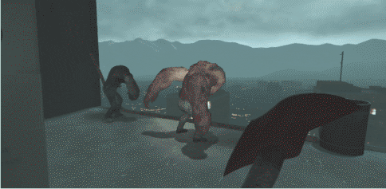

# Description | 內容
Use Melees to knockback teammates/S.I.

> __Note__ <br/>
This plugin is private, Please contact [me](/#私人插件列表-private-plugins-list)<br/>
此為私人插件, 請聯繫[本人](/#私人插件列表-private-plugins-list)

* Apply to | 適用於
	```
	L4D2
	```

* [Video | 影片展示](https://youtube.com/shorts/GnxyoVr3l4k)

* Image | 圖示
	<br/>
	<br/>

* <details><summary>How does it work?</summary>

	* Use melee weapons to sent teammates or special infected fly away
	* Support custom melee
	* Modify melee knockback power in file: [data/l4d2_melee_knock.cfg](data/l4d2_melee_knock.cfg)
		* Manual in this file, click for mor details
</details>

* Require | 必要安裝
	1. [left4dhooks](https://forums.alliedmods.net/showthread.php?t=321696)

* <details><summary>ConVar | 指令</summary>

	* cfg/sourcemod/l4d2_melee_knock.cfg
		```php
		// 0=Plugin off, 1=Plugin on.
		l4d2_melee_knock_enable "1"

		// Players with these flags have melee knock power (Empty = Everyone, -1: Nobody)
		l4d2_melee_knock_access_flag ""
		```
</details>

* <details><summary>Changelog | 版本日誌</summary>

	* v1.1 (2025-6-3)
		* Support S.I.
		* Change plugin name

	* v1.0 (2024-6-13)
		* Initial Release
</details>

- - - -
# 中文說明
近戰武器可以擊飛隊友或特感

* 原理
	* 拿著近戰武器，可以打飛隊友或是特感 (沒有死的話)
	* 支援自製近戰武器
	* 如果想調整擊退力道可自行修改文件: [data/l4d2_melee_knock.cfg](data/l4d2_melee_knock.cfg)
		* 內有中文說明，可打開文件查看

* <details><summary>指令中文介紹 (點我展開)</summary>

	* cfg/sourcemod/l4d2_melee_knock.cfg
		```php
		// 0=關閉插件, 1=啟動插件
		l4d2_melee_knock_enable "1"

		// 擁有這些權限的玩家，才可以使用近戰武器擊飛隊友與特感 (留白 = 任何人都能, -1: 無人)
		l4d2_melee_knock_access_flag ""
		```
</details>