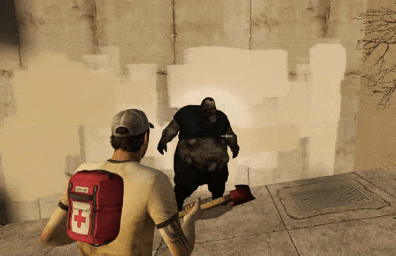

# Description | 內容
Modify Chainsaw and each melee weapon damages dealt to Commons/S.I./Tank/Witch

> __Note__ <br/>
This plugin is private, Please contact [me](/#私人插件列表-private-plugins-list)<br/>
此為私人插件, 請聯繫[本人](/#私人插件列表-private-plugins-list)

* Apply to | 適用於
	```
	L4D2
	```

* Image | 圖示
    | Before (裝此插件之前)  			| After (裝此插件之後) |
    | -------------|:-----------------:|
    |||
    |||

* <details><summary>How does it work?</summary>

    * (Before) Melee weapons in l4d2 are too powerful
        * One-Melee kill Boomer/Jockey/Smoker/Hunter/Spitter (No matter health)
        * Two-Melee kill Charger (No matter health)
        * 20-Melee kill Tank (No matter health)
        * 4-Melee kill Witch (No matter health)
    * (After) Modify Chainsaw damages dealt to Commons/S.I./Tank/Witch
    * (After) Modify each melee damages dealt to Commons/S.I./Tank/Witch
        * Remove One-Melee kill
        * Remove instant kill on flying hunter or jockey with melee or chainsaw
        * Support All official and custom melee weapon
        * A common zombie still instantly dies on a headshot by melee (No matter what damage)
    * Modify damage value in file: [data/l4d2_melee_modify_damage.cfg](data/l4d2_melee_modify_damage.cfg)
        * Manual in this file, click for more details...
    * To modify each gun weapons' damage, please check "Related Plugin" below
</details>

* Require | 必要安裝
    1. [left4dhooks](https://forums.alliedmods.net/showthread.php?t=321696)
    2. [sourcescramble](https://github.com/nosoop/SMExt-SourceScramble/releases)
    3. [charging_takedamage_patch](https://github.com/fbef0102/L4D1_2-Plugins/tree/master/charging_takedamage_patch)

* <details><summary>ConVar | 指令</summary>

    * cfg/sourcemod/l4d2_melee_modify_damage.cfg
        ```php
        // 0=Plugin off, 1=Plugin on. Modify Chainsaw and each melee weapon damages dealt to Commons/S.I./Tank/Witch
        // A common zombie still instantly dies on a headshot by melee.
        l4d2_melee_modify_damage_enable "1"

        // Set wounds only when the zombie is going to die.
        l4d2_melee_modify_damage_common_wound_dead "1"
        ```
</details>

* <details><summary>API | 串接</summary>

    ```php
    library name: l4d2_melee_modify_damage
    ```
</details>

* <details><summary>Known Conflicts</summary>
    
    If you don't use any of these plugins at all, no need to worry about conflicts.
    1. [Nerf Damage To Commons](https://forums.alliedmods.net/showthread.php?t=330085)
        * Disable nerf damage for melee weapon and Chainsaw
    2. [Common Infected Health - Damage Received](https://forums.alliedmods.net/showthread.php?t=332832)
        * Disable damage modify for melee weapon and Chainsaw
</details>

* <details><summary>Related Plugin | 相關插件</summary>

    1. [l4d2_gun_damage_modify](https://github.com/fbef0102/L4D1_2-Plugins/tree/master/l4d2_gun_damage_modify): Modify every weapon damage done to Tank, SI, Witch, Common in l4d2
        * 修改每一種槍械武器對普通殭屍/Tank/Witch/特感 的傷害倍率
    1. [l4d2_melee_durability](/L4D_插件/Real_Realism_真寫實模式/l4d2_melee_durability): Every melee weapons have durability, once run out durability, the melee weapon will be removed
        * 每個近戰武器都有耐久值，揮砍殭屍會消耗耐力，當耐久值耗盡時移除近戰武器
</details>

* <details><summary>Changelog | 版本日誌</summary>

    * v1.5 (2025-11-14)
        * Update data
        * Add different hitgroup melee damage

    * v1.4 (2024-8-11)
        * Optimize Code
        * Update Gamedata

    * v1.3 (2024-8-6)
        * Optimize Code

    * v1.2 (2024-7-23)
        * Melee won't one-swing-kill hunter when poucing
        * Melee won't one-swing-kill jockey when leaping

    * v1.1 (2024-1-27)
        * Modify melee damage multiplier by HeadShot or Leg

    * v1.0 (2024-1-25)
        * Initial Release
</details>

- - - -
# 中文說明
修改電鋸與每一種近戰武器對 普通殭屍/Tank/Witch/特感 的傷害值

* 原理
    * (裝插件之前) 官方預設中，近戰過於強大到可以
        * 一刀砍死特感 (無論血量多高)
        * 兩刀砍死Charger (無論血量多高)
        * 20刀砍死Tank (無論血量多高)
        * 四刀砍死Witch (無論血量多高)
    * (裝插件之後) 修改電鋸對 普通殭屍/Tank/Witch/特感 的傷害值
    * (裝插件之後) 修改每一種近戰武器對 普通殭屍/Tank/Witch/特感 的傷害值
        * 不再一刀砍死特感, 每次砍的傷害值可以修改
        * 解決飛行中的Hunter與Jockey被近戰或是電鋸秒殺的問題
        * 支援所有官方與三方圖近戰武器
        * 使用近戰爆頭 普通殭屍，依然會瞬間死亡 (無論傷害高低)
    * 於文件修改傷害數值: [data/l4d2_melee_modify_damage.cfg](data/l4d2_melee_modify_damage.cfg)
        * 內有說明書
    * 如要修改槍械武器的傷害值，請查看 "相關插件" 部分

* <details><summary>指令中文介紹 (點我展開)</summary>

    * cfg/sourcemod/l4d2_melee_modify_damage.cfg
        ```php
        // 0=關閉插件, 1=啟動插件.
        // 近戰爆頭 普通殭屍，依然會瞬間死亡
        l4d2_melee_modify_damage_enable "1"

        // 普通殭屍 1=確定死亡時才會有傷口, 0=每次被近戰或電鋸砍到會有傷口
        l4d2_melee_modify_damage_common_wound_dead "1"
        ```
</details>

* <details><summary>會衝突的插件</summary>
    
    如果沒安裝以下插件就不需要擔心衝突
    1. [Nerf Damage To Commons](https://forums.alliedmods.net/showthread.php?t=330085)
        * 必須關閉此插件中的 "近戰與電鋸" 削弱傷害
    2. [Common Infected Health - Damage Received](https://forums.alliedmods.net/showthread.php?t=332832)
        * 必須關閉此插件中的 "近戰與電鋸" 對普通殭屍的傷害數值調整
</details>