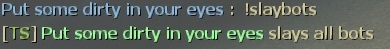

# Description | 內容
Use commands to slay bots

> __Note__ <br/>
This plugin is private, Please contact [me](/#私人插件列表-private-plugins-list)<br/>
此為私人插件, 請聯繫[本人](/#私人插件列表-private-plugins-list)

* Apply to | 適用於
	```
	L4D1
	L4D2
	```

* Image | 圖示
	<br/>

* Require | 必要安裝
	1. [left4dhooks](https://forums.alliedmods.net/showthread.php?t=321696)
	2. [[INC] Multi Colors](https://github.com/fbef0102/L4D1_2-Plugins/releases/tag/Multi-Colors)

* <details><summary>ConVar | 指令</summary>

	* cfg/sourcemod/slay_bots.cfg
		```php
		// 0=Plugin off, 1=Plugin on.
		slay_bots_enable "1"

		// Changes how message displays. (0: Disable, 1:In chat, 2: In Hint Box, 3: In center text)
		slay_bots_announce_type "1"

		// Players with these flags have access to use command to slay bots. (Empty = Everyone, -1: Nobody)
		slay_bots_access_flag "z"

		// Slay which team bots. (1=Survivor, 2=Infected, 3=Both)
		slay_bots_team_bots "3"

		// Delay to slay bots when using !nb cmd
		slay_bots_delay "3.0"

		// If 1, block slay command after game starts (survivors leaving saferoom / survival or scavenge begins)
		slay_bots_game_block "0"
		```
</details>

* <details><summary>Command | 命令</summary>
	
	* **Slay all bots**
		```php
		sm_slaybots
		```

	* **Teleport all bots to your position and slay them.**
		```php
		sm_nobots
		sm_nobot
		sm_nb
		```
</details>

* Translation Support | 支援翻譯
	```
	translations/slay_bots.phrases.txt
	```

* <details><summary>Changelog | 版本日誌</summary>

	* v1.1 (2024-9-21)
		* Support Translation
		* Update cvars

	* v1.0 (2022-12-21)
		* Initial Release
</details>

- - - -
# 中文說明
輸入指令一次處死多個Bots

* 原理
	* 管理員輸入指令處死所有的倖存者bot
	* 也可以處死特感bot

* <details><summary>指令中文介紹 (點我展開)</summary>

	* cfg/sourcemod/slay_bots.cfg
		```php
		// 0=關閉插件, 1=啟動插件
		slay_bots_enable "1"

		// 提示該如何顯示. (0: 不提示, 1: 聊天框, 2: 黑底白字框, 3: 螢幕正中間)
		slay_bots_announce_type "1"

		// 擁有這些權限的玩家，才可以輸入指令 (留白 = 任何人都能, -1: 無人)
		slay_bots_access_flag "z"

		// 處死哪個隊伍的bots? (1=人類, 2=特感, 3=雙方隊伍)
		slay_bots_team_bots "3"

		// 使用!nb指令傳送bots到玩家身邊後等待x秒才處死
		slay_bots_delay "3.0"

		// 為1時，遊戲開始之後，禁止使用指令處死Bots
		// 遊戲開始是指 1. 玩家離開安全室 2. 生存模式計時開始 3. 清道夫模式計時開始
		slay_bots_game_block "0"
		```
</details>

* <details><summary>命令中文介紹 (點我展開)</summary>
	
	* **處死所有bot**
		```php
		sm_slaybots
		```

	* **傳送所有的bot到你的位置上並處死**
		```php
		sm_nobots
		sm_nobot
		sm_nb
		```
</details>