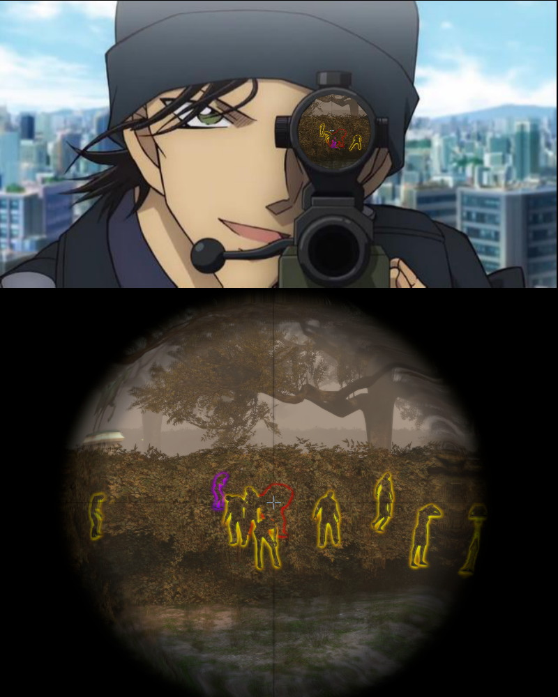

# Description | 內容
Survivor can use sniper scopes to see the infected model glows though the wall

> __Note__ <br/>
This plugin is private, Please contact [me](/#私人插件列表-private-plugins-list)<br/>
此為私人插件, 請聯繫[本人](/#私人插件列表-private-plugins-list)

* [Video | 影片展示](https://youtu.be/JPnXmb5SiYY)

* Image | 圖示
	<br/>

* Require | 必要安裝
	1. [left4dhooks](https://forums.alliedmods.net/showthread.php?t=321696)

* <details><summary>ConVar | 指令</summary>

	* cfg/sourcemod/l4d2_scope_wallhack.cfg
		```php
		// If 1, enable Ghost SI glow.
		l4d2_scope_wallhack_ghost_enable "1"

		// If 1, add a flashing effect on Ghost SI glow.
		l4d2_scope_wallhack_ghost_flashing "1"

		// Ghost SI glow color, Three values between 0-255 separated by spaces. RGB Color255 - Red Green Blue.
		l4d2_scope_wallhack_ghost_color "0 0 255"

		// Ghost SI glow range, 0=No limit
		l4d2_scope_wallhack_ghost_glow_range "2000"

		// If 1, enable Alive SI glow.
		l4d2_scope_wallhack_alive_enable "1"

		// If 1, add a flashing effect on Alive SI glow.
		l4d2_scope_wallhack_alive_flashing "1"

		// Alive SI glow color, Three values between 0-255 separated by spaces. RGB Color255 - Red Green Blue.
		l4d2_scope_wallhack_alive_color "255 0 0"

		// Alive SI glow range, 0=No limit
		l4d2_scope_wallhack_alive_glow_range "2000"

		// If 1, enable Common Infected glow.
		l4d2_scope_wallhack_common_enable "1"

		// If 1, add a flashing effect on Common Infected glow.
		l4d2_scope_wallhack_common_flashing "1"

		// Common Infected glow color, Three values between 0-255 separated by spaces. RGB Color255 - Red Green Blue.
		l4d2_scope_wallhack_common_color "255 155 0"

		// Common Infected glow range, 0=No limit
		l4d2_scope_wallhack_common_glow_range "2000"

		// If 1, enable Witch glow.
		l4d2_scope_wallhack_witch_enable "1"

		// If 1, add a flashing effect on Witch glow.
		l4d2_scope_wallhack_witch_flashing "1"

		// Witch glow color, Three values between 0-255 separated by spaces. RGB Color255 - Red Green Blue.
		l4d2_scope_wallhack_witch_color "155 0 255"

		// Witch glow range, 0=No limit
		l4d2_scope_wallhack_witch_glow_range "2000"

		// Which weapon have wallhack scope? 1=Hunting Rifle, 2=Sniper Military, 4=Sniper AWP, 8=Sniper Scout, 16=SG552. 31=All. Add numbers together. (0=Off)
		l4d2_scope_wallhack_types "15"
		```
</details>

* <details><summary>Command | 命令</summary>
	
	None
</details>

* Apply to | 適用於
	```
	L4D2
	```

* <details><summary>Similar Plugin | 相似插件</summary>

	1. [l4d2_wallhack_cheat](/L4D_插件/Nothing_Impossible_無理改造版/l4d2_wallhack_cheat): Admins can use commands to see the infected model glows though the wall
		> 管理員輸入指令能透視看到特感
	2. [l4d2_glow_item_weapon_cheat](/L4D_插件/Nothing_Impossible_無理改造版/l4d2_glow_item_weapon_cheat): Admins can use commands to see the infected model glows though the wall
		> 管理員輸入指令能透視看到武器與物資
</details>

* <details><summary>Changelog | 版本日誌</summary>

	* v1.1 (2023-5-17)
		* Optimize code and improve performance

	* v1.0
		* Initial Release
</details>

- - - -
# 中文說明
倖存者打開狙擊鏡能透視看到特感

* 原理
	* 倖存者使用狙擊槍打開狙擊鏡能隔牆看到特感光圈
	* 也會看到靈魂特感的光圈

* <details><summary>指令中文介紹 (點我展開)</summary>

	* cfg/sourcemod/l4d2_scope_wallhack.cfg
		```php
		// 為1時，開啟靈魂特感的光圈
		l4d2_scope_wallhack_ghost_enable "1"

		// 為1時，靈魂特感的光圈會閃爍
		l4d2_scope_wallhack_ghost_flashing "1"

		// 靈魂特感的光圈顏色，填入RGB三色 (三個數值介於0~255，需要空格)
		l4d2_scope_wallhack_ghost_color "0 0 255"

		// 靈魂特感的光圈發光範圍, 0=無距離限制
		l4d2_scope_wallhack_ghost_glow_range "2000"

		// 為1時，開啟活著特感的光圈
		l4d2_scope_wallhack_alive_enable "1"

		// 為1時，活著特感的光圈會閃爍
		l4d2_scope_wallhack_alive_flashing "1"

		// 活著特感的光圈顏色，填入RGB三色 (三個數值介於0~255，需要空格)
		l4d2_scope_wallhack_alive_color "255 0 0"

		// 活著特感的光圈發光範圍, 0=無距離限制
		l4d2_scope_wallhack_alive_glow_range "2000"

		// 為1時，開啟普通感染者的光圈
		l4d2_scope_wallhack_common_enable "1"

		// 為1時，普通感染者的光圈會閃爍
		l4d2_scope_wallhack_common_flashing "1"

		// 普通感染者的光圈顏色，填入RGB三色 (三個數值介於0~255，需要空格)
		l4d2_scope_wallhack_common_color "255 155 0"

		// 普通感染者的光圈發光範圍, 0=無距離限制
		l4d2_scope_wallhack_common_glow_range "2000"

		// 為1時，開啟Witch的光圈
		l4d2_scope_wallhack_witch_enable "1"

		// 為1時，Witch的光圈會閃爍
		l4d2_scope_wallhack_witch_flashing "1"

		// Witch的光圈顏色，填入RGB三色 (三個數值介於0~255，需要空格)
		l4d2_scope_wallhack_witch_color "155 0 255"

		// Witch的光圈發光範圍, 0=無距離限制
		l4d2_scope_wallhack_witch_glow_range "2000"

		// 哪一個狙擊槍具有透視狙擊鏡效果 1=獵槍, 2=軍用狙擊槍, 4=AWP, 8=Scout, 16=SG552. 請將數字相加起來 (31=全部)
		l4d2_scope_wallhack_types "15"
		```
</details>
