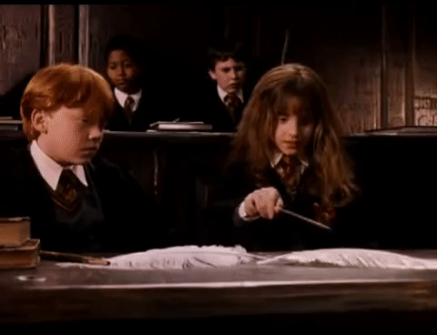
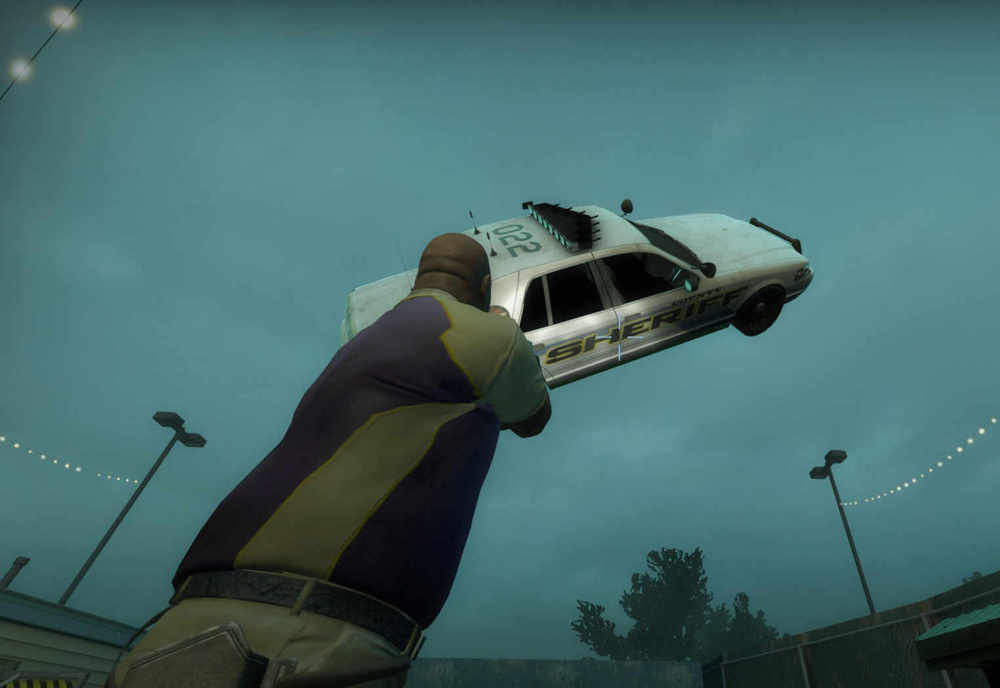
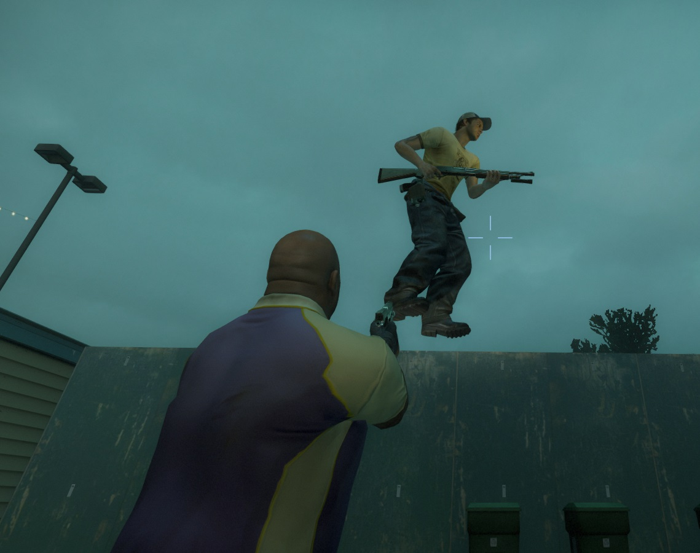

# Description | 內容
Press Double E key to grab and move the objects and players

> __Note__ <br/>
This plugin is private, Please contact [me](/#私人插件列表-private-plugins-list)<br/>
此為私人插件, 請聯繫[本人](/#私人插件列表-private-plugins-list)

* [Video | 影片展示](https://youtu.be/2f0Rk4AcmFk)

* Image | 圖示
	* Wingardium Leviosa! (溫咖癲啦唯啊薩)
	<br/>
	<br/>
	<br/>

* <details><summary>How does it work?</summary>

	* Aim the car or player or item -> press double E -> use mouse to move the object on air.
	* Press E again to release the object or Left mouse to throw the object.
	* You can grab
		1. Player
		2. Gun Weapons, Melee Weapons and Items that have dropped on the ground
		3. Physical props and cars
		4. Pipe bomb projectile, fuel barrel, holiday gift
		5. Tank Rock
	* Unable to grab common infected, special infected, Tank and Witch
	* Infected can move object too.
</details>

* Require | 必要安裝
	1. [left4dhooks](https://forums.alliedmods.net/showthread.php?t=321696)

* <details><summary>ConVar | 指令</summary>

	* cfg/sourcemod/l4d_pushdrag_remake.cfg
		```php
		// Which entity can survivor grab? 
		// 0: Disable, 1: Player, 2:, Weapon/Item 4: Hittable Prop, 8: Moveable Prop (including pipe bomb projectile, fuel barrel, holiday gift...), 16: Tank Rock, 31: All
		l4d_pushdrag_remake_survivor_grab "31"

		// Which entity can infected grab? 
		// 0: Disable, 1: Player, 2:, Weapon/Item 4: Hittable Prop, 8: Moveable Prop (including pipe bomb projectile, fuel barrel, holiday gift...), 16: Tank Rock, 31: All
		l4d_pushdrag_remake_infected_grab "31"

		// Player with these flag have access to Grab object (Empty=Everyone, -1=No one)
		l4d_pushdrag_remake_access_flags ""

		// Grab distance within this range
		l4d_pushdrag_remake_grab_distance "400"

		// Grab tank rock distance within this range
		l4d_pushdrag_remake_grab_rock_distance "400"

		// Press which button twice to grab the objects, , 131072=Shift, 4=Ctrl, 32=Use, 8192=Reload, 524288=Middle Mouse
		// You can add numbers together, ex: 655360=Shift + Middle Mouse
		l4d_pushdrag_remake_grab_buttons "32"

		// Block players using keys when grabbing the objects. (0=Disable, 1=Attack, 2=Attack2, 4=Reload, 7=All, add numbers together)
		l4d_pushdrag_remake_grab_block_key "6"

		// If 1, Prevent players from taking damage with the objects they grab.
		l4d_pushdrag_remake_grab_protect "1"

		// The velocity of the objects when players throw
		l4d_pushdrag_remake_throw_force "2000.0"

		// Hold Distance when grabbing a player
		l4d_pushdrag_remake_player_hold_distance "70.0"

		// Hold Distance when grabbing a weapon
		l4d_pushdrag_remake_weapon_hold_distance "50.0"

		// Hold Distance when grabbing a hittable prop
		l4d_pushdrag_remake_hittable_hold_distance "200.0"

		// Hold Distance when grabbing a moveable prop (including pipe bomb projectile, fuel barrel, holiday gift...)
		l4d_pushdrag_remake_prop_hold_distance "120.0"

		// Hold Distance when grabbing a tank rock
		l4d_pushdrag_remake_rock_hold_distance "300.0"

		// How long can players grab a player
		l4d_pushdrag_remake_player_duration "15.0"

		// How long can players grab a weapon
		l4d_pushdrag_remake_weapon_duration "30.0"

		// How long can players grab a hittable prop
		l4d_pushdrag_remake_hittable_duration "10.0"

		// How long can players grab a moveable prop
		l4d_pushdrag_remake_prop_duration "15.0"

		// How long can players grab a tank rock
		l4d_pushdrag_remake_rock_duration "8.0"

		// Change player move speed when grabbing a player
		l4d_pushdrag_remake_player_speed "180.0"

		// Change player move speed when grabbing a weapon
		l4d_pushdrag_remake_weapon_speed "210.0"

		// Change player move speed when grabbing a hittable prop
		l4d_pushdrag_remake_hittable_speed "100.0"

		// Change player move speed when grabbing a moveable prop
		l4d_pushdrag_remake_prop_speed "150.0"

		// Change player move speed when grabbing a tank rock
		l4d_pushdrag_remake_rock_speed "220.0"

		// If 1, player can press 'Attack2' key to release himself if grabbed by another player
		l4d_pushdrag_remake_grabbed_player_release "1"

		// If 1, incapacitated survivor can grab the objects
		l4d_pushdrag_remake_incap_grab_enable "1"

		// If 1, player can grab the incapacitated survivor
		l4d_pushdrag_remake_grab_incap_enable "1"
		```
</details>

* Apply to | 適用於
	```
	L4D1
	L4D2
	```

* <details><summary>Changelog | 版本日誌</summary>

	* v1.6h (2026-9-11)
	* v1.5h (2025-9-16)
	* v1.4h (2024-3-9)
		* Update cvars

	* v1.3h (2023-6-16)
		* Grab tank rock distance
		* Grab the incapacitated survivor

	* v1.2h (2023-6-14)
		* Grab a tank rock, pipe bomb projectile.
		* Player can press 'Attack2' key to release himself if grabbed by another player.
		* Trigger the alarm if grab alarm cars.
		* Tank/Witch can push away the objects which gabbed by players on the patch.

	* v1.1h
		* Drag and throw prop_fuel_barrel

	* v1.0h
		* Remake Code
		* Add more Convars
		* Safely drag and throw objects
		* Prevent players from taking damage with the objects they grab.
		* How long can players grab a object.
		* Change player move speed when grabbing a object.
		* Block players using keys when grabbing the objects.

	* v12
		* [Original Plugin by panxiaohai](https://forums.alliedmods.net/showthread.php?t=140673)
</details>

- - - -
# 中文說明
玩家對準物品雙擊E鍵，可以使物品或玩家飄浮在半空中

* 原理
	* 玩家對準物品雙擊E鍵，可以使物品飄浮在半空中
    	* 按下E鍵：放下物品
    	* 左鍵：拋出物品
	* 可移動的東西有
		1. 玩家
		2. 掉落在地上的槍械武器、近戰武器、物品
		3. 可移動的物件與任何Tank能打動的車子
		4. 已丟出去的土製炸彈、燃油桶、官方禮物盒
		5. Tank丟出去的石頭
	* 不能對特感、Tank、殭屍、Witch使用飄浮咒
	* 特感也能使用

* <details><summary>指令中文介紹 (點我展開)</summary>

	* cfg/sourcemod/l4d_pushdrag_remake.cfg
		```php
		// 人類可以對哪些物品使用漂浮咒? 
		// 0=不能使用, 1=隊友, 2=武器與物品 4: Tank可以打得動的車子或是物件, 8: 可以移動的物件 (含已丟出去的土製炸彈、汽油桶、禮物盒等等...), 16: Tank丟出去的石頭, 31: 全部
		l4d_pushdrag_remake_survivor_grab "31"

		// 特感可以對哪些物品使用漂浮咒? 
		// 0=不能使用, 1=隊友, 2=武器與物品 4: Tank可以打得動的車子或是物件, 8: 可以移動的物件 (含已丟出去的土製炸彈、汽油桶、禮物盒等等...), 16: Tank丟出去的石頭, 31: 全部
		l4d_pushdrag_remake_infected_grab "31"

		// 擁有這些權限的玩家，才可以使用飄浮咒 (留白 = 任何人都能, -1: 無人)
		l4d_pushdrag_remake_access_flags ""

		// 可以抓400公尺範圍內的 物品
		l4d_pushdrag_remake_grab_distance "400"

		// 可以抓400公尺範圍內 Tank丟出去的石頭
		l4d_pushdrag_remake_grab_rock_distance "400"

		// 哪個按鍵雙擊兩下可以使用飄浮咒? 131072=Shift鍵, 4=Ctrl鍵, 32=E鍵, 8192=R鍵, 524288=滾輪鍵
		// 可以數字相加, 譬如: 655360=必須同時按 "Shift鍵+滾輪鍵"
		l4d_pushdrag_remake_grab_buttons "32"

		// 當玩家被其他人使用飄浮咒控制時，禁止使用以下按鈕. (0=關閉這項功能, 1=左鍵, 2=右鍵, 4=裝彈, 請將數字相加起來, 7=全部)
		l4d_pushdrag_remake_grab_block_key "6"

		// 為1時，玩家再操控的車子的期間不會砸傷自己
		l4d_pushdrag_remake_grab_protect "1"

		// 玩家把物品丟出去的力道
		l4d_pushdrag_remake_throw_force "2000.0"

		// 抓取隊友的時候，飄浮在空中與你保持的距離
		l4d_pushdrag_remake_player_hold_distance "70.0"

		// 抓取武器的時候，飄浮在空中與你保持的距離
		l4d_pushdrag_remake_weapon_hold_distance "50.0"

		// 抓取車子的時候，飄浮在空中與你保持的距離
		l4d_pushdrag_remake_hittable_hold_distance "200.0"

		// 抓取物品的時候，飄浮在空中與你保持的距離 (包含已丟出去的土製炸彈、汽油桶、禮物盒等等...)
		l4d_pushdrag_remake_prop_hold_distance "120.0"

		// 抓取Tank丟出去的石頭時候，飄浮在空中與你保持的距離
		l4d_pushdrag_remake_rock_hold_distance "300.0"

		// 抓取隊友，只能控制15秒
		l4d_pushdrag_remake_player_duration "15.0"

		// 抓取武器，只能控制30秒
		l4d_pushdrag_remake_weapon_duration "30.0"

		// 抓取車子，只能控制10秒
		l4d_pushdrag_remake_hittable_duration "10.0"

		// 抓取物品，只能控制15秒
		l4d_pushdrag_remake_prop_duration "15.0"

		// 抓取Tank丟出去的石頭，只能控制8秒
		l4d_pushdrag_remake_rock_duration "8.0"

		// 抓取隊友，能移動的速度
		l4d_pushdrag_remake_player_speed "180.0"

		// 抓取武器，能移動的速度
		l4d_pushdrag_remake_weapon_speed "210.0"

		// 抓取車子，能移動的速度
		l4d_pushdrag_remake_hittable_speed "100.0"

		// 抓取物品，能移動的速度
		l4d_pushdrag_remake_prop_speed "150.0"

		// 抓取Tank丟出去的石頭，能移動的速度
		l4d_pushdrag_remake_rock_speed "220.0"

		// 為1時，玩家被其他人使用飄浮咒控制時，可以按下 '右鍵' 釋放自己
		l4d_pushdrag_remake_grabbed_player_release "1"

		// 為1時，倒地的玩家也能使用飄浮咒
		l4d_pushdrag_remake_incap_grab_enable "1"

		// 為1時，可以抓取倒地的玩家
		l4d_pushdrag_remake_grab_incap_enable "1"
		```
</details>

