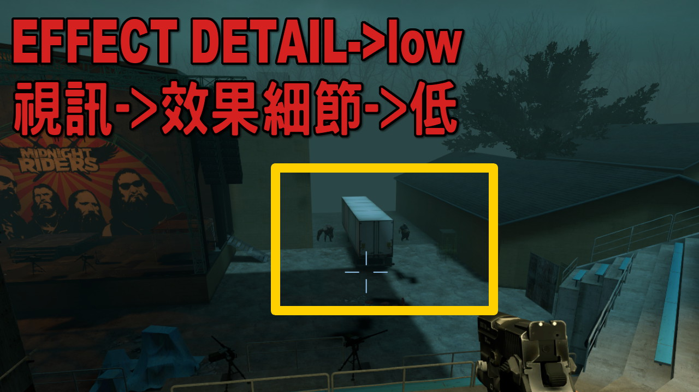
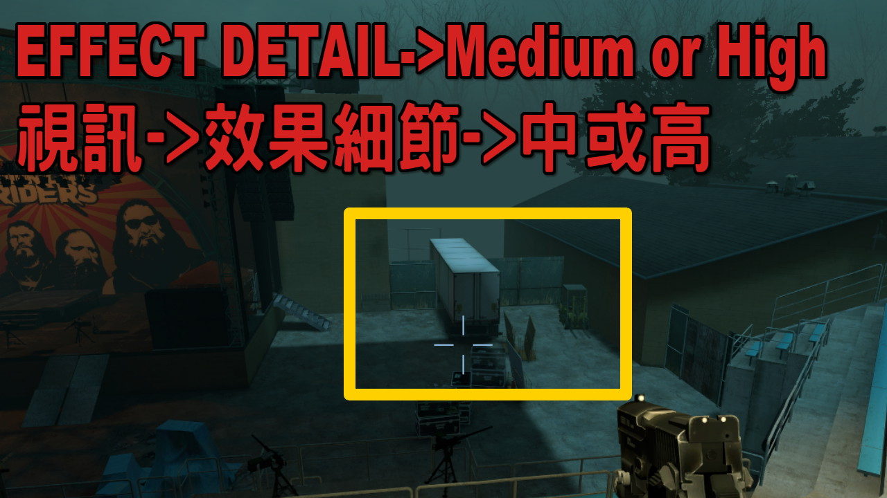
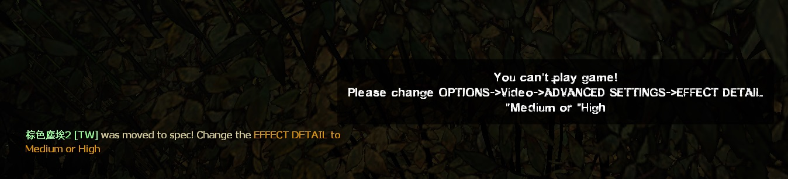
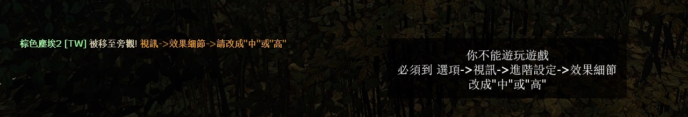

# Description | 內容
Don't let player plays game if EFFECT DETAIL is low (Prevent player from seeing through walls)

> __Note__ <br/>
This plugin is private, Please contact [me](/#私人插件列表-private-plugins-list)<br/>
此為私人插件, 請聯繫[本人](/#私人插件列表-private-plugins-list)

* Apply to | 適用於
	```
	L4D1
	L4D2
	```

* [Video | 影片展示](https://www.youtube.com/watch?v=B0hA-rg98WY)

* Image
	<br/>
	<br/>

* <details><summary>How does it work?</summary>

	* (Before) You can see the infected and tank through walls if options -> video -> EFFECT DETAIL -> low
		* Don't ask me why, this is valve's game from year 2008
	* (After) Force player to spectate if player set options -> video -> EFFECT DETAIL -> low
	<br/>
</details>

* Require | 必要安裝
	1. [[INC] Multi Colors](https://github.com/fbef0102/L4D1_2-Plugins/releases/tag/Multi-Colors)>

* <details><summary>ConVar | 指令</summary>

	* cfg/sourcemod/l4d_cpu_level.cfg
		```php
		// 0=Plugin off, 1=Plugin on.
		l4d_cpu_level_enable "1"
		```
</details>

* Translation Support | 支援翻譯
	```
	translations/l4d_cpu_level.phrases.txt
	```

* <details><summary>Changelog | 版本日誌</summary>

	* v1.0 (2025-3-8)
		* Initial Release
</details>

- - - -
# 中文說明
視訊->效果細節為低的玩家不能遊玩 (防止遊戲的合法透視)

* 原理
	* (裝此插件之前) 視訊->效果細節為低的玩家可以透視看到遠方躲在牆後的特感或是Tank
		* 別問我為捨會這樣，這遊戲是2008年，當年為了應付低配備的電腦而不會渲染遠方的障礙物
	* (裝此插件之後) 視訊->效果細節為低的玩家強制旁觀
	<br/>

* <details><summary>指令中文介紹 (點我展開)</summary>

	* cfg/sourcemod/l4d_cpu_level.cfg
		```php
		// 0=關閉插件, 1=啟動插件
		l4d_cpu_level_enable "1"
		```
</details>


