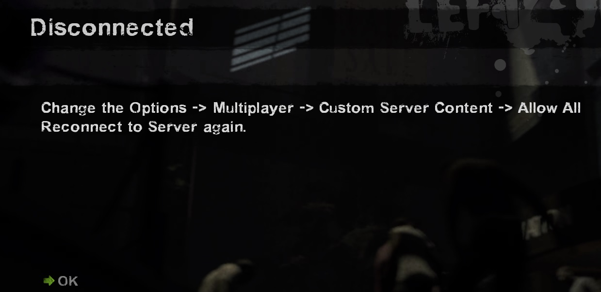
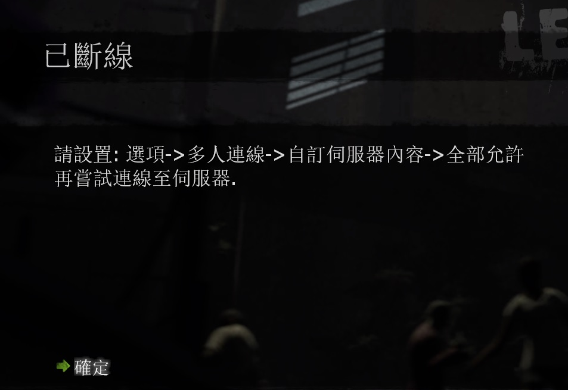

# Description | 內容
Force player to download your server's custom content

> __Note__ <br/>
This plugin is private, Please contact [me](/#私人插件列表-private-plugins-list)<br/>
此為私人插件, 請聯繫[本人](/#私人插件列表-private-plugins-list)

* Apply to | 適用於
	```
	L4D1
	L4D2
	```

* Image
	<br/>

* <details><summary>How does it work?</summary>

	* Kick player if player not set options -> multiplayer -> custom server content -> allow all
	* Force player to download your server's custom content via fastdl such as
		* Custom music: [l4d_MusicMapStart](https://github.com/fbef0102/L4D1_2-Plugins/tree/master/l4d_MusicMapStart)
		* Custom materials: [map-decals](https://github.com/fbef0102/L4D1_2-Plugins/tree/master/map-decals)
		* Custom models: [fortnite_dances_emotes_l4d](/L4D_插件/Fun_娛樂/fortnite_dances_emotes_l4d)
</details>

* Require | 必要安裝
	1. 🟥 Use this plugin only when you have [fastdl set](https://developer.valvesoftware.com/wiki/FastDL)
		* 🟥 有使用自己準備的[網空支援Fastdl](https://developer.valvesoftware.com/wiki/Zh/FastDL)，才需要安裝此插件
	2. [[INC] Multi Colors](https://github.com/fbef0102/L4D1_2-Plugins/releases/tag/Multi-Colors)

* <details><summary>Support | 支援插件</summary>

	1. [l4d_fastdl_delay_downloader](https://github.com/fbef0102/L4D1_2-Plugins/tree/master/l4d_fastdl_delay_downloader): Downloading fastdl custom files only when map change/transition
		* 只有在換圖或過關時，才讓玩家下載Fastdl自製的檔案
</details>

* <details><summary>ConVar | 指令</summary>

	* cfg/sourcemod/l4d_force_client_custom_download.cfg
		```php
		// 0=Plugin off, 1=Plugin on.
		l4d_force_client_custom_download_enable "1"
		```
</details>

* Translation Support | 支援翻譯
	```
	translations/l4d_force_client_custom_download.phrases.txt
	```

* <details><summary>Related Plugin | 相關插件</summary>

	1. [sm_downloader](https://github.com/fbef0102/Sourcemod-Plugins/tree/main/sm_downloader): SM File/Folder Downloader and Precacher
		* SM 文件下載器 (玩家連線伺服器的時候能下載自製的檔案)
</details>

* <details><summary>Changelog | 版本日誌</summary>

	* v1.0 (2025-3-8)
		* Initial Release
</details>

- - - -
# 中文說明
強制玩家打開設置下載伺服器自製的檔案

* 圖示
	<br/>

* 原理
	* 玩家如果沒有設置: 選項->多人連線->自訂伺服器內容->全部允許，則踢出伺服器
	* 強制玩家連線時下載 (透過Fastdl)
		* 自製音樂，譬如: [l4d_MusicMapStart](https://github.com/fbef0102/L4D1_2-Plugins/tree/master/l4d_MusicMapStart)
		* 自製貼圖，譬如: [map-decals](https://github.com/fbef0102/L4D1_2-Plugins/tree/master/map-decals)
		* 自製模型，譬如: [fortnite_dances_emotes_l4d](/L4D_插件/Fun_娛樂/fortnite_dances_emotes_l4d)

* <details><summary>指令中文介紹 (點我展開)</summary>

	* cfg/sourcemod/l4d_force_client_custom_download.cfg
		```php
		// 0=關閉插件, 1=啟動插件
		l4d_force_client_custom_download_enable "1"
		```
</details>


