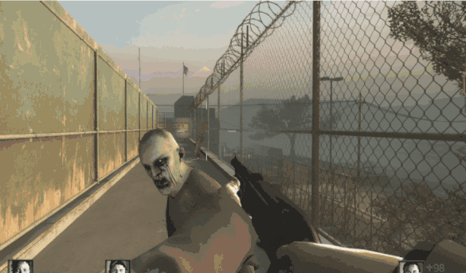
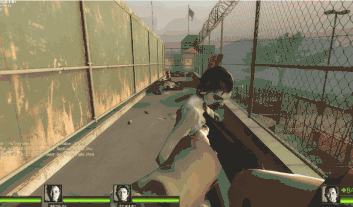
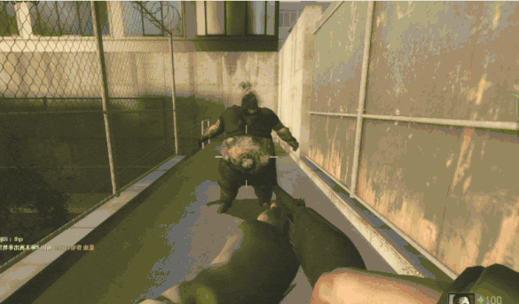
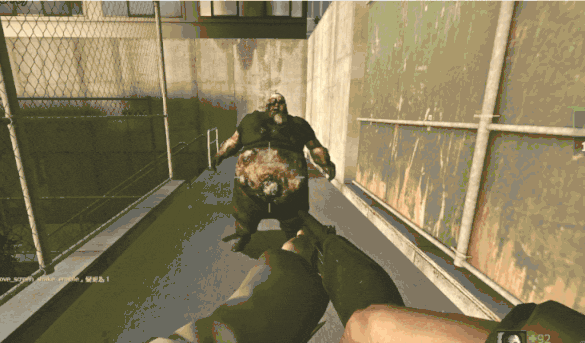
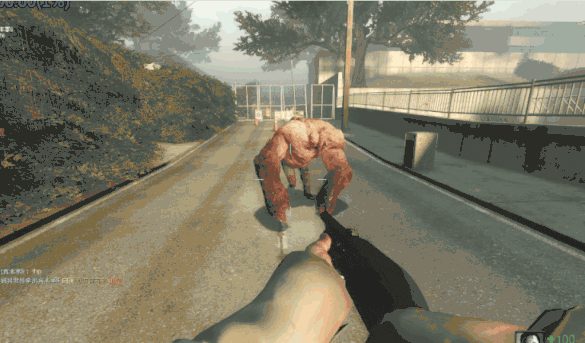
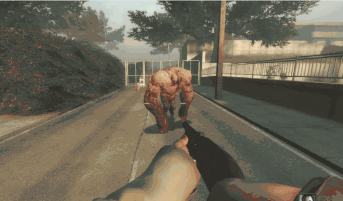
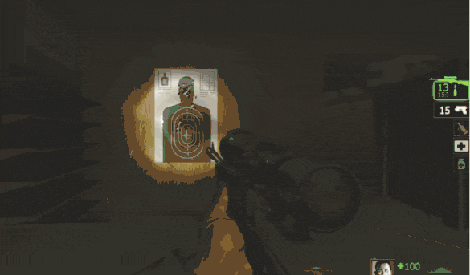
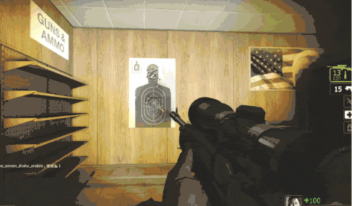
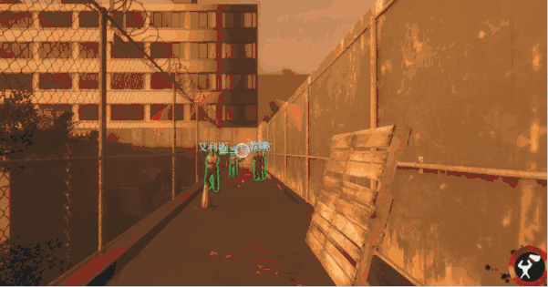
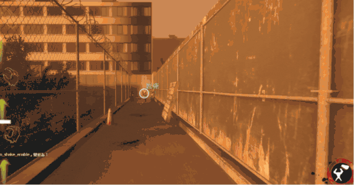

# Description | 內容
Remove a variety of screen shaking in L4D 1/2

> __Note__ <br/>
This plugin is private, Please contact [me](/#私人插件列表-private-plugins-list)<br/>
此為私人插件, 請聯繫[本人](/#私人插件列表-private-plugins-list)

* Apply to | 適用於
	```
	L4D1 
	L4D2
	```

* [Video | 影片展示](https://youtu.be/RtgPmA03ZkE)

* <details><summary>Image | 圖示</summary>

	| Before (裝此插件之前) | After (裝此插件之後) |
	| -------------|:-----------------:|
	| ||
	| ||
	| ||
	| ||
	| ||
	| ||
	| ||
</details>

* <details><summary>How does it work?</summary>

	* Prevent survivor vision from getting experiencing recoil and screen shaking when
		* Teammates or bots shoot through you
		* Teammates or bots shove you
	* Remove survivor screen shaking
		* Friendly Fire
		* Teammate Shove
		* Hit by zombies
		* Hit by Boomer bile
		* Gun shooting (Still have recoil and spread)
		* By the Tank walking
	* Remove special infected screen shaking
		* Getting hit by bullet
</details>

* Require | 必要安裝
	1. [left4dhooks](https://forums.alliedmods.net/showthread.php?t=321696)

* <details><summary>ConVar | 指令</summary>

	* cfg/sourcemod/l4d_remove_screen_shake.cfg
		```php
		// 0=Plugin off, 1=Plugin on.
		l4d_remove_screen_shake_enable "1"

		// Remove which screen shaking for survivors? 1=Friendly Fire, 2=Friendly Shove, 4=Hit by zombies, 8=Hit by Boomer bile, 16=Gun shooting(Still have recoil and spread), 32=By the Tank walking
		// Add numbers together, 63=All
		l4d_remove_screen_shake_type "63"

		// (L4D2) Remove screen shaking for speical infected when getting hit: 1=Smoker, 2=Boomer, 4=Hunter, 8=Spitter, 16=Jockey, 32=Charger, 64=Tank
		// Add numbers together, 0=None, 127=All
		l4d_remove_screen_shake_infected_flag "127"

		// (L4D1) Remove screen shaking for speical infected when getting hit: 1=Smoker, 2=Boomer, 4=Hunter, 8=Tank
		// Add numbers together, 0=None, 15=All
		l4d_remove_screen_shake_infected_flag "15"

		// Survivor Players with these flags can prevent friendly fire shaking. (Empty = Everyone, -1: Nobody)
		l4d_remove_screen_shake_ff_flag ""

		// Survivor Players with these flags can prevent friendly shove shaking. (Empty = Everyone, -1: Nobody)
		l4d_remove_screen_shake_shove_flag ""

		// Infected Players with these flags can prevent getting hit shaking. (Empty = Everyone, -1: Nobody)
		l4d_remove_screen_shake_inf_hurt_flag ""
		```
</details>

* <details><summary>Related Official ConVar</summary>

	* This plugin already modified, you don't need to change the following cvars
		| ConVar/Command  				| Parameters or default value 	| Descriptor  			| Effect|
		| -------------|:-----------------:|:-------------:|:-------------:|
		| z_gun_vertical_punch 				| 1   | Boolean	 	| Toggles vertical punchangles for guns |
		| z_gun_horiz_punch     			| 0   | Boolean 	| Toggles horizontal punchangles for guns |
		| z_claw_hit_pitch_max    			| 0   | angle 		| Screen shake when hit by zombie |
		| z_claw_hit_pitch_min     			| 0   | angle 		| Screen shake when hit by zombie |
		| z_claw_hit_yaw_max     			| 0   | angle 		| Screen shake when hit by zombie |
		| z_claw_hit_yaw_min     			| 0   | angle 		| Screen shake when hit by zombie |
		| z_tank_footstep_shake_duration    | 2   | Second 		| Screen shak if Tank nearby |
</details>

* <details><summary>Changelog | 版本日誌</summary>

	* v1.4 (2026-5-30)
		* Rename Plugin
		* Remove more screen shaking
		* Update cvars
		* Support L4D1

	* v1.3 (2026-5-15)
		* Improve code
		* Use detour to remove scree shaking
		* 不會與友傷插件產生衝突 (Won't conflict with other friend fire damage modify plugins)

	* v1.2 (2024-12-23)
		* Update cvars

	* v1.1 (2024-10-8)
		* Fixed shove not working on teammate who is pinned by infected

	* v1.0 (2023-4-6)
		* Initial Release
</details>

- - - -
# 中文說明
移除遊戲內各種情況的視角晃動

* 原理
	* 發生以下情況不會螢幕晃動與後座力降低
		* 隊友或AI Bot子彈打中你的身體
		* 隊友或AI Bot右鍵推到你
	* (倖存者) 發生以下情況不會螢幕晃動
		* 被隊友友傷
		* 被隊友或AI Bot右鍵推到
		* 被小殭屍或特感抓到
		* 被Boomer噴中期間
		* 開槍射擊時 (但依然有後座力, 子彈依然會擴散)
		* Tank在附近移動時
	* (感染者) 發生以下情況不會螢幕晃動
		* 被子彈打中

* <details><summary>指令中文介紹 (點我展開)</summary>

	* cfg/sourcemod/l4d_remove_screen_shake.cfg
		```php
		// 0=關閉插件, 1=啟動插件
		l4d_remove_screen_shake_enable "1"

		// (倖存者) 發生以下情況不會螢幕晃動 1=友傷, 2=被隊友右鍵推到, 4=被小殭屍或特感抓到, 8=被Boomer噴中期間, 16=開槍射擊時 (但依然有後座力, 子彈依然會擴散), 32=Tank在附近移動時
		// 請數字相加一起, 63=全部
		l4d_remove_screen_shake_type "63"

		// (L4D2) 哪一種特感被子彈打中時不會螢幕晃動: 1=Smoker, 2=Boomer, 4=Hunter, 8=Spitter, 16=Jockey, 32=Charger, 64=Tank
		// 請數字相加一起, 127=全部特感
		l4d_remove_screen_shake_infected_flag "127"

		// (L4D1) 哪一種特感被子彈打中時不會螢幕晃動:: 1=Smoker, 2=Boomer, 4=Hunter, 8=Tank
		// 請數字相加一起, 15=全部特感
		l4d_remove_screen_shake_infected_flag "15"

		// 擁有這些權限的倖存者玩家，被隊友的子彈打中不會螢幕晃動 (留白 = 任何人都能, -1: 無人)
		l4d_remove_screen_shake_ff_flag ""

		// 擁有這些權限的倖存者玩家，被隊友的右鍵推到不會螢幕晃動 (Empty = Everyone, -1: Nobody)
		l4d_remove_screen_shake_shove_flag ""

		// 擁有這些權限的特感玩家，被子彈打中時不會螢幕晃動 (Empty = Everyone, -1: Nobody)
		l4d_remove_screen_shake_inf_hurt_flag ""
		```
</details>

* <details><summary>相關的官方指令中文介紹 (點我展開)</summary>

	* 這個插件已經修改並接管以下所有指令, 你無須更動
		| 指令  				| 預設值 	| 單位  			| 影響|
		| -------------|:-----------------:|:-------------:|:-------------:|
		| z_gun_vertical_punch 				| 1   | 布林值	 	| 槍枝射擊時晃動垂直方向 |
		| z_gun_horiz_punch     			| 0   | 布林值 		| 槍枝射擊時晃動水平方向 |
		| z_claw_hit_pitch_max    			| 0   | 角度 		| 被殭屍抓時晃動 |
		| z_claw_hit_pitch_min     			| 0   | 角度 		| 被殭屍抓時晃動 |
		| z_claw_hit_yaw_max     			| 0   | 角度 		| 被殭屍抓時晃動 |
		| z_claw_hit_yaw_min     			| 0   | 角度 		| 被殭屍抓時晃動 |
		| z_tank_footstep_shake_duration    | 2   | 秒數 		| Tank在附近時晃動 |
</details>