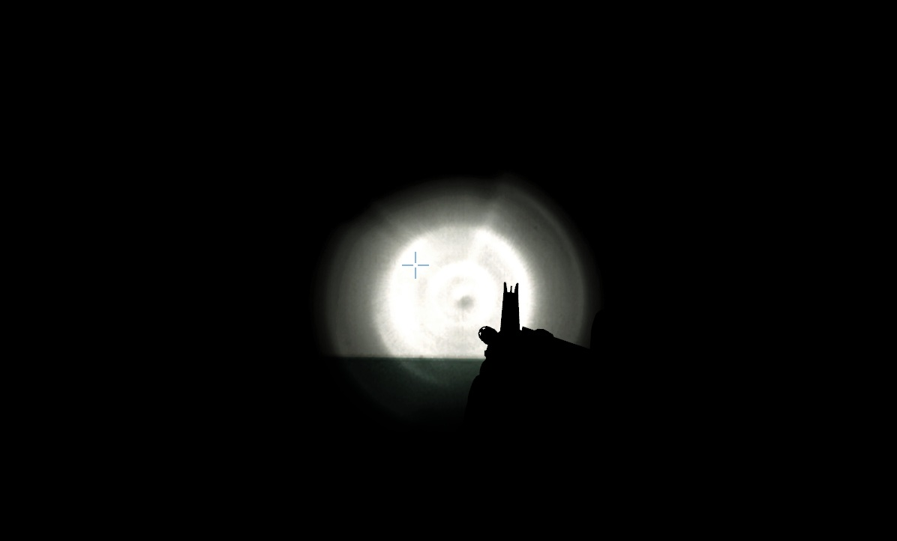
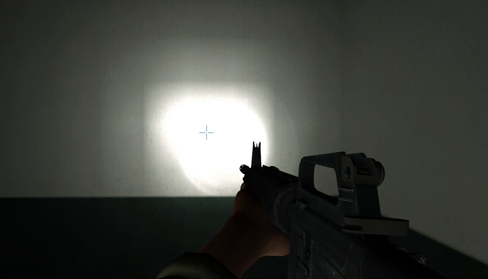
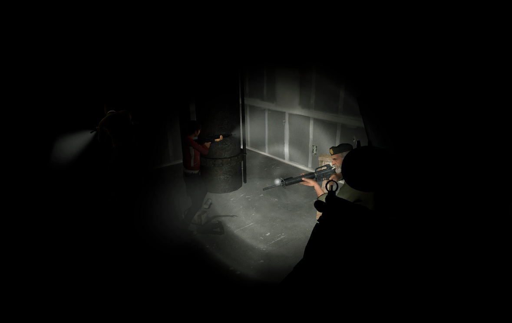
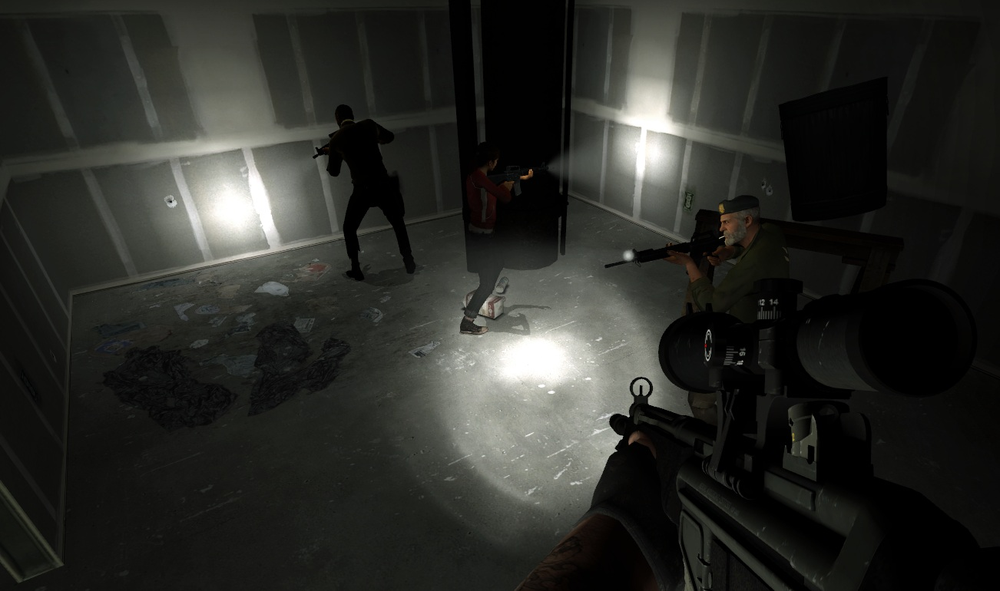
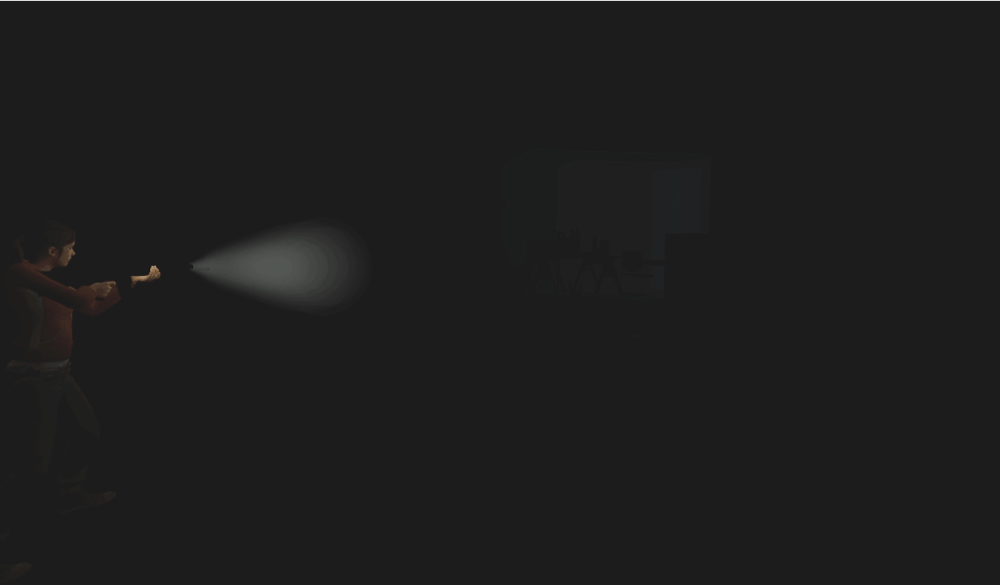
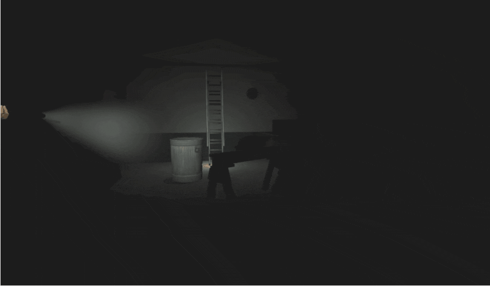
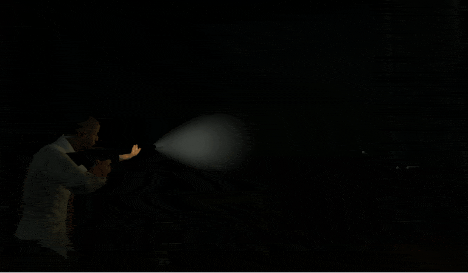
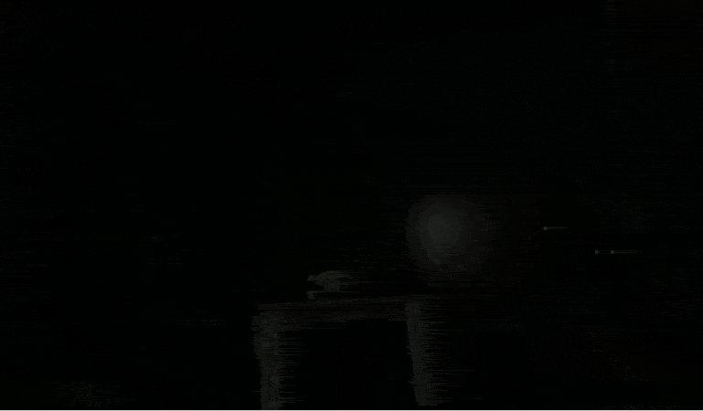

# Description | 內容
Remake Survivor Realism Dynamic Flash Lights!

> __Note__ <br/>
This plugin is private, Please contact [me](/#私人插件列表-private-plugins-list)<br/>
此為私人插件, 請聯繫[本人](/#私人插件列表-private-plugins-list)

* Apply to | 適用於
	```
	L4D1
	L4D2
	```

* [Video | 影片展示](https://youtu.be/oHXD7uTQjy4)

* Image | 圖示
	| Before (裝此插件之前)  			| After (裝此插件之後) |
	| -------------|:-----------------:|
	| ||
	| ||
	| ||
	| ||

* <details><summary>How does it work?</summary>

	* Double tapping ```F key``` to enable/disable dynamic light
	* Add flash spotlight to where survivors are pointing with flashlights on.
		* The radius of the spotlight will get smaller or bigger based on the player's distance from walls/surfaces
	* Attach ambient spotlight to survivors with flashlights on.
</Chargedetails>

* Require | 必要安裝
	1. [left4dhooks](https://forums.alliedmods.net/showthread.php?t=321696)
	2. [[INC] Multi Colors](https://github.com/fbef0102/L4D1_2-Plugins/releases/tag/Multi-Colors)

* <details><summary>ConVar | 指令</summary>

	* cfg/sourcemod/l4d_team_flashlight_remake.cfg
		```php
		// 0=Plugin off, 1=Plugin on.
		l4d_team_flashlight_remake_enable "1"

		// 0=No, 1=Allow bots to have dynamic lights.
		l4d_team_flashlight_remake_bots "1"

		// 0=Off, 1=On. Default state of the light when players join.
		l4d_team_flashlight_remake_default "0"

		// 0=All weapons and items. 1=Guns only. Which items/weapons does the light work on.
		l4d_team_flashlight_remake_guns "0"

		// 1=Print to chat, 2=Hint box.
		l4d_team_flashlight_remake_announce_type "2"

		// 0=Off. 1=Show hint when first using the flashlight, 2=Show hint on toggle, 3=Both.
		l4d_team_flashlight_remake_hints "1"

		// If 1, player can double tapping flashlight key(F) to enable/disable dynamic light
		l4d_team_flashlight_remake_toggle "1"

		// Who can see the dynamic flash light? 0=No one
		// 1=Owner, 2=Other players, 3=Both.
		l4d_team_flashlight_remake_flash_show "3"

		// Distance the flash spotlight shines before not lighting up.
		l4d_team_flashlight_remake_flash_distance "800"

		// The RGB render color of the flash spotlight 
		l4d_team_flashlight_remake_flash_color "13 13 13"

		// The intensity of the flash spotlight. Maximum: 127
		l4d_team_flashlight_remake_flash_brightness "3"

		// This is the size of the flash spotlight, at the object that it is hitting. (The radius will get smaller based on the player's distance from walls/surfaces)
		l4d_team_flashlight_remake_flash_size "50.0"

		// Based on the player's distance from walls/surfaces, the radius of the flash spotlight will get 0=bigger, 1=smaller
		l4d_team_flashlight_remake_flash_type "0"

		// The angles of the inner flash spotlight beam. 0: makes it omnidirectional.
		l4d_team_flashlight_remake_flash_inner_cone "1"

		// The angles of the outer flash spotlight beam. 0: makes it omnidirectional.
		l4d_team_flashlight_remake_flash_cone "15"

		// Who can see the dynamic ambient light? 0=No one
		// 1=Owner, 2=Other players, 3=Both.
		l4d_team_flashlight_remake_ambient_show "1"

		// The RGB render color of the ambient spotlight 
		l4d_team_flashlight_remake_ambient_color "50 50 50"

		// The intensity of the ambient spotlight. Maximum: 127
		l4d_team_flashlight_remake_ambient_brightness "1"

		// The size of ambient spotlight around the player
		l4d_team_flashlight_remake_ambient_size "200"
		```
</details>

* Translation Support | 支援翻譯
	```
	translations/l4d_team_flashlight_remake.phrases.txt
	```

* <details><summary>Changelog | 版本日誌</summary>

	* v1.2h (2025-8-21)
		* Fixed ambient light glitch when flashlight is off

	* v1.1h (2025-8-9)
		* Add cvars

	* v1.0h (2025-08-06)
		* Remake code.
		* Use left4dhooks to improve code
		* Remove Lux's library include
		* Add cvars to control flashlight brightness, color, distance, radius
		* Double tapping F key to enable/disable dynamic flash light
		* Add hints and translation

	* Credit & Original
		* By LuxLuma: [L4D1-2_team_lights](https://github.com/LuxLuma/L4D-small-plugins/tree/master/L4D1-2_team_lights)
</details>

- - - -
# 中文說明
倖存者有真實的手電筒光照效果

* 原理
	* 雙擊```F鍵```即可開啟或關閉此插件的光照特效
	* 倖存者的手電筒照到牆壁上，牆壁上有圓光特效，隊友都可以看到
		* 隨著玩家距離牆壁越遠, 牆壁上光環圓圈變小或變大
	* 倖存者的手電筒打開時，身體周圍會有環境光照效果

* <details><summary>指令中文介紹 (點我展開)</summary>

	* cfg/sourcemod/l4d_team_flashlight_remake.cfg
		```php
		// 0=關閉插件, 1=啟動插件
		l4d_team_flashlight_remake_enable "1"

		// 0=Bot沒有, 1=允許Bots有光照效果
		l4d_team_flashlight_remake_bots "1"

		// 玩家第一次加入伺服器時，手電筒特效預設狀態. 0=關閉, 1=開啟
		l4d_team_flashlight_remake_default "0"

		// 0=所有武器與物品皆有光照效果. 1=只有帶手電筒的武器才有光照效果
		l4d_team_flashlight_remake_guns "0"

		// 提示打印到, 1=聊天框, 2=黑底白字框
		l4d_team_flashlight_remake_announce_type "2"

		// 0=關閉提示. 1=第一次使用手電筒時提示, 2=每次使用手電筒時提示, 3=兩者皆提示.
		l4d_team_flashlight_remake_hints "1"

		// 為1時，玩家雙擊F鍵即可開啟或關閉此插件的光照特效
		l4d_team_flashlight_remake_toggle "1"

		// 誰可以看見手電筒照到牆壁上的光 (0=沒人能看見)
		// 1=自己, 2=其他人, 3=兩者皆是.
		l4d_team_flashlight_remake_flash_show "3"

		// 手電筒最遠照射距離
		l4d_team_flashlight_remake_flash_distance "800"

		// 手電筒照到牆壁上的顏色，填入RGB三色 (三個數值介於0~255，需要空格)
		l4d_team_flashlight_remake_flash_color "13 13 13"

		// 手電筒照到牆壁上的光亮強度，最大: 127
		l4d_team_flashlight_remake_flash_brightness "3"

		// 手電筒照到牆壁上的光環圓圈大小
		l4d_team_flashlight_remake_flash_size "50.0"

		// 隨著玩家距離牆壁越遠, 光環圓圈 0=越大, 1=越小
		l4d_team_flashlight_remake_flash_type "0"

		// 手電筒內部聚光燈光束的角度 0: 全方位. (看不懂則不要修改)
		l4d_team_flashlight_remake_flash_inner_cone "1"

		// 手電筒外部聚光燈光束的角度 0: 全方位. (看不懂則不要修改)
		l4d_team_flashlight_remake_flash_cone "15"

		// 誰可以看見手電筒持有者周圍的環境光 (0=沒人能看見)
		// 1=自己, 2=其他人, 3=兩者皆是.
		l4d_team_flashlight_remake_ambient_show "1"

		// 手電筒持有者周圍的環境光的顏色，填入RGB三色 (三個數值介於0~255，需要空格)
		l4d_team_flashlight_remake_ambient_color "50 50 50"

		// 手電筒持有者周圍的環境光亮強度，最大: 127
		l4d_team_flashlight_remake_ambient_brightness "1"

		// 手電筒持有者周圍的環境光的範圍
		l4d_team_flashlight_remake_ambient_size "200"
		```
</details>
