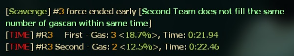
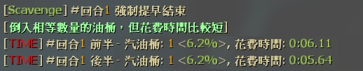
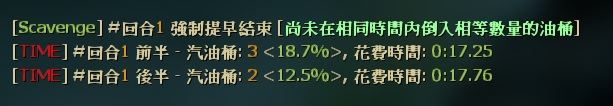

# Description | 內容
Display Scavenge score and time, checks various win conditions mid-round and forece end if necessary.

> __Note__ <br/>
This plugin is private, Please contact [me](https://github.com/fbef0102/Game-Private_Plugin#私人插件列表-private-plugins-list)<br/>
此為私人插件, 請聯繫[本人](https://github.com/fbef0102/Game-Private_Plugin#私人插件列表-private-plugins-list)

* Apply to | 適用於
	```
	L4D2 Scavenge
	```

* Image
	* Display round score and time
	<br/>
	
	* Special rule win : Second Team does not fill the same number of gascan within same time, second team loses.
	<br/>
	
	* Special rule win : Second Team fill the same number of gascan but cost less time, second team wins.
	<br/>
	
	* Special rule win : Both Team fill zero gascan, but second team lives longer, second team wins.
	<br/>

* Require | 必要安裝
	1. [[INC] Multi Colors](https://github.com/fbef0102/L4D1_2-Plugins/releases/tag/Multi-Colors)

* <details><summary>ConVar | 指令</summary>

	* cfg/sourcemod/l4d2_scavenge_special_rule_end.cfg
		```php
		// 0=Plugin off, 1=Plugin on.
		l4d2_scavenge_special_rule_end_enable "1"

		// If 1, Disable all scavenge end special rule, plugin will provide score display only.
		l4d2_scavenge_special_rule_end_score_only "0"

		// If 1, Enable scavenge end special rule: Second Team fill the same number of gascan but cost less time, second team wins.
		l4d2_scavenge_special_rule_end_fillsamegas_enable "1"

		// If 1, Enable scavenge end special rule: Second Team does not fill the same number of gascan within same time, second team loses.
		l4d2_scavenge_special_rule_end_notfillsamegas_enable "1"

		// If 1, Enable scavenge end special rule: Both Team fill zero gascan, but second team lives longer, second team wins.
		l4d2_scavenge_special_rule_end_zerogas_enable "1"
		```
</details>

* <details><summary>Command | 命令</summary>

	* **Display round score and time**
		```php
		sm_score
		sm_time
		```
</details>

* Translation Support | 支援翻譯
	```
	translations/l4d2_scavenge_special_rule_end.phrases.txt
	```

* <details><summary>Changelog | 版本日誌</summary>

	* v1.0h (2023-3-1)
		* Remake code, convert code to latest syntax
		* Fix warnings when compiling on SourceMod 1.11.
		* Optimize code and improve performance
		* Replace Gamedata with left4dhooks
		* Add more cvars,
		* Add one more special rule: Second Team does not fill the same number of gascan within same time
		* Translation Support

	* v1.2
		* [Original Plugin by ProdigySim](https://github.com/ProdigySim/misc-sourcemod-plugins/blob/master/scavenge_quick_end/scavenge_quick_end.sp)
</details>

- - - -
# 中文說明
顯示回合分數與時間，清道夫模式下新增不同的特殊勝利規則

* 原理
	* 回合結束時顯示分數與時間，也可以打```!score```顯示
		<br/>
	
	* 新增三個不同的特殊勝利規則，提早結束回合
		1. 	特殊勝利規則1 : 雙方倒入相等數量的油桶，但後半回合隊伍花費時間比較短，強制結束回合，後半回合隊伍獲勝
		<br/>

		2. 	特殊勝利規則2 : 未在相同時間內倒入相同數量的油桶，強制結束回合，後半回合隊伍失敗
		<br/>

		3. 特殊勝利規則3 : 雙方倒入0個汽油桶，但後半回合隊伍存活時間比較長，強制結束回合，後半回合隊伍獲勝
		<br/>

* <details><summary>指令中文介紹</summary>

	* cfg/sourcemod/l4d2_scavenge_special_rule_end.cfg
		```php
		// 0=關閉插件, 1=啟動插件
		l4d2_scavenge_special_rule_end_enable "1"

		// 為1時，關閉所有特殊勝利規則，此插件只顯示回合分數與回合時間
		l4d2_scavenge_special_rule_end_score_only "0"

		// 為1時，啟用特殊勝利規則1 : 雙方倒入相等數量的油桶，但後半回合隊伍花費時間比較短，強制結束回合，後半回合隊伍獲勝
		l4d2_scavenge_special_rule_end_fillsamegas_enable "1"

		// 為1時，啟用特殊勝利規則1 : 未在相同時間內倒入相同數量的油桶，強制結束回合，後半回合隊伍失敗
		l4d2_scavenge_special_rule_end_notfillsamegas_enable "1"

		// 為1時，啟用特殊勝利規則1 : 雙方倒入0個汽油桶，但後半回合隊伍存活時間比較長，強制結束回合，後半回合隊伍獲勝
		l4d2_scavenge_special_rule_end_zerogas_enable "1"
		```
</details>

* <details><summary>命令中文介紹</summary>

	* **顯示回合分數與回合時間**
		```php
		sm_score
		sm_time
		```
</details>