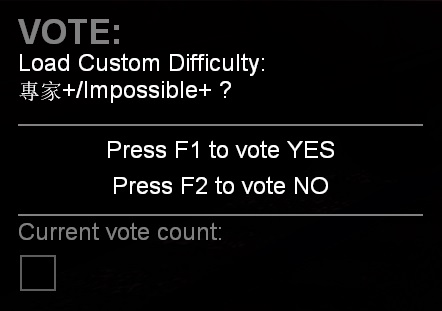
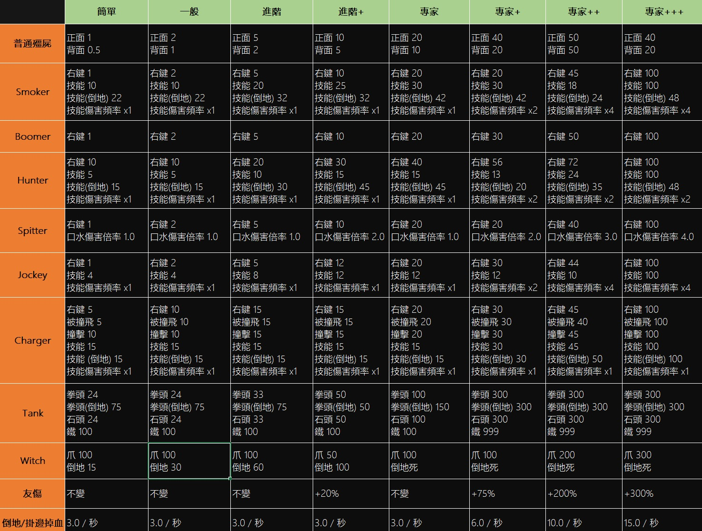

# Description | 內容
Set your own custom difficulty and damage + vote to change custom difficulty

> __Note__ <br/>
This plugin is private, Please contact [me](/#私人插件列表-private-plugins-list)<br/>
此為私人插件, 請聯繫[本人](/#私人插件列表-private-plugins-list)

* Apply to | 適用於
	```
	L4D1
	L4D2
	```

* Image
	* Free to modify custom difficulty and damage, image for reference only
	<br/>
	<br/>
	<br/>

* <details><summary>How does it work?</summary>

	* Type ```!dvote``` -> select custom difficulty -> call vote to change -> load custom difficulty
	* Modify custom difficulty name and damage, file is in [data/l4d2_custom_difficulty.cfg](addons/sourcemod/data/l4d2_custom_difficulty.cfg)
	* Auto exec cfg when switching difficulties, for example:
		* impossible+ -> hard+ (exec reset.cfg -> hard+.cfg)
		* hard+ -> impossible++ (exec reset.cfg -> impossible++.cfg)
</details>

* Require | 必要安裝
	1. [left4dhooks](https://forums.alliedmods.net/showthread.php?t=321696)
	2. [[INC] Multi Colors](https://github.com/fbef0102/L4D1_2-Plugins/releases/tag/Multi-Colors)
	3. [builtinvotes](https://github.com/fbef0102/Game-Private_Plugin/releases/tag/builtinvotes)

* <details><summary>ConVar | 指令</summary>

	* cfg/sourcemod/l4d2_custom_difficulty.cfg
		```php
		// 0=Plugin off, 1=Plugin on.
		l4d2_custom_difficulty_enable "1"

		// How many players at least to vote custom difficulty.
		l4d2_custom_difficulty_vote_need_player "4"
		```
</details>

* <details><summary>Command | 命令</summary>

	* **Vote To Change Custom Difficulty**
		```php
		sm_difficultyvote
		sm_dvote
		```

	* **(Server Cmd) Load custom difficulty by index, starting from 1**
		```php
		z_custom_difficulty_index <number>
		```
</details>

* <details><summary>API | 串接</summary>

	* [l4d2_custom_difficulty.inc](scripting/include/l4d2_custom_difficulty.inc)
		```php
		library name: l4d2_custom_difficulty
		```
</details>

* <details><summary>Data Config</summary>

	* Modify custom difficulty and damage
	* [data/l4d2_custom_difficulty.cfg](addons/sourcemod/data/l4d2_custom_difficulty.cfg)
		```php
		"l4d2_custom_difficulty"
		{
			"Total"
			{
				// There are 8 different difficulty
				"num"   "8"
				
				// Default, load Custom Difficulty by index (0=Off)
				"default" "5"
				
				// First Custom Difficulty, index is 1
				"1"
				{
					// Modify for your own settings
					...
				}

				...
			}
		}
		```
</details>

* Translation Support | 支援翻譯
	```
	translations/l4d2_custom_difficulty.phrases.txt
	```

* <details><summary>Related | 相關插件</summary>

	1. [l4d2_vote_manager3](https://github.com/fbef0102/L4D1_2-Plugins/tree/master/l4d2_vote_manager3): Unable to call valve vote if player does not have access
		* 沒有權限的玩家不能隨意發起官方投票
	2. [l4d2_vote_change](/L4D_插件/Server_伺服器/l4d2_vote_change): New Vote System (use L4D built-in votes UI)
		* 新型投票系統 (使用官方內建的投票)
</details>

* <details><summary>Changelog | 版本日誌</summary>

	* v1.3 (2024-8-16)
		* Update API

	* v1.2 (2024-7-29)
		* Also apply to l4d1 

	* v1.1 (2024-7-21)
		* Update Cmds
		* Update data
		* Update API

	* v1.0 (2024-7-17)
		* Initial Release
</details>

- - - -
# 中文說明
自訂遊戲難度、特感傷害、殭屍傷害、Tank傷害、Witch傷害 + 投票更換自訂的難度

* 圖示
	* 可自行增修傷害與難度名稱，圖片僅供參考
	<br/>
	<br/>
	<br/>

* 原理
	* 輸入```!dvote``` -> 選擇項目 -> 發起投票 -> 更換自訂的難度
	* 修改以下對倖存者的傷害
		* 特感傷害
		* 殭屍傷害
		* Tank傷害
		* Witch傷害
		* 友傷
		* 倒地/掛邊流血
	* 投票更換難度後自動執行的cfg文件，譬如
		* 專家+ -> 進階+ (先執行 reset.cfg -> 後執行 hard+.cfg)
		* 進階+ -> 專家++ (先執行 reset.cfg -> 後執行 impossible++.cfg)
	
* <details><summary>指令中文介紹(點我展開)</summary>

	* cfg/sourcemod/l4d2_custom_difficulty.cfg
		```php
		// 0=插件關閉, 1=插件開啟.
		l4d2_custom_difficulty_enable "1"

		// 倖存者與特感隊伍總共要有X位真人玩家在場才能發起投票.
		l4d2_custom_difficulty_vote_need_player "4"
		```
</details>

* <details><summary>命令中文介紹(點我展開)</summary>

	* **打開選單投票更換難度**
		```php
		sm_difficultyvote
		sm_dvote
		```

	* **(伺服器專用) 強制載入該索引的自製難度, 索引數字從1開始**
		```php
		z_custom_difficulty_index <索引數字>
		```
</details>

* <details><summary>文件設定範例</summary>

	* 自由修改難度與傷害數值
	* [data/l4d2_custom_difficulty.cfg](addons/sourcemod/data/l4d2_custom_difficulty.cfg)
		```php
		"l4d2_custom_difficulty"
		{
			"Total"
			{
				// 有8種不同的遊戲難度
				"num"   "8"
				
				// 伺服器啟動後預設載入的自製難度	(0=不預設載入)
				"default" "5"
				
				// 第一個自製難度, 索引是1
				"1"
				{
					// 自行修改數據
					...
				}

				...
			}
		}
		```
</details>