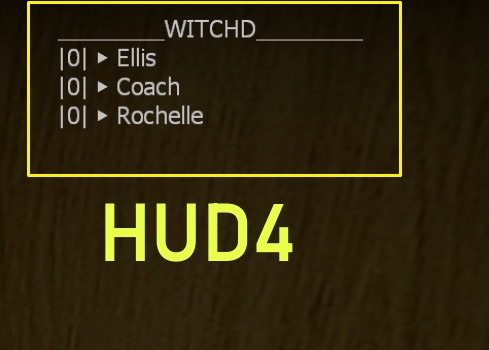
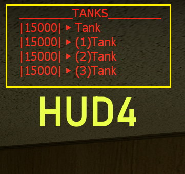

# Description | 內容
Display different Default HUD Text, for coop campaign (variant 1)

* Original: [l4d2_scripted_hud_remake](/L4D_插件/Server_伺服器/l4d2_scripted_hud_remake)

> __Note__ <br/>
This plugin is private, Please contact [me](https://github.com/fbef0102/Game-Private_Plugin#私人插件列表-private-plugins-list)<br/>
此為私人插件, 請聯繫[本人](https://github.com/fbef0102/Game-Private_Plugin#私人插件列表-private-plugins-list)

* Video | 影片展示
<br/>None

* Image | 圖示
	<br/>
	<br/>
	<br/>
	<br/>

* <details><summary>How does it work?</summary>

	* Display HUD Text on player's screen
	* Adjust each hud in file [data/l4d2_scripted_hud_remake_1.cfg](data/l4d2_scripted_hud_remake_1.cfg),
		* Custom text
		* Position
		* Animated movement 
		* Background, blink from white to red
	* 🟥 The limit of each HUD text is up to 127 characters. (Go ask Valve)
</details>

* Require | 必要安裝
	1. [left4dhooks](https://forums.alliedmods.net/showthread.php?t=321696)

* <details><summary>ConVar | 指令</summary>

	* cfg/sourcemod/l4d2_scripted_hud_remake_1.cfg
		```php
		// Enable/Disable the plugin.
		// 0 = Disable, 1 = Enable.
		l4d2_scripted_hud_remake_1_enable "1"
		```
</details>

* <details><summary>Command | 命令</summary>

	* **Reload the data file and refreash hud (Access: ADMFLAG_ROOT)**
		```php
		sm_l4d2_scripted_hud_remake_reload_data
		```
</details>

* <details><summary>Data Config</summary>
  
	* [data/l4d2_scripted_hud_remake_1.cfg](data/l4d2_scripted_hud_remake_1.cfg)
		> Manual in this file, click for more details...
</details>

* <details><summary>Default HUD Text</summary>

	* HUD 1: 
		1. CI kill Top Rank
	* HUD 2: 
		2. SI kill Top Rank
	* HUD 3: 
		3. Damage to tank Top Rank
	* HUD 4: 
		1. Damage to witch Top Rank
		2. System data + time + server slots
		3. Tank health
	* HUD 5: 
		1. Player has escaped list in end of campaign
</details>

* <details><summary>FAQ</summary>

	* How to switch HUD Text?
		* Modify ```Display``` key-value in data file

	* How to switch HUD position?
		* Modify ```x_pos``` key-value in data file
		* Modify ```y_pos``` key-value in data file
		<br/>

	* How to write message in HUD text as I want?
		1. Modify ```Texts``` key-value in data file

	* Why hud disappear or being cut?	
		* The limit of each HUD text is up to 127 characters.
		* Hud position depends on Gaming Monitor Resolutions
</details>

* Apply to | 適用於
	```
	L4D2
	```

* <details><summary>Changelog | 版本日誌</summary>

	* 1.2h-v1 (2024-11-16)
		* l4d2_scripted_hud_remake "v1.2h (2024-11-16)" variant 1
		* Change hud 1~5 display text

	* Original
		* [l4d2_scripted_hud_remake](/L4D_插件/Server_伺服器/l4d2_scripted_hud_remake)
</details>

- - - -
# 中文說明
不同的預設 HUD 文字，搭配戰役用 (變體代號1)

* 原版: [l4d2_scripted_hud_remake](/L4D_插件/Server_伺服器/l4d2_scripted_hud_remake)

* 功能
	* 在玩家的畫面上顯示Hud文字
	* 修改文件 [data/l4d2_scripted_hud_remake_1.cfg](data/l4d2_scripted_hud_remake_1.cfg), 自行調整
		* 顯示的文字內容
		* 顯示位置
		* 文字移動的動畫效果
		* 黑色背景框, 文字閃紅色的特效
	* 🟥 每個Hud文字上限為127，遊戲限制不能增加，認真你就輸了，再問就是Valve的鍋

* <details><summary>預設的 HUD 文字 (點我展開)</summary>

	* HUD 1:
		1. 普通感染者統計排行榜前三名
	* HUD 2: 
		1. 擊殺統計排行榜前三名
	* HUD 3: 
		1. 打Tank的傷害統計排行榜前三名
	* HUD 4: 
		1. 打Witch的傷害統計排行榜前三名
		2. 伺服器的日期與時間 + 伺服器人數
		3. 每個Tank的血量狀態
	* HUD 5:
		1. 已逃脫成功的倖存者列表 (最後一關上救援載具後才顯示)
</details>

* <details><summary>指令中文介紹 (點我展開)</summary>

	* cfg/sourcemod/l4d2_scripted_hud_remake_1.cfg
		```php
		// 0=關閉插件, 1=啟動插件
		l4d2_scripted_hud_remake_1_enable "1"
		```
</details>

* <details><summary>命令中文介紹 (點我展開)</summary>

	* **重載data文件並刷新所有Huds (權限: ADMFLAG_ROOT)**
		```php
		sm_l4d2_scripted_hud_remake_reload_data
		```
</details>

* <details><summary>文件設定範例</summary>
  
	* [data/l4d2_scripted_hud_remake_1.cfg](data/l4d2_scripted_hud_remake_1.cfg)
		> 內有中文說明，可點擊查看
</details>

* <details><summary>問題區</summary>

	* 如何更換預設的 HUD 文字?
		* 在data文件裡請修改 ```Display``

	* 如何改變 HUD 位置?
		* 在data文件裡修改 ```x_pos```
		* 在data文件裡修改 ```y_pos``` 
		<br/>

	* 如何修改在 HUD 加入自己寫的文字?
		* 在data文件裡修改 ```Texts```

	* 為何 HUD 會移位或被切掉?	
		* 每個Hud文字上限為127，遊戲限制不能增加，認真你就輸了
		* 根據玩家自己的遊戲分辨率，看到的Hud位置會有不同，請斟酌修改位置
</details>