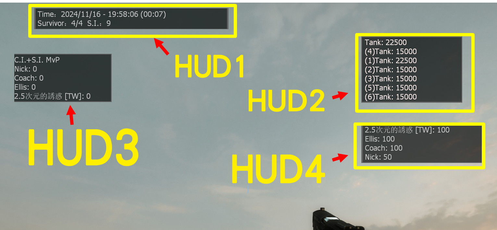

# Description | 內容
Display text for up to 15 scripted HUD slots on the screen.

> __Note__ <br/>
This plugin is private, Please contact [me](https://github.com/fbef0102/Game-Private_Plugin#私人插件列表-private-plugins-list)<br/>
此為私人插件, 請聯繫[本人](https://github.com/fbef0102/Game-Private_Plugin#私人插件列表-private-plugins-list)

* Apply to | 適用於
	```
	L4D2
	```

* Image | 圖示
	* Survivor - 人類方
	<br/>
	* Infected - 特感方
	<br/>
	* Animated movement
	<br/>
	* Custom Hud text
	<br/>

* <details><summary>How does it work?</summary>

	* Display HUD Text on player's screen
	* Adjust each hud in file [data/l4d2_scripted_hud_remake.cfg](data/l4d2_scripted_hud_remake.cfg),
		* Custom text
		* Position
		* Animated movement 
		* Background, blink from white to red
	* 🟥 The limit of each HUD text is up to 127 characters. (Go ask Valve)
</details>

* Require | 必要安裝
	1. [left4dhooks](https://forums.alliedmods.net/showthread.php?t=321696)

* <details><summary>ConVar | 指令</summary>

	* cfg/sourcemod/l4d2_scripted_hud_remake.cfg
		```php
		// Enable/Disable the plugin.
		// 0 = Disable, 1 = Enable.
		l4d2_scripted_hud_remake_enable "1"
		```
</details>

* <details><summary>Command | 命令</summary>

	* **Reload the data file and refreash hud (Access: ADMFLAG_ROOT)**
		```php
		sm_l4d2_scripted_hud_remake_reload_data
		```
</details>

* <details><summary>Data Config</summary>
  
	* [data/l4d2_scripted_hud_remake.cfg](data/l4d2_scripted_hud_remake.cfg)
		> Manual in this file, click for more details...
</details>

* <details><summary>Default HUD Text</summary>

	* HUD 1:
		1. System Time + Map Played Time + Survivor Count + Infected Count
		2. System Time + Survivor Count + Infected Count
        3. System Time + Survivor Count
        4. System Time
	* HUD 2:
		1. Tank Health
		2. Server HostName + Server Slots
	* HUD 3: 
		1. S.I. kills rank
		2. C.I.+S.I.+Tank+Witch kills rank
	* HUD 4:
		1. Survivor Mic Speaking
		2. Survivor health
	* HUD 5: 
		1. Infected Mic Speaking
</details>

* <details><summary>FAQ</summary>

	* How to switch HUD Text?
		* Modify ```Display``` key-value in data file

	* How to switch HUD position?
		* Modify ```x_pos``` key-value in data file
		* Modify ```y_pos``` key-value in data file
		<br/>

	* How to write message in HUD text as I want?
		1. Modify ```Texts``` key-value in data file

	* Why hud disappear or being cut?	
		* The limit of each HUD text is up to 127 characters.
		* Hud position depends on Gaming Monitor Resolutions
</details>

* <details><summary>Other Version | 其他版本</summary>

	1. [l4d2_scripted_hud_remake_1](OtherVersion_其他版本/l4d2_scripted_hud_remake_1): Display different Default HUD Text, for coop campaign (variant 1)
		> 不同的預設 HUD 文字，搭配戰役用 (變體代號1)
	1. [l4d2_scripted_hud_remake_2](OtherVersion_其他版本/l4d2_scripted_hud_remake_2): Display different Default HUD Text, for versus/zonemod campaign (variant 2)
		> 不同的預設 HUD 文字，搭配對抗與Zonemod用 (變體代號2)
</details>

* <details><summary>Related Plugin | 相關插件</summary>

	1. [l4d2_cs_kill_hud](https://github.com/fbef0102/L4D1_2-Plugins/tree/master/l4d2_cs_kill_hud): HUD with cs kill info list.
		> L4D2擊殺提示改成CS遊戲的擊殺列表
</details>

* <details><summary>Changelog | 版本日誌</summary>

	* v1.2h (2024-11-16)
		* Remake plugin, support 15 huds
		* Update cvar, cmd, data file
		* Change plugin name
		* Remove center text
		* Remove vscript, no need

	* v1.1h (2023-11-21)
		* Optimize code and improve performance

	* v1.1.0 (2023-02-13)
		* Display Survivors, Infected, and Spectator MIC Speaking text separately
		* Add HUD 5 for Infected Mic Speaking
		* Add Center text for Spectator Mic Speaking

	* v1.0.5 (2022-11-27)
		* HUD3_TEXT + C.I.+S.I.+Tank+Witch kills rank
		* HUD4_TEXT + Survivor health
		* Add cvars to switch HUDX_TEXT text

	* v1.0.4 (2022-11-24)
		* Kill Infected Counter Rank (HUD3_Text)
		* Time and Survivor/Infected count (HUD1_Text)

	* v1.0.2
		* [By Marttt](https://forums.alliedmods.net/showthread.php?t=331212)
</details>

- - - -
# 中文說明
在玩家畫面可顯示至多15個Hud, 每個Hud顯示不同的內容

* 功能
	* 在玩家的畫面上顯示Hud文字
	* 修改文件 [data/l4d2_scripted_hud_remake.cfg](data/l4d2_scripted_hud_remake.cfg), 自行調整
		* 顯示的文字內容
		* 顯示位置
		* 文字移動的動畫效果
		* 黑色背景框, 文字閃紅色的特效
	* 🟥 每個Hud文字上限為127，遊戲限制不能增加，認真你就輸了，再問就是Valve的鍋

* <details><summary>預設的 HUD 文字 (點我展開)</summary>

	* HUD 1:
		1. 系統時間 + 地圖已遊玩時間 + 倖存者數量 + 特感數量
		2. 系統時間 + 倖存者數量 + 特感數量
        3. 系統時間 + 倖存者數量
        4. 系統時間
	* HUD 2:
		1. Tank 血量
		2. 房名 + 伺服器人數
	* HUD 3: 
		1. 特感擊殺數 統計排行榜
		2. 普通感染者+特感+Tank+Witch擊殺數 統計排行榜
	* HUD 4:
		1. 倖存者玩家語音列表
		2. 倖存者血量狀態
	* HUD 5: 
		1. 特感玩家語音列表
</details>

* <details><summary>指令中文介紹 (點我展開)</summary>

	* cfg/sourcemod/l4d2_scripted_hud_remake.cfg
		```php
		// 0=關閉插件, 1=啟動插件
		l4d2_scripted_hud_remake_enable "1"
		```
</details>

* <details><summary>命令中文介紹 (點我展開)</summary>

	* **重載data文件並刷新所有Huds (權限: ADMFLAG_ROOT)**
		```php
		sm_l4d2_scripted_hud_remake_reload_data
		```
</details>

* <details><summary>文件設定範例</summary>
  
	* [data/l4d2_scripted_hud_remake.cfg](data/l4d2_scripted_hud_remake.cfg)
		> 內有中文說明，可點擊查看
</details>

* <details><summary>問題區</summary>

	* 如何更換預設的 HUD 文字?
		* 在data文件裡請修改 ```Display``

	* 如何改變 HUD 位置?
		* 在data文件裡修改 ```x_pos```
		* 在data文件裡修改 ```y_pos``` 
		<br/>

	* 如何修改在 HUD 加入自己寫的文字?
		* 在data文件裡修改 ```Texts```

	* 為何 HUD 會移位或被切掉?	
		* 每個Hud文字上限為127，遊戲限制不能增加，認真你就輸了
		* 根據玩家自己的遊戲分辨率，看到的Hud位置會有不同，請斟酌修改位置
</details>