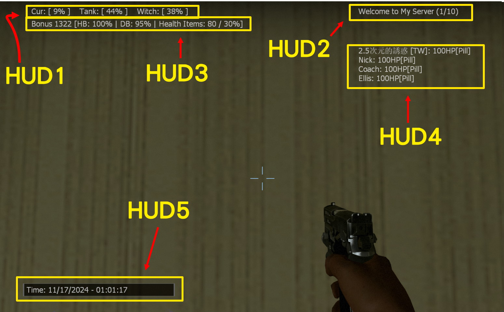
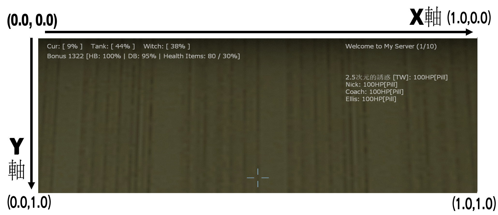
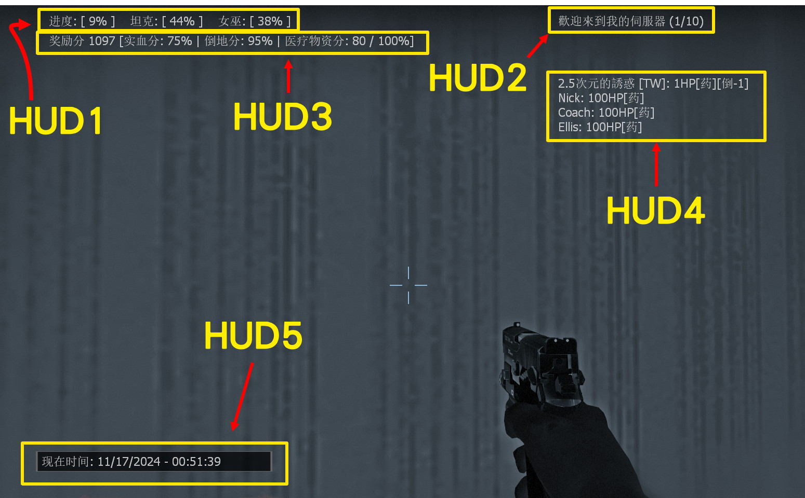

# Description | 內容
Display different Default HUD Text, for versus/zonemod server (variant 2)

* Original: [l4d2_scripted_hud_remake](/L4D_插件/Server_伺服器/l4d2_scripted_hud_remake)

> __Note__ <br/>
This plugin is private, Please contact [me](/#私人插件列表-private-plugins-list)<br/>
此為私人插件, 請聯繫[本人](/#私人插件列表-private-plugins-list)

* Apply to | 適用於
	```
	L4D2
	```

* Image | 圖示
	<br/>

* <details><summary>How does it work?</summary>

	* Display HUD Text on player's screen
	* Adjust each hud in file [data/l4d2_scripted_hud_remake_2.cfg](data/l4d2_scripted_hud_remake_2.cfg),
		* Manual in this file, click for more details...
		* Custom text or set default HUD Text (The predefined default text in the source code)
		* Position
		* Animated movement 
		* Background, blink from white to red
	* [Up to 15 custom script HUDs](https://developer.valvesoftware.com/wiki/Left_4_Dead_2/Scripting/Expanded_Mutation_System/Appendix:_HUD)
	* 🟥 The limit of each HUD text is up to 127 characters. (Go ask Valve)
	* To display score and bonus, you must install scoremod plugin, see "Support | 支援插件" below
</details>

* Require | 必要安裝
	1. [left4dhooks](https://forums.alliedmods.net/showthread.php?t=321696)

* <details><summary>Support | 支援插件</summary>

	1. [l4d2_hybrid_scoremod](https://github.com/SirPlease/L4D2-Competitive-Rework/blob/master/addons/sourcemod/scripting/l4d2_hybrid_scoremod.sp): Modify vesus score for zonemod, display hud 3 score
		* Zonemod用的藥抗分數插件，裝上後Hud3 顯示分數
	2. [l4d2_versus_scoremod](/L4D_插件/Versus_%E5%B0%8D%E6%8A%97%E6%A8%A1%E5%BC%8F/l4d2_versus_scoremod): Display hud 3 score
		* Hud3 顯示分數
</details>

* <details><summary>Default HUD Text</summary>

	* The predefined default text in the source code
	* See "Display List ID" on the top of this file: [data/l4d2_scripted_hud_remake_2.cfg](data/l4d2_scripted_hud_remake_2.cfg)
		```php
		// 1=Cur: [XX%] Tank: [XX%] Witch: [XX%]
		// 2=Server HostName + Server Slots
		// 3=Bonus XX [HB: XX%% | DB: XX%% | Pills: XX / XX%%]
		// 4=Survivor HP status + has pill or not + incap count
		// 5=System Data + Time
		```
</details>

* <details><summary>ConVar | 指令</summary>

	* cfg/sourcemod/l4d2_scripted_hud_remake_2.cfg
		```php
		// Enable/Disable the plugin.
		// 0 = Disable, 1 = Enable.
		l4d2_scripted_hud_remake_2_enable "1"

		// Display text language
		// 0=English, 1=Chinese 中文.
		l4d2_scripted_hud_remake_2_language "1"
		```
</details>

* <details><summary>Command | 命令</summary>

	* **Reload the data file and refreash hud (Access: ADMFLAG_ROOT)**
		```php
		sm_l4d2_scripted_hud_remake_reload_data
		```
</details>

* <details><summary>FAQ</summary>

	* How to modify HUD Text?
		* Modify ```Texts``` key-value in data file
		* Modify ```Display``` key-value in data file

	* How to switch HUD position?
		* Modify ```x_pos``` key-value in data file
		* Modify ```y_pos``` key-value in data file
		<br/>

	* Why hud disappear or being cut?	
		* The limit of each HUD text is up to 127 characters.
		* Hud position depends on Gaming Monitor Resolutions
</details>

* <details><summary>Changelog | 版本日誌</summary>

	* v1.3h-v2 (2026-7-13)
		* Any HUDs can display any default text in data file

	* 1.2h-v2 (2024-11-16)
		* l4d2_scripted_hud_remake "v1.2h (2024-11-16)" variant 2
		* Change hud 1~5 display text

	* Original
		* [l4d2_scripted_hud_remake](/L4D_插件/Server_伺服器/l4d2_scripted_hud_remake)
</details>

- - - -
# 中文說明
不同的預設 HUD 文字，搭配對抗與Zonemod用 (變體代號2)

* 原版: [l4d2_scripted_hud_remake](/L4D_插件/Server_伺服器/l4d2_scripted_hud_remake)

* 圖示
	<br/>

* 功能
	* 在玩家的畫面上顯示Hud文字
	* 修改文件 [data/l4d2_scripted_hud_remake_2.cfg](data/l4d2_scripted_hud_remake_2.cfg), 自行調整
		* 內有中文說明，可 點擊查看
		* 顯示的文字內容或是插件內已準備好的預設文字，查看文件最上方"顯示列表ID"
		* 顯示位置
		* 文字移動的動畫效果
		* 黑色背景框, 文字閃紅色的特效
	* 🟥 每個Hud文字上限為127，遊戲限制不能增加，認真你就輸了，再問就是Valve的鍋
	* 請安裝分數插件，才能顯示對抗分數，查看上方 "Support | 支援插件"

* <details><summary>預設的 HUD 文字 (點我展開)</summary>

	* 插件內已準備好的預設文字
	* 查看文件最上方"顯示列表ID": [data/l4d2_scripted_hud_remake_2.cfg](data/l4d2_scripted_hud_remake_2.cfg)
		```php
		// 1=進度: [XX%] 坦克: [XX%] 女巫: [XX%]
		// 2=房名 + 伺服器人數
		// 3=獎勵分 XX [實血分: XX%% | 倒地分: XX%% | 藥分: XX / XX%%]
		// 4=玩家血量狀態 + 是否有藥丸 + 倒地次數
		// 5=服務器的日期與時間
		```
</details>

* <details><summary>指令中文介紹 (點我展開)</summary>

	* cfg/sourcemod/l4d2_scripted_hud_remake_2.cfg
		```php
		// 0=關閉插件, 1=啟動插件
		l4d2_scripted_hud_remake_2_enable "1"

		// HUD顯示何種語言文字
		// 0=English, 1=Chinese 中文.
		l4d2_scripted_hud_remake_2_language "1"
		```
</details>

* <details><summary>命令中文介紹 (點我展開)</summary>

	* **重載data文件並刷新所有Huds (權限: ADMFLAG_ROOT)**
		```php
		sm_l4d2_scripted_hud_remake_reload_data
		```
</details>

* <details><summary>問題區</summary>

	* 如何修改或更換 HUD 文字?
		* 在data文件裡請修改 ```Texts``
		* 在data文件裡請修改 ```Display``

	* 如何改變 HUD 位置?
		* 在data文件裡修改 ```x_pos```
		* 在data文件裡修改 ```y_pos``` 
		<br/>

	* 為何 HUD 會移位或被切掉?	
		* 每個Hud文字上限為127，遊戲限制不能增加，認真你就輸了
		* 根據玩家自己的遊戲分辨率，看到的Hud位置會有不同，請斟酌修改位置
</details>