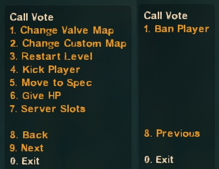
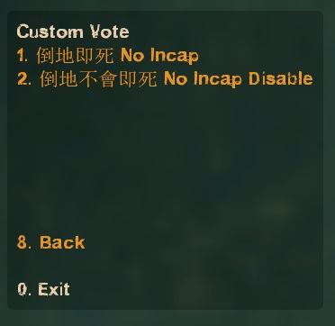
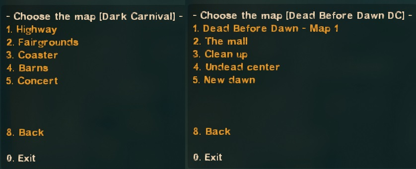
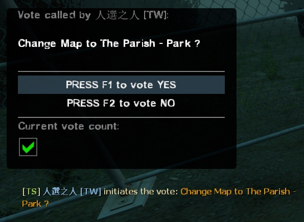
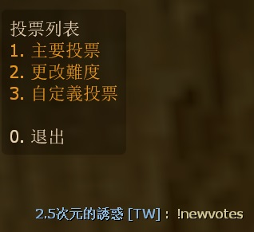
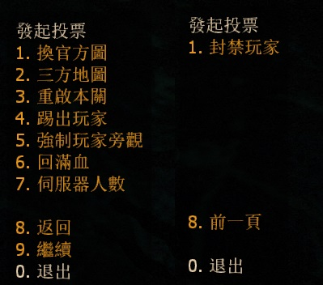
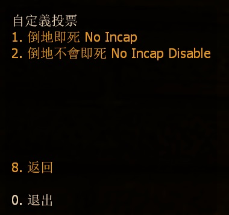
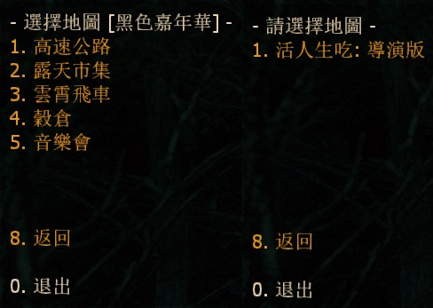

# Description | 內容
New Vote System (use L4D built-in votes UI) + Add custom vote

> __Note__ <br/>
This plugin is private, Please contact [me](https://github.com/fbef0102/Game-Private_Plugin#私人插件列表-private-plugins-list)<br/>
此為私人插件, 請聯繫[本人](https://github.com/fbef0102/Game-Private_Plugin#私人插件列表-private-plugins-list)

* Video | 影片展示
<br/>None

* <details><summary>Image</summary>

	* Type ```!newvotes``` to open vote menu
	<br/>
	* Menu - "Main Vote"
	<br/>
	* Menu - "Change Difficulty"
	<br/>
	* Menu - "Custom Vote", you can add more custom votes
	<br/>
	* Valve Map + Custom Maps (automatic parsing of custom maps vpk files - no need to add map names manually)
	<br/>
	* Use L4D built-in votes UI system
	<br/>
</details>

* <details><summary>How does it work?</summary>

	* Type ```!newvotes``` to open vote menu -> select -> call vote to change
	* Admin can type ```!vp``` to force pass the current vote, or ```!!vc``` to force cancel the current vote
	* Automatic parsing of custom maps vpk files - no need to add map names manually，file is in [configs/l4d2_vote_change.txt](configs/l4d2_vote_change.txt) (don't touch)
	* Customize vote, add more custom vote in [data/l4d2_vote_change.cfg](data/l4d2_vote_change.cfg)
</details>

* Require
	1. [left4dhooks](https://forums.alliedmods.net/showthread.php?t=321696)
	2. [[INC] Multi Colors](https://github.com/fbef0102/L4D1_2-Plugins/releases/tag/Multi-Colors)
	3. [builtinvotes](https://github.com/fbef0102/Game-Private_Plugin/releases/tag/builtinvotes)
	4. [sourcescramble](https://github.com/nosoop/SMExt-SourceScramble/releases)
	5. [l4dtoolz](/Tutorial_%E6%95%99%E5%AD%B8%E5%8D%80/English/Server/Install_Other_File#l4dtoolz)

* <details><summary>ConVar | 指令</summary>

	* cfg/sourcemod/l4d2_vote_change.cfg
		```php
		// Players with these flags have kick immune. (Empty = Everyone, -1: Nobody)
		l4d2_vote_change_Kick_immune_flag "z"

		// Players with these flags have ban immune. (Empty = Everyone, -1: Nobody)
		l4d2_vote_change_ban_immune_flag "z"

		// Ban how many minutes. (0 = Permanent)
		l4d2_vote_change_ban_minutes "0"

		// Delay to start another vote after vote ends.
		l4d2_vote_change_delay "60"

		// 0=Plugin off, 1=Plugin on.
		l4d2_vote_change_enable "1"

		// Numbers of real survivor and infected player required to start a vote.
		l4d2_vote_change_required "1"

		// If 1, spectator can call a vote
		l4d2_vote_change_spectator_call_vote "0"

		// If 1, spectator can participate any vote (vote yes, vote no)
		l4d2_vote_change_spectator_join_vote "1"
		```
</details>

* <details><summary>Command | 命令</summary>

	* **Open New Vote Menu**
		```php
		sm_newvotes
		sm_votes
		```

	* **Open Custom Vote Menu**
		```php
		sm_customvotes
		```

	* **Admin can force pass the current vote (Adm Required: ADMFLAG_BAN)**
		```php
		sm_vp
		```

	* **Admin can force cancel the current vote (Adm Required: ADMFLAG_BAN)**
		```php
		sm_vc
		```
</details>

* <details><summary>API | 串接</summary>


	* [l4d2_vote_change.inc](scripting/include/l4d2_vote_change.inc)
		```php
		library name: l4d2_vote_change
		```
</details>

* <details><summary>Data Config</summary>

	* [data/l4d2_vote_change.cfg](data/l4d2_vote_change.cfg)
		> Manual in this file, click for more details...
</details>

* Apply to | 適用於
	```
	L4D1
	L4D2
	```

* <details><summary>Translation Support | 支援翻譯</summary>

	```
	English
	繁體中文
	简体中文
	```
</details>

* <details><summary>Related | 相關插件</summary>

	1. [l4d2_vote_manager3](https://github.com/fbef0102/L4D1_2-Plugins/tree/master/l4d2_vote_manager3): Unable to call valve vote if player does not have access
		* 沒有權限的玩家不能隨意發起官方投票
	2. [l4d2_custom_difficulty](/L4D_插件/Server_伺服器/l4d2_custom_difficulty): Set your own custom difficulty and damage + vote to change custom difficulty
		* 自訂遊戲難度、特感傷害、殭屍傷害、Tank傷害、Witch傷害 + 投票更換自訂的難度
</details>

* <details><summary>Changelog | 版本日誌</summary>

	* v1.5h (2024-8-16)
		* Update data file
		* Update translation
		* Add API and include
		* Update menu again

	* v1.4h (2024-8-4)
		* Update data file
		* Update vote menu
		* Add L4D1 support
		* Player can now customize vote
		* Update translation

	* v1.3h (2024-4-30)
		* Add data file to enable/disable each vote option

	* v1.2h (2024-2-8)
		* Fixed "Restart Level" not working in versus

	* v1.1h (2023-6-11)
		* Initial Release
</details>

- - - -
# 中文說明
新型的投票系統，可自行新增投票　(使用官方內建的投票)

* <details><summary>圖示(點我展開)</summary>

	* 輸入```!newvotes```打開投票選單
	<br/>
	* "主要投票"
	<br/>
	* "更改難度"
	<br/>
	* "自定義投票"，可自行新增
	<br/>
	* 官方圖與三方圖可以選擇關卡 (能自動識別並新增三方圖)
	<br/>
	* 使用官方的內建投票圖形UI
	<br/>
</details>

* 必要安裝
	1. [left4dhooks](https://forums.alliedmods.net/showthread.php?t=321696)
	2. [[INC] Multi Colors](https://github.com/fbef0102/L4D1_2-Plugins/releases/tag/Multi-Colors)
	3. [builtinvotes](https://github.com/fbef0102/Game-Private_Plugin/releases/tag/builtinvotes)
	4. [sourcescramble](https://github.com/nosoop/SMExt-SourceScramble/releases)
	5. [l4dtoolz](/Tutorial_%E6%95%99%E5%AD%B8%E5%8D%80/Chinese_%E7%B9%81%E9%AB%94%E4%B8%AD%E6%96%87/Server/%E5%AE%89%E8%A3%9D%E5%85%B6%E4%BB%96%E6%AA%94%E6%A1%88%E6%95%99%E5%AD%B8#%E5%AE%89%E8%A3%9Dl4dtoolz)

* 原理
	* 輸入```!newvotes``` -> 選擇項目 -> 發起投票 -> F1同意 或 F2不同意
	* 任何人發起投票後，管理員可輸入```!vp```一票同意；```!vc```一票否決。
	* 自動添加三方圖，文件位於[configs/l4d2_vote_change.txt](configs/l4d2_vote_change.txt) (不要修改)
	* 打開文件 [data/l4d2_vote_change.cfg](data/l4d2_vote_change.cfg) 自行增加更多投票

* 投票選單表
	* 請看上方圖示
	
* <details><summary>指令中文介紹(點我展開)</summary>

	* cfg/sourcemod/l4d2_vote_change.cfg
		```php
		// 擁有這權限的人無法被投票踢出伺服器 (留白 = 任何人無法被踢, -1: 所有人都可以被踢)
		l4d2_vote_change_Kick_immune_flag "z"

		// 擁有這權限的人無法被投票永久封禁 (留白 = 任何人無法被永久封禁, -1: 所有人都可以被永久封禁)
		l4d2_vote_change_ban_immune_flag "z"

		// 過X秒後才能再發起投票.
		l4d2_vote_change_delay "60"

		// 0=插件關閉, 1=插件開啟.
		l4d2_vote_change_enable "1"

		// 倖存者與特感隊伍總共要有X位真人玩家在場才能發起投票.
		l4d2_vote_change_required "1"

		// 如果為1, 旁觀者可以發起投票
		l4d2_vote_change_spectator_call_vote "1"

		// 如果為1, 旁觀者可以參與投票 (按F1同意, 按F2不同意)
		l4d2_vote_change_spectator_join_vote "1"
		```
</details>

* <details><summary>命令中文介紹(點我展開)</summary>

	* **打開投票主選單**
		```php
		sm_newvotes
		sm_votes
		```

	* **打開"自定義投票"選單**
		```php
		sm_customvotes
		```

	* **管理員可以強制通過 (權限: ADMFLAG_BAN)**
		```php
		sm_vp
		```

	* **管理員可以強制否則 (權限: ADMFLAG_BAN)**
		```php
		sm_vc
		```
</details>

* <details><summary>文件設定範例</summary>

	* [data/l4d2_vote_change.cfg](data/l4d2_vote_change.cfg)
		> 內有中文說明，可點擊查看
</details>