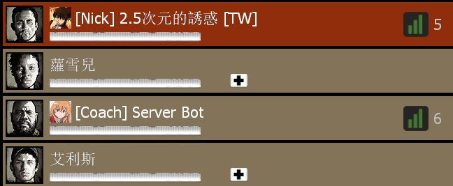
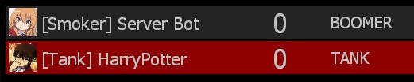

# Description | 內容
Set Prefix Name based on team, character, infected class

> __Note__ <br/>
This plugin is private, Please contact [me](/#私人插件列表-private-plugins-list)<br/>
此為私人插件, 請聯繫[本人](/#私人插件列表-private-plugins-list)

* Apply to | 適用於
	```
	L4D1
	L4D2
	```

* Image | 圖示
	<br/>
	<br/>
	<br/>

* <details><summary>How does it work?</summary>

	* Add prefix in player's name based player's team, character, infected class... etc
	* Set prefix name by config [data/l4d_name_prefix_game.cfg](data/l4d_name_prefix_game.cfg)
</details>

* Require | 必要安裝
	1. [left4dhooks](https://forums.alliedmods.net/showthread.php?t=321696)

* <details><summary>ConVar | 指令</summary>

	* cfg/sourcemod/l4d_name_prefix_game.cfg
		```php
		// 0=Plugin off, 1=Plugin on.
		l4d_name_prefix_game_enable "1"

		// If 1, when player changed name by himself, record in log file: logs/l4d_name_prefix_game.log
		l4d_name_prefix_game_log "1"
		```
</details>

* <details><summary>Changelog | 版本日誌</summary>

	* v1.1 (2025-2-26)
		* Optimize code

	* v1.0 (2024-12-6)
		* Initial Release
</details>

- - - -
# 中文說明
根據玩家的狀態與所在隊伍在名字前面增加前輟

* 原理
	* 譬如:
		* 玩家在旁觀者則名字顯示```[Spec]```
		* 玩家是Coach角色則名字顯示```[Coach]```, 其他角色類推
		* 玩家是靈魂特感則名字顯示```[Ghost]```
		* 使用data文件修改前輟名: [data/l4d_name_prefix_game.cfg](data/l4d_name_prefix_game.cfg)

* 用意在哪?
	* 給人查看伺服器狀態時一目了然
	* 統一玩家名稱用

* <details><summary>指令中文介紹 (點我展開)</summary>

	* cfg/sourcemod/l4d_name_prefix_game.cfg
		```php
		// 0=關閉插件, 1=開啓插件
		l4d_name_prefix_game_enable "1"

		// 為1時，當玩家自己改名時，紀錄於文件中: logs/l4d_name_prefix_game.log
		l4d_name_prefix_game_log "1"
		```
</details>