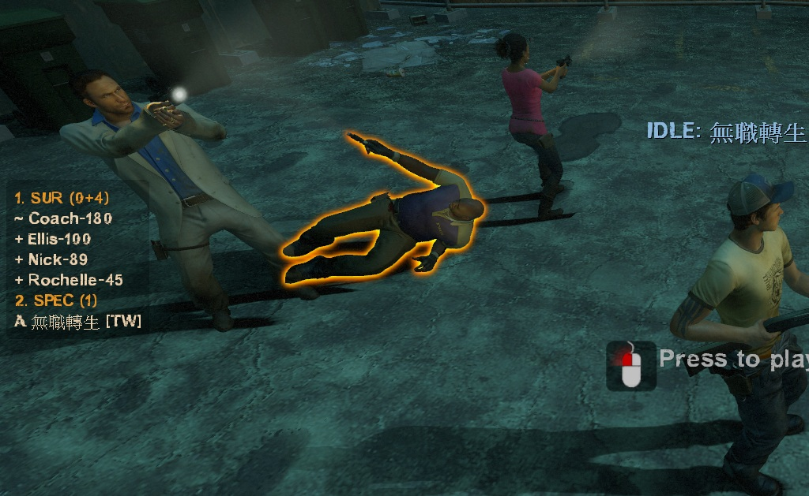
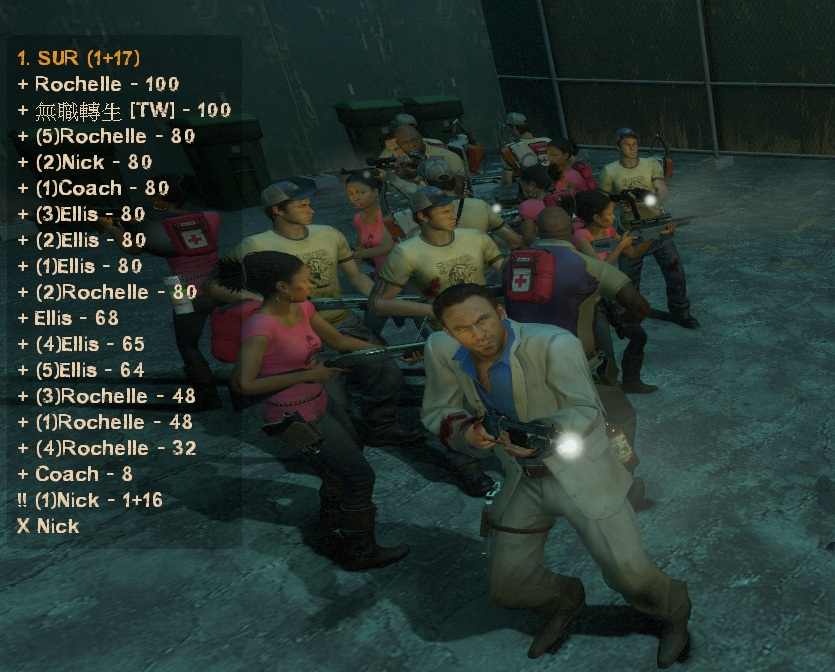
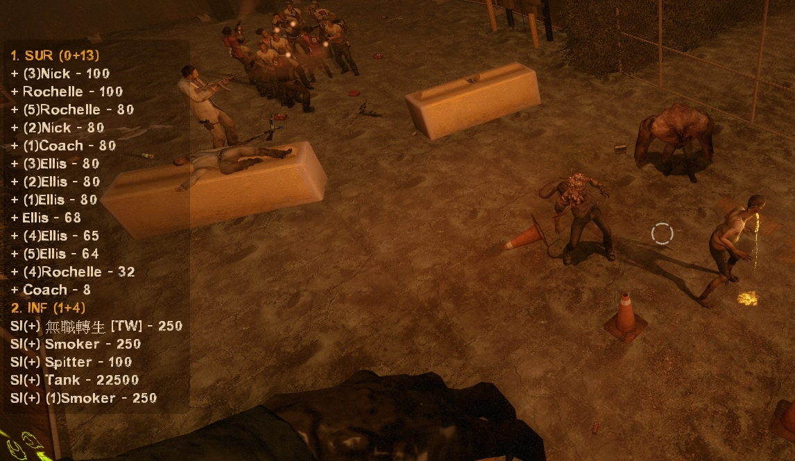

# Description | 內容
Display a sourcemod panel when players press the SCORE key.

> __Note__ <br/>
This plugin is private, Please contact [me](/#私人插件列表-private-plugins-list)<br/>
此為私人插件, 請聯繫[本人](/#私人插件列表-private-plugins-list)

* Apply to | 適用於
	```
	L4D1
	L4D2
	```

* <details><summary>Image | 圖示</summary>

	* Number = HP, see convar to know symbols meaning (數字為玩家的血量，符號代表的意義請看下方指令中文說明)
	<br/>
	* Support multi players (支援五人以上伺服器)
	<br/>
	<br/>
</details>

* <details><summary>How does it work?</summary>

	* Type tab Key (IN_SCORE) to show a hud for 8 seconds, it displays all players' state
	* The game default scoreboard is client side, so unfortunately can't block it.
	* Sort survivor list by health from highest to lowest
</details>

* Require | 必要安裝
	1. [left4dhooks](https://forums.alliedmods.net/showthread.php?t=321696)
	2. [l4d_heartbeat](https://github.com/fbef0102/L4D1_2-Plugins/tree/master/l4d_heartbeat)

* <details><summary>ConVar | 指令</summary>

	* cfg/sourcemod/l4d_scoreboard_panel.cfg
		```php
		// 0=Plugin off, 1=Plugin on.
		l4d_scoreboard_panel_enable "1"

		// Cold down in seconds can a player press tab key to display panel again.
		l4d_scoreboard_panel_tab_cooldown "1.0"

		// Panel display time.
		l4d_scoreboard_panel_display_time "8"

		// If 1, display health on panel
		l4d_scoreboard_panel_display_health "1"

		// Symbol for survivors hanging from ledge
		l4d_scoreboard_panel_hanging_symbol "H"

		// Symbol for incapacitated survivors
		l4d_scoreboard_panel_incapacitated_symbol "~"

		// Symbol for alive survivors
		l4d_scoreboard_panel_survior_alive_symbol "+"

		// Symbol for dead survivors
		l4d_scoreboard_panel_survivor_dead_symbol "X"

		// Symbol for black and white survivors (last life)
		l4d_scoreboard_panel_survivor_bw_symbol "!!"

		// Symbol for infected players (Only display to survivor)
		l4d_scoreboard_panel_infected_team_symbol "SI"

		// Symbol for ghost infected players
		l4d_scoreboard_panel_infected_ghost_symbol "SI(G)"

		// Symbol for alive infected players
		l4d_scoreboard_panel_infected_alive_symbol "SI(+)"

		// Symbol for dead infected players
		l4d_scoreboard_panel_infected_dead_symbol "SI(-)"

		// Symbol for afk players (idle survivor)
		l4d_scoreboard_panel_afk_symbol "A"

		// Symbol for spectator players
		l4d_scoreboard_panel_spectator_team_symbol "O"

		// If 1, display infected bot to infected player
		l4d_scoreboard_panel_infected_bot_display "0"
		```
</details>

* <details><summary>Changelog | 版本日誌</summary>

	* v1.2 (2026-1-31)
		* Update panel, sort survivor list by health from highest to lowest
		* Update cvars

	* v1.1 (2023-1-8)
	    * Draw more details on panel

	* v1.0 (2023-1-5)
		* Initial Release
</details>

- - - -
# 中文說明
按下Tab之後出現玩家列表介面，顯示每個玩家的狀態

* 原理
	* 按下Tab之後顯示每個玩家的狀態，特感也有
		* 倖存者看不到特感玩家的狀態
	* 依生命值從高到低排序倖存者列表
	* 適合用於多人連線的伺服器，因為遊戲內的記分板最多只能顯示五個人類與五個特感玩家狀態
	* 遊戲預設按Tab出現的遊戲預設記分板依然會顯示

* <details><summary>指令中文介紹 (點我展開)</summary>

	* cfg/sourcemod/l4d_scoreboard_panel.cfg
		```php
		// 0=關閉插件, 1=啟動插件
		l4d_scoreboard_panel_enable "1"

		// 再次使用tab顯示介面的冷卻時間
		l4d_scoreboard_panel_tab_cooldown "1.0"

		// 介面顯示時間
		l4d_scoreboard_panel_display_time "8"

		// 為1時，列表上顯示血量
		l4d_scoreboard_panel_display_health "1"

		// 顯示的符號 - 人類掛邊
		l4d_scoreboard_panel_hanging_symbol "H"

		// 顯示的符號 - 人類倒地
		l4d_scoreboard_panel_incapacitated_symbol "~"

		// 顯示的符號 - 人類還活著
		l4d_scoreboard_panel_survior_alive_symbol "+"

		// 顯示的符號 - 人類已死亡
		l4d_scoreboard_panel_survivor_dead_symbol "X"

		// 顯示的符號 - 人類黑白狀態
		l4d_scoreboard_panel_survivor_bw_symbol "!!"

		// 顯示的符號 - 特感 (只顯示給人類玩家觀看)
		l4d_scoreboard_panel_infected_team_symbol "SI"

		// 顯示的符號 - 靈魂特感
		l4d_scoreboard_panel_infected_ghost_symbol "SI(G)"

		// 顯示的符號 - 非靈魂的存活特感
		l4d_scoreboard_panel_infected_alive_symbol "SI(+)"

		// 顯示的符號 - 特感已死亡
		l4d_scoreboard_panel_infected_dead_symbol "SI(-)"

		// 顯示的符號 - 閒置玩家
		l4d_scoreboard_panel_afk_symbol "A"

		// 顯示的符號 - 旁觀者
		l4d_scoreboard_panel_spectator_team_symbol "O"

		// 為1時，特感玩家不會在列表上看到特感Bot
		l4d_scoreboard_panel_infected_bot_display "0"
		```
</details>