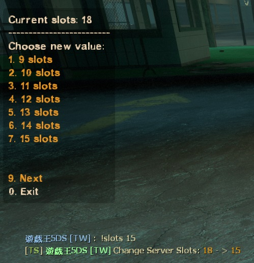
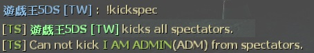
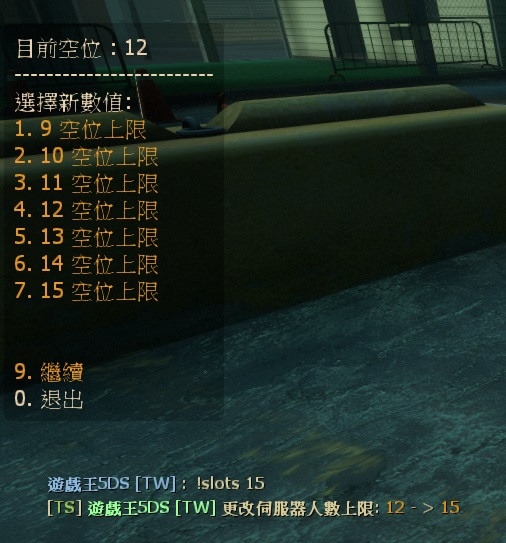

# Description | 內容
Allow players to change server slots by using vote. + Kick non-admin spectators

> __Note__ <br/>
This plugin is private, Please contact [me](/#私人插件列表-private-plugins-list)<br/>
此為私人插件, 請聯繫[本人](/#私人插件列表-private-plugins-list)
<br/>🟥Dedicated Server Only
<br/>🟥只能安裝在Dedicated Server

* Apply to | 適用於
	```
	L4D1 Dedicated Server
	L4D2 Dedicated Server
	```

* [Video | 影片展示](https://youtu.be/HyKyNw80x7Y)

* Image | 圖示
	* Change server slots
	<br/>
	* Kick all spectators
	<br/>

* <details><summary>How does it work?</summary>

	* Change server slots
		* Admin types ```!slots X``` to change server slots (X is number)
		* Normal player types ```!slots X``` to call vote to change server slots (X is number)
	* Kick all spectators
		* Admin types ```!kickspec``` to kick all spectators except for admins.
		* Normal player types ```!kickspec``` to call vote to kick all spectators except for admins. (Ban 5 mins)
</details>

* Require
	1. [l4dtoolz](/Tutorial_教學區/English/Server/Install_Other_File#l4dtoolz)
	2. [[INC] Multi Colors](https://github.com/fbef0102/L4D1_2-Plugins/releases/tag/Multi-Colors)
	3. [builtinvotes](https://github.com/fbef0102/Game-Private_Plugin/releases/tag/builtinvotes)

* <details><summary>ConVar | 指令</summary>

	* cfg/sourcemod/l4d_slot_vote.cfg
		```php
		// If 1, Enabled this plugin.
		l4d_slot_vote_enabled "1"

		// Minimum allowed number of server slots.
		l4d_slot_vote_min "9"

		// Maximum allowed number of server slots.
		l4d_slot_vote_max "28"

		// Minimum # of players in game to start the vote
		l4d_slot_vote_player_limit "3"

		// Pass vote percentage.
		l4d_slot_vote_pass_percentage "0.60"

		// Delay to start another a slot vote after vote ends.
		l4d_slot_vote_delay "5"

		// If 1, players can type comamnd to votekick all spectators.
		l4d_slot_vote_kick_spec_enable "1"

		// If 1, players can type comamnd to change server slots.
		l4d_slot_vote_slots_enable "1"

		// Players with these flags have immune to be kicked in spectator team.
		l4d_slot_vote_immue_kick_flag "z"

		// Players with these flags can change slot or kick spectators directly without vote
		l4d_slot_vote_admin_flag "z"

		// If 1, non-admin can not call vote to change slots or kick spectators
		l4d_slot_vote_player_block "1"

		// If 1, lock server slots (_maxplayers) until server restarts after slot changed by vote or by admin
		l4d_slot_vote_lock "1"
		```
</details>

* <details><summary>Command | 命令</summary>

	* **Vote to change Server Slots, Admin can change without vote**
		```php
		sm_slots <number>
		sm_maxslots <number>
		```

	* **Vote to kick all non-admin spectators, Admin can kick without vote**
		```php
		sm_nospec
		sm_nospecs
		sm_kickspec
		sm_kickspecs
		```
</details>

* Translation Support | 支援翻譯
	```
	translations/l4d_slot_vote.phrases.txt
	```

* <details><summary>Changelog | 版本日誌</summary>

	* v1.0h (2026-2-6)
		* Update cvars
		* support l4d1

	* v2.4 (2023-2-2)
		* Use the L4D2 built-in vote screens for l4d2
		* Require "builtinvotes" extension

	* v2.3
		* Initial Release
</details>

- - - -
# 中文說明
允許玩家使用命令更改伺服器人數上限 + 踢除非管理員的所有旁觀者

* 圖示
	* 更改伺服器人數上限
	<br/>
	* 踢出所有非管理員的旁觀者
	<br/>

* 必要安裝
	1. [l4dtoolz](/Tutorial_教學區/English/Server/Install_Other_File#l4dtoolz): 解鎖伺服器人數上限
	2. [[INC] Multi Colors](https://github.com/fbef0102/L4D1_2-Plugins/releases/tag/Multi-Colors)
	3. [builtinvotes](https://github.com/fbef0102/Game-Private_Plugin/releases/tag/builtinvotes)

* 原理
	* 玩家輸入```!slots X```，投票調整伺服器的人數上限，管理員無須投票
	* 投票輸入```!kickspec```，投票踢出所有非管理員的旁觀者，管理員無須投票 (封鎖時間: 五分鐘)

* 用意在哪
	* 時常有一群傻B來伺服器掛機旁觀不知道衝三小所以才有了此插件
	* 也可以更改伺服器人數上限，方便管理人員進出

* <details><summary>指令中文介紹 (點我展開)</summary>

	* cfg/sourcemod/l4d_slot_vote.cfg
		```php
		// 0=關閉插件, 1=啟動插件
		l4d_slot_vote_enabled "1"

		// 更改伺服器人數的最低下限
		l4d_slot_vote_min "9"

		// 更改伺服器人數的最大上限
		l4d_slot_vote_max "28"

		// 至少要3位以上真人玩家在場才可以投票
		l4d_slot_vote_player_limit "3"

		// 投票通過門檻 (60=需要全體通過60%)
		l4d_slot_vote_pass_percentage "0.60"

		// 一個投票結束後再發起新的投票的冷卻時間
		l4d_slot_vote_delay "5"

		// 為1時，玩家可以輸入 !kickspec 發起投票踢出所有旁觀者
		l4d_slot_vote_kick_spec_enable "1"

		// 為1時，玩家可以輸入 !slots 發起更改伺服器人數
		l4d_slot_vote_slots_enable "1"

		// 擁有這些權限的玩家，不會被踢出去 (留白 = 任何人都不會被踢, -1: 任何人都可以被踢)
		l4d_slot_vote_immue_kick_flag "z"

		// 擁有這些權限的玩家，可以不經過投票強制執行 (留白 = 任何人都能, -1: 無人)
		l4d_slot_vote_admin_flag "z"

		// 為1時，非管理員的玩家不可以輸入 !kickspec 或 !slots 發起投票
		l4d_slot_vote_player_block "0"

		// 為1時，玩家或管理員使用件更改了伺服器人數，該伺服器人數永遠不改變除非伺服器重啟
		l4d_slot_vote_lock "1"
		```
</details>

* <details><summary>命令中文介紹 (點我展開)</summary>

	* **發起投票更改伺服器人數, 有權限的管理員可以不用投票**
		```php
		sm_slots <number>
		sm_maxslots <number>
		```

	* **發起投票踢出所有旁觀者, 有權限的管理員可以不用投票**
		```php
		sm_nospec
		sm_nospecs
		sm_kickspec
		sm_kickspecs
		```
</details>