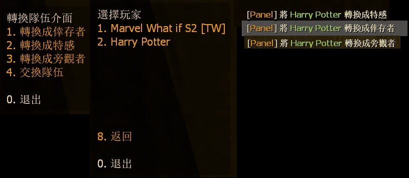
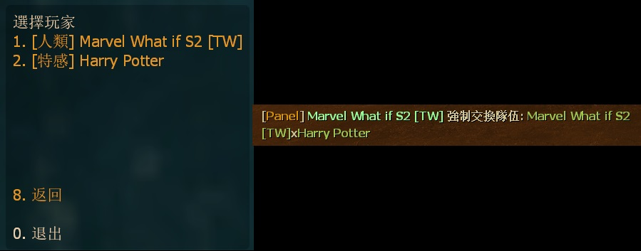

# Description | 內容
Admin can use panel to swap player to another team

> __Note__ <br/>
This plugin is private, Please contact [me](/#私人插件列表-private-plugins-list)<br/>
此為私人插件, 請聯繫[本人](/#私人插件列表-private-plugins-list)

* Apply to | 適用於
	```
	L4D1
	L4D2
	```

* Image | 圖示
	<br/>
	<br/>

* <details><summary>How does it work?</summary>

	* Admin types ```!teampanel``` to open menu
		* Force player to switch team.
		* Swap two players
</details>

* Require | 必要安裝
	1. [left4dhooks](https://forums.alliedmods.net/showthread.php?t=321696)
	2. [[INC] Multi Colors](https://github.com/fbef0102/L4D1_2-Plugins/releases/tag/Multi-Colors)

* <details><summary>ConVar | 指令</summary>

	* cfg/sourcemod/l4d_switchteam_panel.cfg
		```php
		// 0=Plugin off, 1=Plugin on.
		l4d_switchteam_panel_enable "1"

		// Players with these flags have access to use sm_panel menu. (Empty = Everyone, -1: Nobody)
		l4d_switchteam_panel_access_flag "z"
		```
</details>

* <details><summary>Command | 命令</summary>

	* **Open menu to swap players**
		```php
		sm_teampanel
		sm_swappanel
		```
</details>

* Translation Support | 支援翻譯
	```
	translations/l4d_switchteam_panel.phrases.txt
	```

* <details><summary>Changelog | 版本日誌</summary>

	* v1.0 (2024-1-5)
		* Initial Release
</details>

- - - -
# 中文說明
管理員可以使用介面強制轉移玩家到另一個隊伍

* 圖示
	<br/>
	<br/>

* 原理
	* 管理員輸入```!teampanel```
		* 選擇玩家後強制轉移到另一個隊伍
		* 選擇兩位玩家強制交換隊伍

* <details><summary>指令中文介紹 (點我展開)</summary>

	* cfg/sourcemod/l4d_switchteam_panel.cfg
		```php
		// 0=關閉插件, 1=啟動插件.
		l4d_switchteam_panel_enable "1"

		// 擁有這些權限的玩家，才可以使用!teampanel (留白 = 任何人都能, -1: 無人)
		l4d_switchteam_panel_access_flag "z"
		```
</details>
