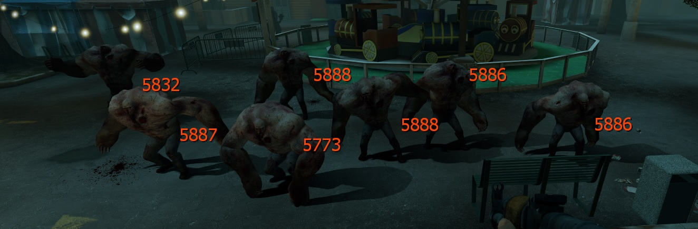

# Description | 內容
Display corresponding health value hint of all Special Infected

> __Note__ <br/>
This plugin is private, Please contact [me](https://github.com/fbef0102/Game-Private_Plugin#私人插件列表-private-plugins-list)<br/>
此為私人插件, 請聯繫[本人](https://github.com/fbef0102/Game-Private_Plugin#私人插件列表-private-plugins-list)

* Apply to | 適用於
	```
	L4D2
	```

* Image | 圖示
	<br/>
	<br/>
	<br/>

* <details><summary>How does it work?</summary>

	* Shows the health value of all infected using instructor hints when injured.
	* All survivor player and infected player can see
</details>

* <details><summary>Important</summary>

    * Player must Enabled GAME INSTRUCTOR, in ESC -> Options -> Multiplayer, or they can't see the hp hint
    <br/>
    * DO NOT modify convar ```sv_gameinstructor_disable``` this force all clients to disable their game instructors.
</details>

* Require | 必要安裝
	1. [left4dhooks](https://forums.alliedmods.net/showthread.php?t=321696)

* <details><summary>ConVar | 指令</summary>

	* cfg/sourcemod/l4d2_infected_hp_hint.cfg
		```php
		// 0=Plugin off, 1=Plugin on.
		l4d2_infected_hp_hint_enable "1"

		// If 1, Show Instuctor Hint For Smoker HP
		l4d2_infected_hp_hint_smoker_show "1"

		// If 1, Show Instuctor Hint For Boomer HP
		l4d2_infected_hp_hint_boomer_show "1"

		// If 1, Show Instuctor Hint For Hunter HP
		l4d2_infected_hp_hint_hunter_show "1"
		
		// If 1, Show Instuctor Hint For Spitter HP
		l4d2_infected_hp_hint_spitter "1"

		// If 1, Show Instuctor Hint For Jockey HP
		l4d2_infected_hp_hint_jockey_show "1"

		// If 1, Show Instuctor Hint For Charger HP
		l4d2_infected_hp_hint_charger_show "1"

		// If 1, Show Instuctor Hint For Tank HP
		l4d2_infected_hp_hint_tank_show "1"

		// If 1, Show Instuctor Hint For Witch HP
		l4d2_infected_hp_hint_witch_show "1"

		// Smoker HP Color, Three values between 0-255 separated by spaces.
		l4d2_infected_hp_hint_smoker_color "255 255 0"

		// Boomer HP Color, Three values between 0-255 separated by spaces.
		l4d2_infected_hp_hint_boomer_color "255 255 0"

		// Hunter HP Color, Three values between 0-255 separated by spaces.
		l4d2_infected_hp_hint_hunter_color "255 255 0"

		// Spitter HP Color, Three values between 0-255 separated by spaces.
		l4d2_infected_hp_hint_spitter_color "255 255 0"

		// Jockey HP Color, Three values between 0-255 separated by spaces.
		l4d2_infected_hp_hint_jockey_color "255 255 0"

		// Charger HP Color, Three values between 0-255 separated by spaces.
		l4d2_infected_hp_hint_charger_color "255 255 0"

		// Tank HP Color, Three values between 0-255 separated by spaces.
		l4d2_infected_hp_hint_tank_color "255 69 0"

		// Witch HP Color, Three values between 0-255 separated by spaces.
		l4d2_infected_hp_hint_witch_color "148 0 211"
		```
</details>

* <details><summary>Related Plugin | 相關插件</summary>

	1. [l4d_infected_hp_text](/L4D_插件/Special_Infected_特感/l4d_infected_hp_text): Display health bar text of Special Infected to attacker
		> 向攻擊者顯示特感血條
</details>

* <details><summary>Changelog | 版本日誌</summary>

	* v1.1h (2024-2-21)
		* Fixed wrong health if infected gain some health
		* Optimize code and improve performance

	* v1.0h (2024-1-2)
		* Remake code, convert code to latest syntax
		* Fix warnings when compiling on SourceMod 1.11.
		* Optimize code and improve performance
		* Use left4dhooks
		* Add hp color
		* Safely remove and create entity
		* Fixed wrong witch health if other plugin adjust witch health

	* v1.2
		* [Original Plugin By MasterMind420](https://forums.alliedmods.net/showthread.php?t=302535)
</details>

- - - -
# 中文說明
在特感身上顯示剩餘血量

* 原理
	* 在特感/Tank/Witch身上顯示剩餘血量
	* 所有玩家與特感都會看到

* 注意事項
    * 玩家必須啟動[遊戲指導系統](https://github.com/fbef0102/Game-Private_Plugin/tree/main/Tutorial_%E6%95%99%E5%AD%B8%E5%8D%80/Chinese_%E7%B9%81%E9%AB%94%E4%B8%AD%E6%96%87/Game#%E5%95%9F%E5%8B%95%E9%81%8A%E6%88%B2%E6%8C%87%E5%B0%8E%E7%B3%BB%E7%B5%B1)，否則玩家看不見
    * 伺服器端不要修改指令 ```sv_gameinstructor_disable```，這會關閉所有玩家的遊戲指導系統

* <details><summary>指令中文介紹 (點我展開)</summary>

	* cfg/sourcemod/l4d2_infected_hp_hint.cfg
		```php
		// 0=關閉插件, 1=啟動插件
		l4d2_infected_hp_hint_enable "1"

		// 為1時，Smoker顯示剩餘血量
		l4d2_infected_hp_hint_smoker_show "1"

		// 為1時，Boomer顯示剩餘血量
		l4d2_infected_hp_hint_boomer_show "1"

		// 為1時，Hunter顯示剩餘血量
		l4d2_infected_hp_hint_hunter_show "1"
		
		// 為1時，Spitter顯示剩餘血量
		l4d2_infected_hp_hint_spitter "1"

		// 為1時，Jockey顯示剩餘血量
		l4d2_infected_hp_hint_jockey_show "1"

		// 為1時，Charger顯示剩餘血量
		l4d2_infected_hp_hint_charger_show "1"

		// 為1時，Tank顯示剩餘血量
		l4d2_infected_hp_hint_tank_show "1"

		// 為1時，Witch顯示剩餘血量
		l4d2_infected_hp_hint_witch_show "1"

		// Smoker血量的顏色，填入RGB三色 (三個數值介於0~255，需要空格)
		l4d2_infected_hp_hint_smoker_color "255 255 0"

		// Boomer血量的顏色，填入RGB三色 (三個數值介於0~255，需要空格)
		l4d2_infected_hp_hint_boomer_color "255 255 0"

		// Hunter血量的顏色，填入RGB三色 (三個數值介於0~255，需要空格)
		l4d2_infected_hp_hint_hunter_color "255 255 0"

		// Spitter血量的顏色，填入RGB三色 (三個數值介於0~255，需要空格)
		l4d2_infected_hp_hint_spitter_color "255 255 0"

		// Jockey血量的顏色，填入RGB三色 (三個數值介於0~255，需要空格)
		l4d2_infected_hp_hint_jockey_color "255 255 0"

		// Charger血量的顏色，填入RGB三色 (三個數值介於0~255，需要空格)
		l4d2_infected_hp_hint_charger_color "255 255 0"

		// Tank血量的顏色，填入RGB三色 (三個數值介於0~255，需要空格)
		l4d2_infected_hp_hint_tank_color "255 69 0"

		// Witch血量的顏色，填入RGB三色 (三個數值介於0~255，需要空格)
		l4d2_infected_hp_hint_witch_color "148 0 211"
		```
</details>
