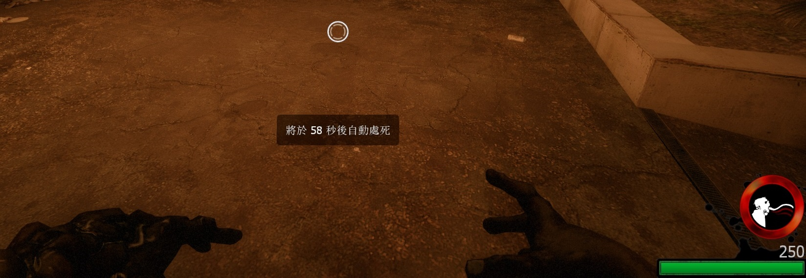

# Description | 內容
Kill special infected after spawn over 60 seconds (Also apply to AI)

> __Note__ <br/>
This plugin is private, Please contact [me](/#私人插件列表-private-plugins-list)<br/>
此為私人插件, 請聯繫[本人](/#私人插件列表-private-plugins-list)

* Apply to | 適用於
    ```
    L4D2
    ```

* Image
    <br/>
    <br/>

* <details><summary>How does it work?</summary>

	* After infected spawns alive (not ghost state), count down 60 seconds.
    * After 60 seconds, slay infected no matter he was tank or pinned survivor already.
    * Count down time paused when ghost state
    * Apply to both human and AI infected
</details>

* Require | 必要安裝
	1. [left4dhooks](https://forums.alliedmods.net/showthread.php?t=321696)
	2. [[INC] Multi Colors](https://github.com/fbef0102/L4D1_2-Plugins/releases/tag/Multi-Colors)

* <details><summary>ConVar | 指令</summary>

    * cfg/sourcemod/l4d2_infected_spawn_auto_kill_time.cfg
        ```php
        // 0=Plugin off, 1=Plugin on.
        l4d2_infected_spawn_auto_kill_time_enable "1"

        // How countdown message displays. (0: Disable, 1:In chat, 2: In Hint Box, 3: In center text)
        l4d2_infected_spawn_auto_kill_time_announce_type "2"

        // Delay to kill Smoker after spawn. (0=off)
        l4d2_infected_spawn_auto_kill_time_smoker "60"

        // Delay to kill Boomer after spawn. (0=off)
        l4d2_infected_spawn_auto_kill_time_boomer "60"

        // Delay to kill Hunter after spawn. (0=off)
        l4d2_infected_spawn_auto_kill_time_hunter "60"

        // Delay to kill Spitter after spawn. (0=off)
        l4d2_infected_spawn_auto_kill_time_spitter "60"

        // Delay to kill Jockey after spawn. (0=off)
        l4d2_infected_spawn_auto_kill_time_jockey "60"

        // Delay to kill Charger after spawn. (0=off)
        l4d2_infected_spawn_auto_kill_time_charger "60"

        // If 1, this plugin also applies to bot.
        l4d2_infected_spawn_auto_kill_time_bot "1"

        // Player with these flags have access to turn off auto kill feature by using !autokill command (Empty=Everyone, -1=No one).
        l4d2_infected_spawn_auto_kill_time_flags "z"
        ```
</details>

* <details><summary>Command | 命令</summary>
	
	* **Turn on/off Auto kill feature personally**
		```php
		sm_autokill
		```
</details>

* Translation Support | 支援翻譯
	```
	translations/l4d2_infected_spawn_auto_kill_time.phrases.txt
	```

* <details><summary>Changelog | 版本日誌</summary>

    * 1.0h (2023-8-15)
	    * Initial Release
</details>

- - - -
# 中文說明
特感生成60秒之後，強制處死 (AI特感也適用)

* 圖示
    <br/>
    <br/>

* 原理
	* 在真人特感復活之後 (非靈魂狀態)，計時60秒
    * 無論特感是否為Tank、無論是否正在控倖存者，60秒之後自動處死
    * 靈魂狀態時，計時暫停
    * 真人與AI特感玩家都適用

* <details><summary>指令中文介紹 (點我展開)</summary>

    * cfg/sourcemod/l4d2_infected_spawn_auto_kill_time.cfg
        ```php
        // 0=關閉插件, 1=啟動插件
        l4d2_infected_spawn_auto_kill_time_enable "1"

        // 倒數提示該如何顯示. (0: 不提示, 1: 聊天框, 2: 黑底白字框, 3: 螢幕正中間)
        l4d2_infected_spawn_auto_kill_time_announce_type "2"

        // 設定60秒後處死Smoker. (0=關閉)
        l4d2_infected_spawn_auto_kill_time_smoker "60"

        // 設定60秒後處死Boomer. (0=關閉)
        l4d2_infected_spawn_auto_kill_time_boomer "60"

        // 設定60秒後處死Hunter. (0=關閉)
        l4d2_infected_spawn_auto_kill_time_hunter "60"

        // 設定60秒後處死Spitter. (0=關閉)
        l4d2_infected_spawn_auto_kill_time_spitter "60"

        // 設定60秒後處死Jockey. (0=關閉)
        l4d2_infected_spawn_auto_kill_time_jockey "60"

        // 設定60秒後處死Charger. (0=關閉)
        l4d2_infected_spawn_auto_kill_time_charger "60"

        // 為1時，特感Bot也適用自動處死
        l4d2_infected_spawn_auto_kill_time_bot "1"

        // 擁有這些權限的玩家，才可以輸入!autokill，關閉自動處死功能 (留白 = 任何人都能, -1: 無人)
        l4d2_infected_spawn_auto_kill_time_flags "z"
        ```
</details>

* <details><summary>命令中文介紹 (點我展開)</summary>
	
	* **開關自動處死功能 (個人)**
		```php
		sm_autokill
		```
</details>
