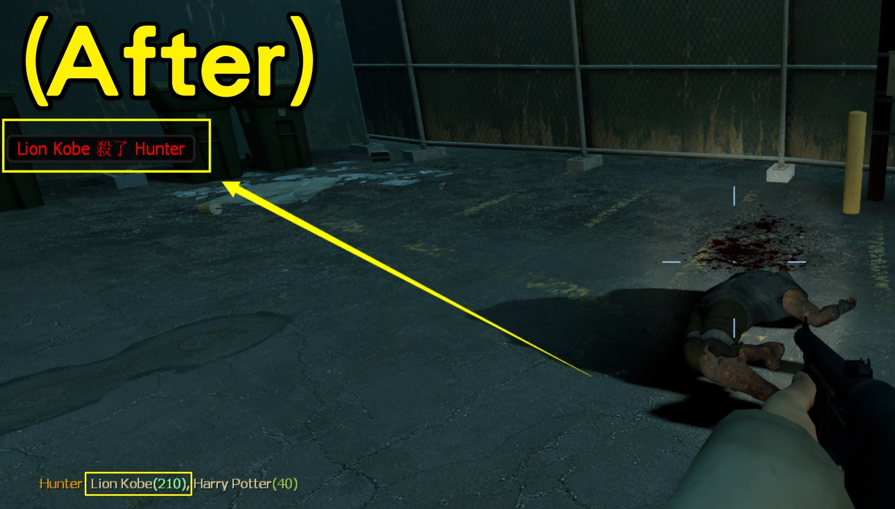

# Description | 內容
Sets the real killer of a special infected, based on who inflicted the most damage, instead of last shot.

> __Note__ <br/>
This plugin is private, Please contact [me](https://github.com/fbef0102/Game-Private_Plugin#私人插件列表-private-plugins-list)<br/>
此為私人插件, 請聯繫[本人](https://github.com/fbef0102/Game-Private_Plugin#私人插件列表-private-plugins-list)

* Image | 圖示
	| Before (裝此插件之前)  			| After (裝此插件之後) |
	| -------------|:-----------------:|
	| ||

* <details><summary>How does it work?</summary>

    * (Before) The killer of a special infected is the survivor who **did the last shot**.
    * (After) Sets the real killer of a special infected, based on who **inflicted the most damage**
    * Apply to Witch/Tank also
    * Display damage
    * Support any other plugins that use "player_death", "witch_killed" event to receive the killer data
</details>

* Require | 必要安裝
    1. [left4dhooks](https://forums.alliedmods.net/showthread.php?t=321696)

* <details><summary>ConVar | 指令</summary>

    * cfg/sourcemod/l4d2_kills_manager.cfg
        ```php
        // Enable/Disable this plugin.
        l4d2_kills_manager_enable "1"

        // Kills modify mode. 0=Last-Shot based (Game Default), 1=Most Damage based.
        l4d2_kills_manager_modify_mode "1"

        // (L4D2) Sets the real killer of Which L4D2 SI death event?  2=SMOKER, 4=BOOMER, 8=HUNTER, 16=SPITTER, 32=JOCKEY, 64=CHARGER, 128=WITCH, 256=TANK (add numbers together, 510=ALL)
        l4d2_kills_manager_si "510"

        // (L4D1) Sets the real killer of Which L4D2 SI death event?  2=SMOKER, 4=BOOMER, 8=HUNTER, 16=WITCH, 32=TANK (add numbers together, 62=ALL)
        l4d2_kills_manager_si "510"

        // Type of statistics notification 0=Off, 1=CenterText, 2=HintBox, 3=Chat
        l4d2_kills_manager_stats_show_type "3"

        // (L4D2) Show damage statistics on which L4D2 SI death? 2=SMOKER, 4=BOOMER, 8=HUNTER, 16=SPITTER, 32=JOCKEY, 64=CHARGER, 128=WITCH, 256=TANK (add numbers together, 510=ALL)
        l4d2_kills_manager_stats_show_si "510"

        // (L4D1) Show damage statistics on which L4D1 SI death? 2=SMOKER, 4=BOOMER, 8=HUNTER, 16=WITCH, 32=TANK (add numbers together, 62=ALL)
        l4d2_kills_manager_stats_show_si "510"

        // Maximum amount of attackers shown in each statistic message. 0=All players
        l4d2_kills_manager_stats_max "0"
        ```
</details>

* <details><summary>Command | 命令</summary>
    
    None
</details>

* <details><summary>API | 串接</summary>

    * [l4d2_kills_manager.inc](scripting/include/l4d2_kills_manager.inc)
        ```php
        library name: l4d2_kills_manager
        ```
</details>

* Apply to | 適用於
    ```
    L4D1
    L4D2
    ```

* <details><summary>Related Plugin | 相關插件</summary>

    1. [l4d2_cs_kill_hud](https://github.com/fbef0102/L4D1_2-Plugins/tree/master/l4d2_cs_kill_hud): HUD with cs kill info list.
        * L4D2擊殺提示改成CS遊戲的擊殺列表
    2. [kills](https://github.com/fbef0102/L4D1_2-Plugins/tree/master/kills): Show statistics of surviviors (kill S.I, C.I. and FF)on round end
        * 擊殺殭屍與特殊感染者統計
</details>    

* <details><summary>Changelog | 版本日誌</summary>

    * v1.2h (2024-12-20)
        * Add API

    * v1.1h (2024-3-28)
        * Fixed damage error if attacker is game system or map

    * v1.0h (2024-3-20)
        * Require lef4dhooks
        * Remake code, convert code to latest syntax
        * Fix warnings when compiling on SourceMod 1.11.
        * Optimize code and improve performance
        * Support L4D1
        * Fixed weapon name error
        * Support any other plugins that use "player_death" event
        * Support witch and any other plugins that use "player_death", "witch_killed" event
        * Correct damages
        * Update cvars

    * v1.2.8
        * [Proaxel's fork](https://forums.alliedmods.net/showpost.php?p=2740687&postcount=39)

    * v1.2
        * [Original Plugin by axelnieves2012](https://forums.alliedmods.net/showthread.php?t=313827)
</details>

- - - -
# 中文說明
強制將特感擊殺者改成造成傷害最多的玩家

* 原理
    * (裝此插件之前) 特感擊殺者永遠都是**最後一擊**的玩家
    * (裝此插件之前) 特感擊殺者改成**造成傷害最多**的玩家
    * 此插件自帶傷害數據提示，可關閉
    * Witch/Tank也適用，修改"player_death"、"witch_killed" 遊戲事件

* 用意在哪?
    * 避免玩家撿尾刀
    * 可以配合其他插件，計算特感的擊殺統計與傷害數據
    * 可以配合其他插件，獎勵給真正的特感擊殺者

* <details><summary>指令中文介紹 (點我展開)</summary>

    * cfg/sourcemod/l4d2_kills_manager.cfg
        ```php
        // 0=關閉插件, 1=啟動插件
        l4d2_kills_manager_enable "1"

        // 擊殺者修改模式. 0=最後一擊的玩家 (遊戲預設), 1=造成傷害最多的玩家
        l4d2_kills_manager_modify_mode "1"

        // (L4D2) 修改哪些特感的擊殺者?  2=SMOKER, 4=BOOMER, 8=HUNTER, 16=SPITTER, 32=JOCKEY, 64=CHARGER, 128=WITCH, 256=TANK (請將數字相加, 510=全部)
        l4d2_kills_manager_si "510"

        // (L4D1) 修改哪些特感的擊殺者?  2=SMOKER, 4=BOOMER, 8=HUNTER, 16=WITCH, 32=TANK (請將數字相加, 510=全部)
        l4d2_kills_manager_si "510"

        // 傷害數據提示 (0: 不提示, 1: 螢幕正中間, 2: 黑底白字框, 3: 聊天框)
        l4d2_kills_manager_stats_show_type "3"

        // (L4D2) 哪些特感死亡會提示傷害數據? 2=SMOKER, 4=BOOMER, 8=HUNTER, 16=SPITTER, 32=JOCKEY, 64=CHARGER, 128=WITCH, 256=TANK (請將數字相加, 510=全部)
        l4d2_kills_manager_stats_show_si "510"

        // (L4D1) 哪些特感死亡會提示傷害數據? 2=SMOKER, 4=BOOMER, 8=HUNTER, 16=WITCH, 32=TANK (請將數字相加, 510=全部)
        l4d2_kills_manager_stats_show_si "510"

        // 傷害數據顯示最多的玩家數量 0=顯示全部
        l4d2_kills_manager_stats_max "0"
        ```
</details>