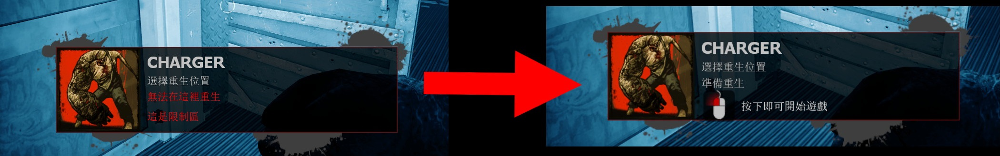

# Description | 內容
Remove Special infected ghost spawn resctricts such as in start/end safe areas, be seen by survivors, too close

> __Note__ <br/>
This plugin is private, Please contact [me](https://github.com/fbef0102/Game-Private_Plugin#私人插件列表-private-plugins-list)<br/>
此為私人插件, 請聯繫[本人](https://github.com/fbef0102/Game-Private_Plugin#私人插件列表-private-plugins-list)

* Apply to | 適用於
	```
	L4D1
	L4D2
	```

* Image | 圖示
	<br/>
	<br/>

* <details><summary>How does it work?</summary>

	* Remove Special infected ghost spawn resctricts in [data/l4d_ghost_restrict_remove.cfg](data/l4d_ghost_restrict_remove.cfg)
		* "waiting for survivors to leave the safe area"
		* "You can been seen by survivors"
		* "You are too close to survivors"
		* "This is a restricted area"
</details>

* Require | 必要安裝
	1. [left4dhooks](https://forums.alliedmods.net/showthread.php?t=321696)

* <details><summary>ConVar | 指令</summary>

	* cfg/sourcemod/l4d_ghost_restrict_remove.cfg
		```php
		// 0=Plugin off, 1=Plugin on.
		l4d_ghost_restrict_remove_enable "1"
		```
</details>

* <details><summary>Data Config</summary>

	* [data/l4d_ghost_restrict_remove.cfg](data/l4d_ghost_restrict_remove.cfg)
		> Manual in this file, click for more details...
</details>

* <details><summary>Changelog | 版本日誌</summary>

	* v1.0 (2024-11-13)	
		* Initial Release
</details>

- - - -
# 中文說明
移除靈魂特感的生成限制，玩家可以在安全室裡面復活、在倖存者眼前復活

* 圖示
	<br/>
	<br/>

* 原理
	* 移除靈魂特感的生成限制，可到[data/l4d_ghost_restrict_remove.cfg](data/l4d_ghost_restrict_remove.cfg)自行調整
		* "正在等待倖存者離開安全室"
		* "倖存者會看到你"
		* "你太靠近倖存者了"
		* "這是限制區"

* <details><summary>指令中文介紹 (點我展開)</summary>

	* cfg/sourcemod/l4d_ghost_restrict_remove.cfg
		```php
		// 0=關閉插件, 1=啟動插件
		l4d_ghost_restrict_remove_enable "1"
		```
</details>

* <details><summary>文件設定範例</summary>
  
	* [data/l4d_ghost_restrict_remove.cfg](data/l4d_ghost_restrict_remove.cfg)
		> 內有中文說明，可點擊查看
</details>