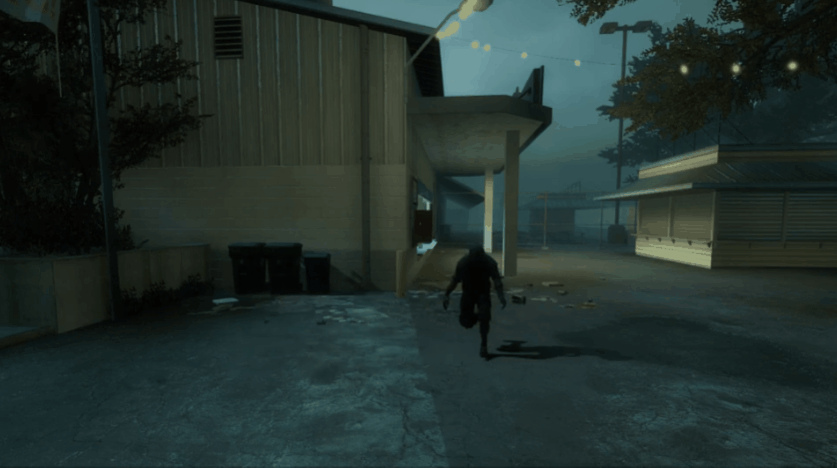

# Description | 內容
L4D1/2 infected get speed boost while duck or climbing the ladder (Also apply to AI)

> __Note__ <br/>
This plugin is private, Please contact [me](https://github.com/fbef0102/Game-Private_Plugin#私人插件列表-private-plugins-list)<br/>
此為私人插件, 請聯繫[本人](https://github.com/fbef0102/Game-Private_Plugin#私人插件列表-private-plugins-list)

* Apply to | 適用於
    ```
    L4D1
    L4D2
    ```

* [Video | 影片展示](https://youtu.be/1-6phGIURTg)

* Image | 圖示
    <br/>
    <br/>

* Require | 必要安裝
    1. [Lagged Movement - Plugin Conflict Resolver](https://forums.alliedmods.net/showthread.php?t=340345)

* <details><summary>ConVar | 指令</summary>

    * cfg/sourcemod/l4d_infected_speed_boost.cfg
        ```php
        // 0=Plugin off, 1=Plugin on.
        l4d_infected_speed_allow "1"

        // Turn on the plugin in these game modes, separate by commas (no spaces). (Empty = all).
        l4d_infected_speed_modes ""

        // Turn off the plugin in these game modes, separate by commas (no spaces). (Empty = none).
        l4d_infected_speed_modes_off ""

        // Turn on the plugin in these game modes. 0=All, 1=Coop, 2=Survival, 4=Versus, 8=Scavenge. Add numbers together.
        l4d_infected_speed_modes_tog "0"

        // Set infected duck speed boost multiper.
        l4d_infected_duck_speed_boost "2.5"

        // If 1, AI infected can use duck speed boost.
        l4d_infected_duck_ai "1"

        // If 1, Real infected Player can use duck speed boost.
        l4d_infected_duck_real_player "1"

        // (L4D2) Which zombie class can boost duck speed? 0=All, 1=Smoker, 2=Boomer, 4=Hunter, 8=Spitter, 16=Jockey, 32=Charger, 128=Tank. Add numbers together.
        l4d_infected_duck_flags "0"

        // (L4D1) Which zombie class can boost duck speed? 0=All, 1=Smoker, 2=Boomer, 4=Hunter, 16=Tank. Add numbers together.
        l4d_infected_duck_flags "0"

        // Set infected ladder speed boost multiper.
        l4d_infected_ladder_speed_boost "2.5"

        // If 1, AI infected can use ladder speed boost.
        l4d_infected_ladder_ai "1"

        // If 1, Real infected player can use ladder speed boost.
        l4d_infected_ladder_real_player "1"

        // (L4D2) Which zombie class can boost ladder speed? 0=All, 1=Smoker, 2=Boomer, 4=Hunter, 8=Spitter, 16=Jockey, 32=Charger, 128=Tank. Add numbers together.
        l4d_infected_ladder_flags "0"

        // (L4D1) Which zombie class can boost ladder speed? 0=All, 1=Smoker, 2=Boomer, 4=Hunter, 16=Tank. Add numbers together.
        l4d_infected_ladder_flags "0"
        ```
</details>

* <details><summary>Related Plugin | 相關插件</summary>

    1. [l4d_si_slowdown](/L4D_插件/Special_Infected_特感/l4d_si_slowdown): Manages the gunfire slowdown for infected team
        > 依據槍械種類修改特感隊伍的槍緩速度
    
    2. [l4d_rejump](/L4D_插件/Nothing_Impossible_無理改造版/l4d_rejump): Allows multi-jumping on air.
        > 成為超級瑪利歐，人類與特感能在空中使用月步，多次跳躍
</details>

* <details><summary>Changelog | 版本日誌</summary>

    * v1.0
        * Initial Release
</details>

- - - -
# 中文說明
特感在爬梯或蹲下期間自動加速移動 (AI特感也適用)

* 原理
    * 特感蹲下移動時會加速
    * 特感爬特感梯子移動時會加速
    * 真人與AI特感都適用

* 用意在哪?
    * 加快特感攻擊速度，勿浪費時間爬特感梯子

* <details><summary>ConVar | 指令</summary>

    * cfg/sourcemod/l4d_infected_speed_boost.cfg
        ```php
        // 0=關閉插件, 1=啟動插件
        l4d_infected_speed_allow "1"

        // 什麼模式下啟動此插件, 逗號區隔 (無空白). (留白 = 所有模式)
        l4d_infected_speed_modes ""

        // 什麼模式下關閉此插件, 逗號區隔 (無空白). (留白 = 無)
        l4d_infected_speed_modes_off ""

        // 什麼模式下啟動此插件. 0=所有模式, 1=戰役, 2=生存, 4=對抗, 8=清道夫. 請將數字相加起來
        l4d_infected_speed_modes_tog "0"

        // 設置蹲下移動倍率
        l4d_infected_duck_speed_boost "2.5"

        // 為1時，AI特感蹲下移動也會加速
        l4d_infected_duck_ai "1"

        // 為1時，真人特感玩家蹲下移動也會加速
        l4d_infected_duck_real_player "1"

        // (L4D2) 哪些殭屍種類可以獲得蹲下加速? 0=全部, 1=Smoker, 2=Boomer, 4=Hunter, 8=Spitter, 16=Jockey, 32=Charger, 128=Tank. 請將數字相加起來
        l4d_infected_duck_flags "0"

        // (L4D1) 哪些殭屍種類可以獲得蹲下加速? 0=全部, 1=Smoker, 2=Boomer, 4=Hunter, 16=Tank. 請將數字相加起來
        l4d_infected_duck_flags "0"

        // 設置特感爬特感梯子移動倍率
        l4d_infected_ladder_speed_boost "2.5"

        // 為1時，AI特感爬特感梯子移動也會加速
        l4d_infected_ladder_ai "1"

        // 為1時，真人特感玩家爬特感梯子移動也會加速
        l4d_infected_ladder_real_player "1"

        // (L4D2) 哪些殭屍種類可以獲得爬梯子加速? 0=全部, 1=Smoker, 2=Boomer, 4=Hunter, 8=Spitter, 16=Jockey, 32=Charger, 128=Tank. 請將數字相加起來
        l4d_infected_ladder_flags "0"

        // (L4D1) 哪些殭屍種類可以獲得爬梯子加速? 0=全部, 1=Smoker, 2=Boomer, 4=Hunter, 16=Tank. 請將數字相加起來
        l4d_infected_ladder_flags "0"
        ```
</details>
