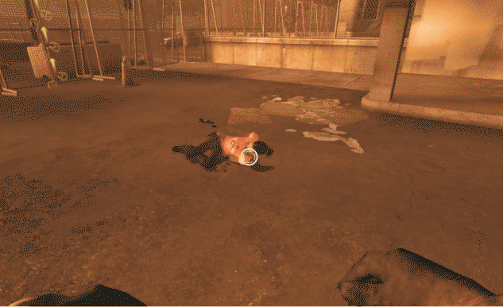

# Description | 內容
S.I can not pin or scratch incapacitated survivors

> __Note__ <br/>
This plugin is private, Please contact [me](https://github.com/fbef0102/Game-Private_Plugin#私人插件列表-private-plugins-list)<br/>
此為私人插件, 請聯繫[本人](https://github.com/fbef0102/Game-Private_Plugin#私人插件列表-private-plugins-list)

* Apply to | 適用於
	```
	L4D1
	L4D2
	```

* Image | 圖示
	| Before (裝此插件之前)  			| After (裝此插件之後) |
	| -------------|:-----------------:|
	| ||
	| ||

* <details><summary>How does it work?</summary>

	* All special infected can not do damage to incapacitated survivors with claw
	* Hunter unable to pounce incapacitated survivors
	* Boomer unable to puke incapacitated survivors
	* Tank can not do damage to incapacitated survivors with hittable car or punch
	* To control each special infected, modify file: [data/l4d_no_dmg_to_incap.cfg](data/l4d_no_dmg_to_incap.cfg)
		* Manual in this file, click for mor details
</details>

* Require | 必要安裝
	1. [left4dhooks](https://forums.alliedmods.net/showthread.php?t=321696)
	2. [collisionhook](https://github.com/fbef0102/Game-Private_Plugin/releases/tag/collisionhook)

* <details><summary>ConVar | 指令</summary>

	* cfg/sourcemod/l4d_no_dmg_to_incap.cfg
		```php
		// 0=Plugin off, 1=Plugin on.
		l4d_no_dmg_to_incap_enable "1"
		```
</details>

* <details><summary>Changelog | 版本日誌</summary>

	* v1.0 (2025-6-3)
		* Initial Release
</details>

- - - -
# 中文說明
禁止特感對人類鞭屍，無法對倒地的倖存者造成二次傷害

* 原理
	* 所有特感無法使用右鍵對倒地的倖存者造成傷害 (禁止鞭屍的意思)
	* Hunter 無法撲倒地的倖存者
	* Boomer 無法噴吐倒地的倖存者
	* Tank 無法用車子殺死倒地的倖存者，也無法用拳頭造成傷害
	* 控制參數請查看文件: [data/l4d_no_dmg_to_incap.cfg](data/l4d_no_dmg_to_incap.cfg)
		* 內有中文說明，可打開文件查看

* <details><summary>指令中文介紹 (點我展開)</summary>

	* cfg/sourcemod/l4d_no_dmg_to_incap.cfg
		```php
		// 0=關閉插件, 1=啟動插件
		l4d_no_dmg_to_incap_enable "1"
		```
</details>