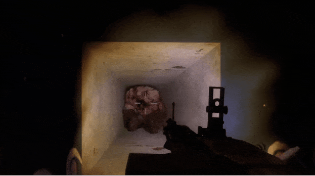
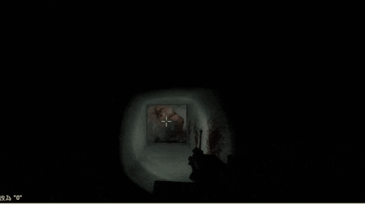

# Description | 內容
Manages the gunfire slowdown for infected team (Also apply to AI)

> __Note__ <br/>
This plugin is private, Please contact [me](/#私人插件列表-private-plugins-list)<br/>
此為私人插件, 請聯繫[本人](/#私人插件列表-private-plugins-list)

* Apply to | 適用於
	```
	L4D1
	L4D2
	```

* [Video | 影片展示](https://youtu.be/TtGyesF7mhs)

* Image | 圖示
	| Before (裝此插件之前)  			| After (裝此插件之後) |
	| -------------|:-----------------:|
	| ||

* <details><summary>How does it work?</summary>

	* Modify movement speed while special infected get shot by survivor
	* Modify each weapon gunfire slowdown in [data/l4d_si_slowdown_gunfire.cfg](data/l4d_si_slowdown_gunfire.cfg)
		* Manual in this file, click for more details...
	* Apply to both AI infected and real infected player
</details>

* Require | 必要安裝
<br/>None

* <details><summary>ConVar | 指令</summary>

	* cfg/sourcemod/l4d_si_slowdown_gunfire.cfg
		```php
		// 0=Plugin off, 1=Plugin on.
		l4d_si_slowdown_gunfire_enable "1"
		```
</details>

* <details><summary>Gunfire Slowdown Calculation Formula</summary>
	
	* See [data/l4d_si_slowdown_gunfire.cfg](data/l4d_si_slowdown_gunfire.cfg)
</details>

* <details><summary>Changelog | 版本日誌</summary>

	* v1.3h (2026-5-24)
		* Use data to contorl each infected and weapon gunfire slowdown
		* Update cvars

	* v1.2h (2025-10-8)
		* Add chainsaw and melee slowdown
		* Update cvars

	* v1.1h (2024-2-28)
		* Control slowdown when crouch
		* Update cvars

	* v1.0h (2024-2-6)
		* Update cvars
		* Add MP5 and bomb explosion

	* v3.1 (2023-2-13)
		* Add a cvar
		* Remodify cvar name

	* v3.0
		* Remove water slowdown, couch speed control, only gunfire slowdown control
		* Add all weapons gunfire slowdown control including Minigun and 50cal Machine gun
		* Add AI infected and Player infected cvars
		* Modify gunfire slowdown calculation formula
		* Support L4D1

	* v2.7.1
		* [By Visor, Sir, darkid, Forgetest, A1m`, Derpduck](https://github.com/SirPlease/L4D2-Competitive-Rework/blob/master/addons/sourcemod/scripting/l4d2_slowdown_control.sp)
</details>

- - - -
# 中文說明
依據槍械種類修改特感的槍緩速度 (AI特感也適用)

* 原理
	* 遊戲中特感被倖存者射中時，特感會停頓下然後"移動速度衰減"，俗稱"槍緩"
	* 此插件就是修改特感被子彈射中之後的"速度衰減"
	* 想修改武器傷害的速度衰減可到文件[data/l4d_si_slowdown_gunfire.cfg](data/l4d_si_slowdown_gunfire.cfg)
		* 內有中文說明，可點擊查看
	* 此插件適用AI特感與真人特感玩家

* <details><summary>指令中文介紹 (點我展開)</summary>

	* cfg/sourcemod/l4d_si_slowdown_gunfire.cfg
		```php
		// 0=關閉插件, 1=啟動插件
		l4d_si_slowdown_gunfire_enable "1"
		```
</details>

* <details><summary>槍緩速度計算 (點我展開)</summary>

	* 看文件[data/l4d_si_slowdown_gunfire.cfg](data/l4d_si_slowdown_gunfire.cfg), 內有說明
</details>
